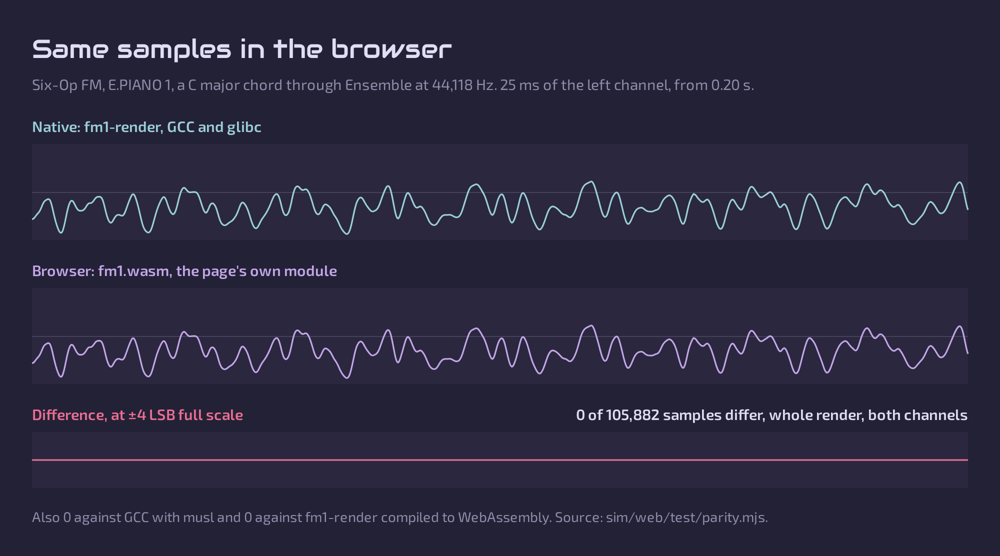

# Developing Lunar Modulator

Welcome. This is the technical home of Lunar Modulator, open firmware for the
M-VAVE FM-1. The [README](README.md) presents Lunar Modulator as a product:
what it does, how to try it, and what is coming. This file holds everything
technical:
- how to build, test and contribute;
- how the software works;
- the specifications and the hardware;
- where development stands, the roadmap in detail and the path to an
  installable build;
- the research behind it ([`docs/`](docs/), [`notes/`](notes/)).

It is for contributors, and for anyone who wants to know how Lunar
Modulator works. Today the code runs on a desktop and in a browser, not yet
on a JieLi chip or an FM-1, so everything can be built, tested and played on
an ordinary computer: [Getting started](#getting-started) takes about five
minutes. For the whole project in six points, read [Key facts](#key-facts).

> **The one rule.** Nothing gets flashed to, or written on, an FM-1 until a
> full flash dump and a byte-identical restore have been demonstrated on
> that unit. [The details](#the-one-rule) come before any work on hardware.

Until 2026-10-01 the project was called "Open firmware for the M-VAVE FM-1"
(`ip2k/mvave-fm1-open-firmware`). GitHub redirects the old URLs [reported:
GitHub's documentation on renaming a repository].

## Contents

- [Getting started](#getting-started)
  - [Build, test and play in five minutes](#build-test-and-play-in-five-minutes)
  - [Where to go next](#where-to-go-next)
  - [All the commands](#all-the-commands)
- [How Lunar Modulator works](#how-lunar-modulator-works)
  - [The layers](#the-layers)
  - [The engine platform](#the-engine-platform)
  - [Renders checked against the reference, sample by sample](#renders-checked-against-the-reference-sample-by-sample)
  - [The sequencer core](#the-sequencer-core)
  - [The virtual FM-1](#the-virtual-fm-1)
- [The hardware](#the-hardware)
  - [The FM-1 at a glance](#the-fm-1-at-a-glance)
  - [The two cores](#the-two-cores)
  - [MIDI in and out](#midi-in-and-out)
  - [BLE MIDI](#ble-midi)
  - [Recovery](#recovery)
  - [Bench checks that write nothing](#bench-checks-that-write-nothing)
- [Where development stands](#where-development-stands)
  - [The roadmap in detail](#the-roadmap-in-detail)
  - [The path to an installable build](#the-path-to-an-installable-build)
  - [Research to do](#research-to-do)
- [Contributing](#contributing)
  - [The one rule](#the-one-rule)
  - [Conventions](#conventions)
  - [Licences](#licences)
  - [Pull requests](#pull-requests)
  - [Credits](#credits)
- [Reference](#reference)
  - [Key facts](#key-facts)
  - [Recommended path](#recommended-path)
  - [Documents](#documents)

## Getting started

The engines, the sequencer and the tests build and run on Linux and macOS,
where CI runs them [verified: `.github/workflows/ci.yml`], and the virtual
FM-1 runs in a browser straight from the repository. No FM-1 and no JieLi
tools are needed.

### Build, test and play in five minutes

You need Python 3 (CI uses 3.12), `make` and a C/C++ compiler.

```bash
python3 -m pip install -r requirements-dev.txt     # the test dependencies
make -C engines                                     # the engines, effects, sequencer and fm1-render
python -m pytest                                    # the whole suite; the engine tests build engines/ if needed
engines/build/fm1-render --engine macro --param Model=4 \
    --note 0:57:100:1 --note 0:60:100:1 --note 0:64:100:1 \
    --fx ensemble --fx plate --fx-param Mix=0.3 \
    --seconds 3 --out chord.wav                     # an A minor chord through two effects, as a WAV
cd sim/web/www && python3 -m http.server 8000       # the virtual FM-1 at http://localhost:8000/
```

Open <http://localhost:8000/> and press **Power on**. The built WebAssembly
module is in the repository, so the page needs no WebAssembly toolchain.

### Where to go next

| To work on | Start with |
| --- | --- |
| A sound engine or an effect, new or ported | [The engine platform](#the-engine-platform), [`engines/README.md`](engines/README.md), [`engines/include/fm1_engine.h`](engines/include/fm1_engine.h), and [`engines/schwung.md`](engines/schwung.md) for porting through a shim |
| The sequencer | [The sequencer core](#the-sequencer-core), [`engines/seq.md`](engines/seq.md), [docs/13](docs/13-movy-port.md) |
| The virtual FM-1 | [The virtual FM-1](#the-virtual-fm-1), [`sim/web/README.md`](sim/web/README.md) |
| Getting Lunar onto the device | [The path to an installable build](#the-path-to-an-installable-build), [docs/14](docs/14-verification-ladder.md) |
| The hardware and the stock firmware | [The hardware](#the-hardware), [docs/01](docs/01-hardware.md)–[03](docs/03-update-protocol.md) |
| Anything that touches an FM-1 | [The one rule](#the-one-rule) first, then [docs/07](docs/07-recovery-and-risk.md) §4 |

### All the commands

```bash
python3 tools/check_msfa_table.py path/to/app.bin            # msfa table finder (tested on V13/V14)
python3 tools/extract_fwsc_from_updater.py M-UPGRADE-FM1 -o FM-1.fwsc   # carve package from the updater
python3 reference/jl-misctools/firmware/fwunpack_newfw.py FM-1.fwsc     # unpack (needs: pip install crcmod)
python tools/fm1_identify.py                                   # read-only identity query + decode, any OS (verified on hardware)
python -m pytest                                               # tools, PIO emulation, dongle/ROM co-simulation and engine tests
make -C engines && engines/build/fm1-render --list             # engine platform, desktop build (docs/11, engines/README.md)
python3 -m http.server 8000 -d sim/web/www                     # the virtual FM-1 at http://localhost:8000/ (sim/web/README.md)
FM1_SIM_HOST=user@host sim/web/build-on-aeon.sh                # rebuild and check its WebAssembly module in containers on a Docker host
tools/fm1_identify.sh                                          # Linux, ALSA raw MIDI, read-only, untested
python3 reference/FM-1-RE/tools/fm1_ota.py scan                # AL-255's client, read-only scan
```

`reference/` and `scratch/` are git-ignored; clone third-party repositories
and keep vendor packages there.

## How Lunar Modulator works

Lunar Modulator is portable C and C++ in layers, so that the same code runs
in a desktop renderer, in a browser and, later, on the FM-1.

### The layers

| Layer | Where | What it does |
| --- | --- | --- |
| Engines and effects | [`engines/`](engines/README.md): the API in `include/fm1_engine.h`, the static registry in `src/registry.cc` | Swappable sound engines and effects behind one C API, with no heap |
| Sequencer core | `engines/seq/`, `engines/include/fm1_seq.h` | `fm1_seq`, a port of Movy's sequencer ([`engines/seq.md`](engines/seq.md)) |
| App layer | [`sim/web/src/`](sim/web/src/) | The firmware's panel logic, effect chain and screen drawing |
| Desktop | `engines/host/render.cc` | `fm1-render`: an engine, an effect chain and the bus limiter, rendered to WAV |
| Browser | [`sim/web/`](sim/web/README.md) | The app layer and every engine, compiled to WebAssembly: the virtual FM-1 |
| Dev kit and FM-1 | planned: the `bsp_*` board-support contract of [docs/14](docs/14-verification-ladder.md) §4.3 | The same code on JieLi's chip ([The path to an installable build](#the-path-to-an-installable-build)) |

### The engine platform

- **The API:** six swappable sound engines and twenty-two effects (Comb
  split out of Filter, Squash and Transient added on 2026-10-05), plus test
  engines, behind one C API, version 3
  ([`engines/include/fm1_engine.h`](engines/include/fm1_engine.h);
  [engines/README.md, "Engine API v3"](engines/README.md#engine-api-v3)):
  16-bit parameter flags with the LOG law for pitch- and time-like knobs, a
  dB unit, an optional effect extension that hands an effect a key
  input, the tempo and beat position, and the transport's events, and pad
  kits ([engines/README.md, "Pad kits"](engines/README.md#pad-kits)).
- **Memory:** no heap. The host supplies each instance's memory and makes no
  promise about its contents [verified: `fm1_engine.h`].
- **Parameters:** typed, and shown four to a page for the FM-1's four free
  knobs. Every engine survives any parameter value, NaN included [verified:
  `tests/test_engine_host.py`].
- **Sources:**
  - The engines and effects built from Mutable Instruments code wrap Emilie
    Gillet's modules, vendored unmodified (MIT,
    [`engines/third_party/mutable/UPSTREAM.md`](engines/third_party/mutable/UPSTREAM.md)):
    - **Macro:** Plaits' eight light engines.
    - **Macro Heavy:** Plaits' other 13.
    - **Six-Op FM:** Plaits' DX7-style engine.
    - **Shapes:** Braids.
    - **Drums:** Plaits' drum classes for its kicks, toms, snares and
      hi-hats, in a 16-pad kit with a rim shot, clap, cowbell and cymbal of
      our own, after Werner, Abel and Smith's TR-808 cowbell and cymbal
      models ([`engines/README.md`](engines/README.md#drums)).
    - **Plate:** Rings' reverb, with a Freeze after Elements'.
    - **Room:** Clouds' reverb and diffuser.
    - **Ensemble and Diffuse:** Plaits' ensemble and diffuser.
  - **FM6** is msfa, Google's FM core and the stock FM-1's (Apache-2.0,
    vendored unmodified:
    [`engines/third_party/msfa/UPSTREAM.md`](engines/third_party/msfa/UPSTREAM.md)),
    with a voice, amplitude modulation, the loops of algorithms 4 and 6,
    32 voices and a DX7 SysEx import of our own ([`engines/msfa.md`](engines/msfa.md)).
    Its tables are const data, flash on the FM-1, made ahead of time
    (`tools/msfa_tables.py`); the simulator loads `.syx` files into its user
    slots. The name is borrowed, with thanks, from Felucca's FM6 engine
    (hugelton), whose Apache-2.0 port of the same core is the test oracle.
  - Sophie and PSX Verb are Schwung modules, compiled unmodified through a
    compatibility shim.
  - Crush (a bitcrusher and sample-rate reducer, after DaisySP's Decimator
    and Bitcrush, Electro-Smith, MIT), Fold (a wavefolder with
    antiderivative anti-aliasing), Drive (overdrive and saturation, five
    anti-aliased curves), Echo (a stereo ping-pong delay), Filter (seven
    zero-delay-feedback filter types), Comp (a feed-forward compressor),
    Limiter (a look-ahead brickwall limiter), DJ Filter (one knob, low-pass
    to high-pass, exact bypass in between), Tilt (a tilt equaliser, exact
    bypass when flat), Master Sat (band-limited bus saturation with Glue,
    its curves' coefficients from Airwindows, Chris Johnson, MIT), Isolator
    (a three-band kill EQ), EQ (a three-band parametric equaliser), Hall (a
    reverb on an eight-line feedback delay network, with Freeze), Gate (a
    noise gate with a Duck mode, after the DS201 and DS301 manuals) and
    Transient (a transient shaper) are our own code
    ([`engines/README.md`](engines/README.md#crush)). Squash (three
    compressors: Snap, Mu and Split) ports Airwindows Pop3, Pressure4 and
    ButterComp2 (Chris Johnson, MIT) to single precision without libm, and
    the Limiter's Round mode ports ClipOnly2, both checked against the
    upstream loops run in a container
    ([`engines/README.md`](engines/README.md#squash)).
- **Macro and Macro Heavy, page 3:** Plaits' envelope amounts (Env Pitch,
  Env Timbre, Env Morph) and its low-pass gate modes (Gate, Ping, Off),
  checked sample for sample against upstream `Voice`
  ([`engines/README.md`](engines/README.md#macro-and-macro-heavy-page-3-the-envelope-and-the-gate)).
- **Sample rates:** the Mutable engines run at their modules' own rates and
  are resampled to the FM-1's 44,118 Hz: Braids at 96 kHz, Plaits (and
  Drums) at 47,872 Hz ([`engines/resampler.md`](engines/resampler.md)).
- **The output:** a host limiter on the bus keeps twelve voices started in
  phase under full scale [verified: `tests/test_engine_host.py`].
- **The desktop renderer:** `fm1-render` plays notes, parameter changes and
  sequences into WAV files. Details are in
  [`engines/README.md`](engines/README.md).

### Renders checked against the reference, sample by sample

Every engine and effect built from Mutable Instruments code is compared
with the upstream classes it wraps. Reference renderers drive the original
Plaits, Braids and Rings code as the modules' own firmware does, with
nothing of ours in the path, and more than 400 tests compare the two.
- **At the upstream rates:**
  - 21 of Plaits' 24 engines match sample for sample (Chiptune once its
    low-pass gate has opened);
  - its three six-op banks correlate at 0.99 or better (the wrapper's
    timing differs by design);
  - Braids' 47 shapes and the effects lie within about half a 16-bit step
    (0.55 LSB at worst)
    ([`engines/reference-plaits.md`](engines/reference-plaits.md),
    [`engines/reference-braids-fx.md`](engines/reference-braids-fx.md));
  - the two Schwung modules are compiled unmodified.
- **The browser adds nothing:**
  - eighteen note scripts covering every engine and effect render
    identically, sample for sample, in the browser's WebAssembly module and
    in the native renderer built with GCC and musl;
  - against GCC with glibc fifteen of the eighteen are identical. Two that
    differ are Sophie's, whose feedback FM amplifies last-bit differences
    between the two C libraries' `sinf` and `expf`; the third is Fold's
    sine fold, 19 samples 1 LSB apart [verified:
    `sim/web/www/fm1.wasm.json`, 2026-10-02].



### The sequencer core

- **What it is:** `fm1_seq`, a C99, heap-free port of Movy's sequencer
  (schwung-movy, MIT), with the fixes planned in
  [docs/13](docs/13-movy-port.md) on by default and an exact-Movy mode for
  tests.
- **Tracks:** 4–8, each routed to the engine or to USB-MIDI on its own
  channel, in 14,984 bytes at 4 tracks and 28,808 at 8.
- **On the desktop:** the desktop renderer plays Movy sets and timed scripts
  through it with sample-accurate notes and parameter locks.
- **Checked against Movy:** Movy's own unmodified core, run in a container,
  drives 24 golden fixtures that ours matches event for event, undo aside
  ([`engines/seq.md`](engines/seq.md)).
- **In the browser:** the virtual FM-1's app layer hosts it through the
  same bridge and plays scripts and sets exactly as the desktop renderer
  does, natively and in the browser module (stage S2 of
  [docs/15](docs/15-sequencer-in-simulator.md)). On the panel, PLAY/STOP,
  SEQ mode's Track view and a demo pattern (stage S3), step entry (S4),
  recording, step record and Capture (S5), eight tracks with mute, the
  Set, Clip and Track pages and a metronome click (S6), parameter locks
  from the knobs (S8) and modulation (docs/16 MG3) work on the public page
  ([`sim/web/README.md`](sim/web/README.md), "The sequencer, multi-sound
  and modulation"; the user manual's chapters 7 and 8). They were behind a
  lab switch (`?lab`) until 2026-10-05, when the owner opened them once
  MG3 had landed. Up to four sound units play at once, each with two
  inserts and a level, mixed into the two effect slots as the master bus;
  each track plays the sound its route names, and a RAM meter refuses any
  choice that would not fit the FM-1 (docs/15 §3.16).

### The arpeggiator core

`fm1_arp` is a C99, heap-free arpeggiator on note events, in 728 bytes. It
follows Yarns' arpeggiator (Emilie Gillet, MIT), adds MCL's note orders and
trig-stepped rate (Justin Mammarella, BSD-3), and adds Super Arp's seeded,
loopable random modifiers (Handcrafted Media, MIT); it reimplements them and
compiles no upstream code. The host supplies clock ticks or steps; the core
has no tempo, so its output is the same at any block size. Its note ledger
gives every note-on exactly one note-off. With octaves walked as one list, it
plays Yarns' notes and rests step for step, checked against a Python rewrite
of Yarns' loop [verified: `tests/test_engine_arp.py`]. Since 2026-10-06 it
is engine API v3's first MIDI effect, `arp`, which fm1-render (`--mfx`) and
the virtual FM-1 (ARP: a tap switches it on the current sound and opens its
seven pages, a hold latches, ALGORITHM steps the stock FM-1's arp modes as
presets) run in front of a sound on the sequencer's bridge, so the keys,
MIDI IN and the sequencer's notes go through it, on the sequencer's ticks;
the sequencer records the keys as played (owner, 2026-10-05). The two hosts
play the same notes, byte for byte, at any block size [verified:
`tests/test_engine_midi_fx.py`, `tests/test_sim_arp.py`, the `arp-*` parity
scenarios] ([`engines/midi_fx/README.md`](engines/midi_fx/README.md),
[`sim/web/README.md`](sim/web/README.md), "The arpeggiator"; manual
chapter 4, "Arpeggiator").

### The virtual FM-1

- **What runs:** the firmware's app layer (panel logic, the effect chain and
  the screen drawing), compiled to WebAssembly with every engine and run in
  an AudioWorklet.
- **Threading:** audio and screen drawing share that one thread. On the
  stock FM-1 the screen shares cpu0 with the effects and the output, while
  the synth voices render on cpu1 ([The two cores](#the-two-cores)). Whether
  Lunar can split its work that way is to be tried on the dev kit.
- **The screen:** the firmware's own RGB565 frame buffer, copied to a
  canvas. All 3,288 screens of the layout sweep, the sequencer's,
  modulation's and the arpeggiator's, FM6's user bank and every list popup
  at every entry included, pass a layout check, with no text cut short and
  nothing closer than 4 px [verified: `fm1-sim-render --screens`,
  2026-10-06].
- **What the panel does:** every engine and effect, four sounds with their
  inserts and the master bus, the sequencer (SEQ, PLAY/STOP, REC),
  modulation (LFO, ENV, EDIT) and the arpeggiator (ARP); only SAVE is still
  a stub. The user manual describes every control.
- **On a phone:** the panel keeps keys 31–35 px wide and no target under
  24 px, and scrolls sideways in its own box.
- **Self-contained:** the page loads nothing from anywhere else and finds its
  files relative to itself, so `sim/web/www/` publishes as static files at
  any path. Opened over plain `http://` from another machine, Power on says
  it needs a secure context.
- **Browsers:** tested in Chromium only. That means headless Chromium 153 on
  Linux, from a local server and over https under a sub-path, and Chromium
  152 on macOS. Firefox, Safari, real touch screens and MIDI hardware are not
  tested yet.
- **Checks:** sim/web/README.md, "Limits"; `fm1-sim-render --screens`; and the
  2026-10-01 page test [verified].

**Rebuilding the module** is only needed after changing `engines/` or
`sim/web/src/`.
- It builds in containers on any Linux machine with Docker that you can
  reach over ssh.
- It checks the result sample by sample against the native renderer and plays
  the page in headless Chromium.
- Only then does it replace `sim/web/www/fm1.wasm`.

```bash
FM1_SIM_HOST=user@host sim/web/build-on-aeon.sh   # about 20 s once the images are pulled
python -m pytest tests/test_sim_web.py            # the native checks, no WebAssembly needed
```

The panel's measurements, the parity results and the page tests are in
[`sim/web/README.md`](sim/web/README.md).

## The hardware

The FM-1 in one table, then the points behind the roadmap. The details,
with confidence marks, are in [docs/01](docs/01-hardware.md),
[docs/02](docs/02-stock-firmware.md) and [docs/03](docs/03-update-protocol.md).

### The FM-1 at a glance

| | |
| --- | --- |
| SoC | JieLi AC791N (WL82), LQFP48, marking `C1xxxxx-11B8` (lot varies; owner's `C188612-11B8`); two pi32v2 cores, 240 MHz used of 320; 578 KB SRAM; 1 MB flash, JEDEC `0x856014` (Puya) [reported], probably in-package |
| Memory map | flash XIP `0x02000000`, app entry `0x02000120` [verified: V15 `jlfw.yaml`], RAM `0x01C00000`, SFRs `0x1xxxx…0x5xxxx`, mask ROM `0xFFC0xxxx` |
| USB | normal `4C4A:C755` (USB-MIDI + UAC1, full-speed, product string `FM-1`), OTA loader `4D4A:4155`, mask ROM `4C4A:8057` `UBOOT1.00` [reported] |
| Display | 240×240 RGB565 ST7789V TFT on SPI1 (`0x11D00`), PC7–PC10, backlight PA2 [reported] |
| Controls | 27 keys + 14 buttons in an 11×6 matrix behind two 74HC595s; all 7 encoders scanned in the matrix; MASTER is a pot on PB6 (ADC 4); ADC 3 is the battery on PB1 [reported: Felucca `727f272`, fm1-nes `870f305`; docs/01 §3.1] |
| Audio | ALNK0 (I2S) to an external codec, not the internal DAC, IRQ 11 [reported: Felucca/SLOOP and fm1-nes]; 64-frame halves as in stock [reported: fm1-nes]; about 44,118 Hz (Felucca times 44,117.6 Hz; AL-255 reads stock's as 44,118) [reported]; stock renders 12 msfa voices on the second core [inferred; stock only, no open firmware does yet] |
| MIDI jack | TRS, input only: UART1 RX on PH8 [reported: Felucca] |
| Update | USB-MIDI SysEx, CRC16 only; step 1 refuses only the running version, so rebuilt packages with a new version install, and it accepts a non-M-VAVE `ota.bin` [reported: Felucca, SLOOP]; the OTA loader can rewrite `uboot.boot` |

### The two cores

The AC791N has two pi32v2 cores, and the stock firmware appears to use
both: JieLi's OS on cpu0, and the msfa voice render on cpu1, outside the OS
([docs/11](docs/11-plugin-platform.md) §2 has the evidence).
- The routine at V13 file `0x86AD6` sets a run flag, busy-polls a state
  byte at `0x01C16EC0` and, on value 2, calls `dx7note_compute_block`
  (`0x862FA`), its only call site [verified: V13 disassembly]. That this
  routine runs on cpu1 is [reported: AL-255's symbol names; inferred from
  the `cpu1_run_flag`].
- cpu0 runs the UI, MIDI, USB and BLE, and an audio task with the fade, the
  six FX slots and the output [reported: AL-255; the core inferred].
- AL-255's docs read cpu1 as started but unused. Their addresses assume
  `app.bin` runs from `0x02000000`; it runs from `0x02000120` [verified:
  our V15 `jlfw.yaml`; docs/01 §2].
- Whether a build on the public SDK can do the same is open.
  `os_task_create` has no core argument, but a `#C<n>` task-name prefix
  exists: SDK demos and fm1-nes use `#C0` [verified: SDK `app_main.c` at
  V1.1.9 and `e30b1ee`, `FreeRTOS.h`'s `cpu_id`, `system.a` DWARF], and
  `#C1` is still to be probed [inferred]. The single-core `system.a` that
  stock's arrangement needs comes from JieLi on request only [reported:
  JieLi AC79 doc 7.40]. The second-core probe on the AC79 kit, whose AC7916
  has the same two cores, answers it ([docs/14](docs/14-verification-ladder.md)
  §5.1, C6a–C6f; [docs/07](docs/07-recovery-and-risk.md) §3).
- Felucca and SLOOP run a full instrument on cpu0 alone, with integer
  engines and voice shedding at 85 % of the block [reported]. That supports
  the preview's single-core plan; it says nothing about our float engines.

### MIDI in and out

- **Three inputs:** the stock firmware merges USB-MIDI, the TRS jack (DIN
  MIDI on the chip's UART) and BLE-MIDI through one parser [reported:
  AL-255; [docs/02](docs/02-stock-firmware.md)].
- **The jack is an input, and MIDI out there probably needs a hardware
  change.**
  - M-VAVE's manual and Baud Girl's both call it an input [reported].
  - On the owner's board the jacks are J3, beside the USB-C, and J7
    [verified: [`photos/2026-09-29/2-bottom.jpg`](photos/2026-09-29/2-bottom.jpg)].
    J3 is the MIDI input: the optocoupler PC1 sits at its pads [inferred,
    strong]. docs/01 §3 also gives aroum's reading, J7/J9.
  - Felucca reads TRS MIDI on UART1 RX, pin PH8, and has no TRS out
    [reported: Felucca `hal/fm1_uart.h`; docs/01 §3.1]. PH8 is the lead to
    look for when following PC1's output (bench check 1 below).
  - A TRS MIDI input has both signal contacts, tip and ring, on the
    optocoupler's LED, which leaves none for a standard MIDI out (MIDI
    Association RP-054 [reported]) [inferred].
  - The stock code writes the UART's transmit line (AL-255's "MIDI-thru"),
    but that proves nothing about the board: WL82 routes TX to a pin
    through a crossbar, and the SDK accepts `tx_pin = -1` [verified: SDK
    `gpio.h`, `uart_dev.h`].
  - The unpowered checks in
    [Bench checks that write nothing](#bench-checks-that-write-nothing)
    settle it.
- **USB.** The stock FM-1 already exposes a MIDI port that can send.
  - V15 and FM-1_092 declare a device-to-host MIDI source: jacks 1, 2, 7
    and 8, bulk EP `0x84` IN and `0x04` OUT, 64 B each [verified:
    identical bytes in both `app.bin` files at `0x4E6AB`–`0x4E717` and
    `0x4EA7F`–`0x4EA9A`]. CoreMIDI lists the FM-1 as input and output
    [verified on hardware: [`notes/2026-09-06-bench.md`](notes/2026-09-06-bench.md) §1].
  - The public AC79 SDK has no USB-MIDI device class, only CDC, HID, MSD,
    UAC, UVC and printer [verified: V1.1.9, V1.2.0 and V1.2.13 trees]. Lunar
    needs its own, which is new work on the SDK's `usb_device` code, on the
    `custom_hid.c`/`cdc.c` pattern with `usb_add_desc_config()`. Write its
    descriptors from the USB-MIDI 1.0 spec: the SDK's only MIDI constants
    are in `uac_audio.h`, a GPL-2.0 header [verified].
- **Logging.** docs/08 Phase 3 plans UART logs "on the MIDI TRS jack".
  First logs go out over the SDK's USB CDC class instead (`cdc.c` exists
  [verified]), or on the TFT.

### BLE MIDI

BLE MIDI is a stock feature built on JieLi's closed Bluetooth libraries.
They make up 719 of the 2,062 functions AL-255 classified in the stock app
[reported: AL-255; [docs/02](docs/02-stock-firmware.md) §4,
[docs/05](docs/05-open-source-feasibility.md) §3.4]. AL-255's two function
indexes put that code at 55 KB (287 functions individually classified) and
115 KB (all 719) [verified: sums over both indexes].
- It can stay in builds that link JieLi's SDK, but not in a fully blob-free
  build.
- The SDK has a BLE GATT-server example but no BLE-MIDI [verified: AC79 SDK
  V1.2.0]. Stock also takes the vendor syscmds over BLE [reported: AL-255],
  so Lunar's BLE-MIDI must carry no device-control path.
- docs/08 Phase 5 leaves keeping it as a decision.
- The stack's RAM cost, out of the roughly 387 KB the stock layout leaves
  free ([docs/11](docs/11-plugin-platform.md) §2), is not measured
  [inferred].

### Recovery

The `USB_KEY` dongle for the chip's mask-ROM download mode is in
[docs/10](docs/10-usb-key-dongle.md) and [`dongle/`](dongle/). Reports from
other owners are in docs/10 §1.1. [docs/07](docs/07-recovery-and-risk.md)
ranks the recovery paths, and [the one rule](#the-one-rule) applies before
any of them touches an FM-1.

### Bench checks that write nothing

These settle the MIDI-out questions above within the one rule: the FM-1
gets only the identity query and passive captures.
- The unit runs FM-1+VA (`FM-1_092`), so what it sends describes that
  firmware, not stock; record the identity with every capture.
- They extend the read-only session of
  [docs/09](docs/09-first-session-checklist.md) (§2 for USB, §5 for the
  open case) and answer part of [docs/01](docs/01-hardware.md) §6.

1. **The jack, unpowered.** The owner decides whether to open the case.
   Battery unplugged, switch off, board out of the case.
   - With a TRS breakout plug in J3, use diode mode across tip and ring in
     both directions to find the TRS type (users report Type A [reported]).
   - Check tip, ring, sleeve and J3's two switch lugs for continuity to the
     optocoupler PC1, to GND and to all 48 SoC leads. Follow PC1's output
     to the SoC lead that is UART RX, and confirm J7 as the audio jack.
   - If tip and ring both end on PC1's LED, MIDI out on that jack needs a
     hardware change.
2. **The jack, powered and passive.** A logic analyser decoding 31,250 baud
   on J3's tip and ring, and on any candidate TX lead, while the owner plays
   keys, the arpeggiator and the sequencer. Nothing is sent or plugged in.
   Silence is weak evidence, because FM-1+VA's MIDI path differs from
   stock's [reported: Baud Girl].
3. **The jack, at the desk.** Decode V15's UART1 set-up with JieLi's vendor
   `objdump` (CLAUDE.md trap 4): the TX pin, or "unmapped", with the
   instruction addresses.
4. **MIDI out over USB, passive.**
   - Compare the configuration descriptor the host stored at enumeration
     with V15's bytes above. Avoid `lsusb -v`, which sends extra requests.
   - Listen to the FM-1's MIDI source only while the owner plays, and log
     notes, channels, velocity spread (do the keys send velocity?), CCs,
     clock and the arpeggiator's timing. Baud Girl reports notes on channel
     1 only [reported].
5. **Still forbidden before the gate:** sending MIDI into the unit, for
   example to see whether notes from the jack are passed on to USB.

## Where development stands

The status first, then the roadmap line by line, the path to an installable
build, and the research still to do.

> **Status (2026-10-05): the code runs on a desktop and in a browser, not
> yet on a JieLi chip or an FM-1. This project has flashed nothing.**
>
> - **Desktop and browser:** CI builds the engines, effects and sequencer
>   core on Linux and macOS, and on Linux also as a 32-bit build and under
>   ASan + UBSan. Of 3,439 tests at `549dda9`, 3,428 pass, 9 are skipped
>   (clones in `reference/` that checkout lacked, a manual check that needs
>   the `markdown` module, and one that needs an unpacked stock package) and
>   2 are expected failures (Movy's undo, not ported) [verified: `pytest`,
>   2026-10-05]. The virtual FM-1 is tested in Chromium only
>   ([What it does](README.md#what-it-does), [Try it in your browser](README.md#try-it-in-your-browser)).
> - **On a JieLi chip:** every object compiles for pi32v2 with JieLi's
>   toolchain (compile-only, 2026-10-02, and again on 2026-10-05 against
>   the SDK V1.2.13 libraries:
>   [`notes/2026-10-02-jieli-compile-check.md`](notes/2026-10-02-jieli-compile-check.md)),
>   but nothing has been linked into a firmware or run on a JieLi chip, so
>   speed and memory on pi32v2 are not measured. A JieLi AC79 dev kit and
>   JieLi's USB updater dongle are on order, to run the code there first and
>   to rehearse a flash dump and restore on the kit
>   ([`docs/14`](docs/14-verification-ladder.md)).
> - **On the FM-1:** this project writes nothing to an FM-1 until a full
>   flash dump and a byte-identical restore have been shown on the owner's
>   unit ([`docs/07`](docs/07-recovery-and-risk.md) §4). The dump goes
>   through the chip's mask-ROM USB mode, entered over the USB-C port with a
>   `USB_KEY` dongle: JieLi's (on order), or ours, which is specified,
>   implemented and simulated but not yet run on hardware
>   ([`docs/10`](docs/10-usb-key-dongle.md), [`dongle/`](dongle/)). Two other
>   FM-1 owners report reaching that mode with czietz's Pico dongle, and one
>   reports backing up and writing firmware afterwards [reported:
>   [issue #2](https://github.com/ip2k/lunar-modulator/issues/2),
>   [`docs/10`](docs/10-usb-key-dongle.md) §1.1]; nobody here has run it.
> - **The owner's unit** runs Baud Girl's
>   [FM-1+VA](https://baudgirl.com/work/FM-1+VA), a third-party firmware the
>   owner installed themselves; it identified as `FM-1_092` on 2026-09-29
>   [verified]. This project has only ever sent it read-only requests
>   ([`notes/2026-09-06-bench.md`](notes/2026-09-06-bench.md),
>   [`notes/2026-09-29-baudgirl-fm1va-and-pcb-photos.md`](notes/2026-09-29-baudgirl-fm1va-and-pcb-photos.md)).
>
> For the verdict on how open the firmware can be, read
> [`docs/05`](docs/05-open-source-feasibility.md); for the plan from desktop
> to device, [`docs/14`](docs/14-verification-ladder.md).

### The roadmap in detail

Each line of the README's [roadmap](README.md#roadmap), with its status,
what it depends on, where it is planned and a rough effort. The effort
figures are rough and come from the 2026-10-01 studies:
- "sessions" are agent working sessions;
- "days" are working days;
- owner bench hours are counted separately.

None of them is a date. Marks follow [Conventions](#conventions). The
arpeggiator, modulation and effects lines draw on the options note
[`notes/2026-10-01-arp-modulation-effects-options.md`](notes/2026-10-01-arp-modulation-effects-options.md),
which lands with the plan PR; its stages S0–S7 are named below.

#### Instrument features

**Sound engines and effects** · *Available in the simulator*
- **Depends on:** nothing more in the simulator. On the device: stage B
  cycle counts and voice caps per engine.
- **Where it is planned:** [`engines/README.md`](engines/README.md);
  [docs/11](docs/11-plugin-platform.md) §8 stage B;
  [docs/14](docs/14-verification-ladder.md) §5 step 8.
- **Rough effort:** done in the simulator; the device part is I8 of
  [the install path](#the-path-to-an-installable-build).

**Sequencer** · *In progress*
- **Depends on:**
  - the core and Capture (built and tested [verified: CI]);
  - API v2 parameter uids and the LATCH, SMOOTH and NOLOCK flags (docs/13
    M2): built in docs/15 stage S7a, with locks on NOLOCK parameters
    refused; SMOOTH's 2.5 ms ramp runs inside the engines since S7b;
  - the gesture state machine and screen views (M4);
  - the UI-to-audio command ring and undo.
- **Where it is planned:** [docs/13](docs/13-movy-port.md) §4, §6 and §9 (M2
  and M4 on the desktop; B, C and D on hardware);
  [`engines/seq.md`](engines/seq.md), "What M2 and later still need";
  options note stage S0.
- **Rough effort:** not estimated in docs/13. On hardware, stage B is a line
  in docs/14 §5 step 8 (≤ 2 % of any block).

**Screen and controls refinement** · *In progress*
- **Depends on:** the simulator (ongoing). On the device: the TFT strip
  driver, key matrix and encoders (I12), and one sized arena for the app
  layer, whose `fm1_app_t` is 4,915,120 B today (4.5 MiB of it the fixed
  arenas of multi-sound's four sound units and ten effect slots), the
  sequencer's arena included, against 578 KB of SRAM
  [verified: sim/web/README.md] (I2).
- **Where it is planned:** docs/13 M4;
  [docs/14](docs/14-verification-ladder.md) §4.3;
  [`sim/web/README.md`](sim/web/README.md), "Limits".
- **Rough effort:** ongoing; the device drivers are part of I12 (6–10
  sessions).

**Arpeggiator** · *In the simulator (2026-10-06)*
- **Done:** the MIDI-effect slot (`FM1_KIND_MIDI_FX` in engine API v3,
  below) and its tick clock; the arp in fm1-render (`--mfx`) and the
  virtual FM-1, with the ARP pages, latch, the stock presets and its LED;
  its own seeded generator, never the global `stmlib::Random` that Macro's
  reference tests rely on [verified: `stmlib/utils/random.h`; options note
  §2.3].
- **Still to do:** locks and routes on
  its parameters; its step and random value as matrix sources; on the
  device, the panel drivers and cycle counts (docs/14).
- **Where it is planned:**
  - options note §2, stage S3: `fm1_arp`, our own C after Yarns'
    `ClockArpeggiator` (MIT: directions, 22 rhythm masks, Euclid, latch),
    MCL's 19 modes and trig-stepped rate (BSD-3), Super Arp's seeded
    modifiers (MIT); pages PLAY, RHYTHM, CHANCE and FEEL;
  - [docs/12](docs/12-sequencer.md) §5.1 (stock's ARP becomes the first MIDI
    effect, so ARP and SEQ run together);
  - [CHOMPI note](notes/2026-10-01-chompi-evaluation.md) step 3;
  - Deluge and Ansible (GPL) are design references only.
- **Status:** the core since 2026-10-02
  ([`engines/midi_fx/`](engines/midi_fx/README.md)); in both hosts since
  2026-10-06 ([`sim/web/README.md`](sim/web/README.md), "The
  arpeggiator").
- **Rough effort:** what is left is small: the locks and the sources
  [inferred].

**MIDI effects** · *In progress*
- **Done (2026-10-06):** the contract in engine API v3, additive (docs/13
  M2): an `fm1_midi_fx_t` around an `fm1_engine_t` of kind
  `FM1_KIND_MIDI_FX`, one `process()` per slot per block on frame-stamped
  events (`fm1_midi_ev_t`), with a context holding the block's tick frames
  (from `fm1_seq`'s clock, playing or stopped, or the host's tempo), the
  transport and the project key; at least 64 outputs; note-offs never
  dropped; FLUSH at Stop, bypass and removal; a STEP at each of the
  sequencer's trigs for the sound (RATE TRG). The host stage
  (`engines/include/fm1_mfx_host.h`) keeps up to four slots in front of each
  sound on the bridge both hosts share, a note-off following its note-on
  [verified: engines/README.md, "MIDI effects"]. The arpeggiator is the
  first; the virtual FM-1's panel fills the first slot.
- **Depends on, for the rest:**
  - shared helpers: held-note stack, note ledger, scheduler, scale service
    (the project key is in the context already);
  - a panel for the other three slots.
- **Where it is planned:** [docs/12](docs/12-sequencer.md) §5.1;
  [docs/13](docs/13-movy-port.md) §6; the 2026-10-01 MIDI-effects study (to
  be written up in `notes/`).
- **Rough effort:** about 14–17 days to the first six effects in the
  simulator; under 2 KB of RAM per track [inferred].

**LFOs, envelopes, modulation matrix** · *In progress*
- **Done so far (2026-10-02):** docs/16 stage MG1, desktop only: the
  runtime (a rack of up to 8 modules in a 32-slot matrix with chains and
  feedback, a 32-frame tick), the modules LFO, Envelope and Chance, and
  `fm1-render --mod` ([`engines/mod/README.md`](engines/mod/README.md#the-runtime)).
  Stage MG2 added thirteen modules: Function, Bounce, Register, Coin,
  Divide, Burst, Slew, Quantize, Compare, Logic, Calc, Mix and a resonant
  Filter (the Resonator since 2026-10-05), the Peaks and Braids parts
  checked against the original code
  ([`engines/mod/kinds.md`](engines/mod/kinds.md)). Stage MG3 puts the
  runtime in the virtual FM-1, public since 2026-10-05: the RACK, MATRIX and
  CHAIN pages, the hold-and-turn routing gesture, cables into any of the
  four sound units, their inserts and the master effects, routed
  parameters marked on every page, and panel sessions that replay through
  `fm1-render --mod` byte for byte ([`sim/web/README.md`](sim/web/README.md),
  "The sequencer, multi-sound and modulation"; manual chapter 8). Stage
  MG9 (2026-10-06) adds modulation per voice, which the owner made
  essential: a cable flagged VOICE runs once for every note, with that
  note's own VEL, NOTE, RAND and gate and one instance of each Envelope,
  LFO or Chance it reads, and reaches only that note through the engines'
  per-note offsets; poly into mono is refused. With it the owner's MG3
  answers: an unpatched envelope retriggers on every note, a pitch per
  sound and the current sound's, note sources per sound, cables re-aimed
  by name when an engine changes, and the Resonator
  ([docs/16](docs/16-modulation.md) §8, "MG9, as built";
  [`engines/mod/README.md`](engines/mod/README.md), "Voices (MG9)").
- **Depends on:**
  - API v2 uids, SMOOTH and NOLOCK, plus a new MOD flag (docs/13 M2):
    built in docs/15 stage S7a, with INPUT, units and abbreviations for
    docs/16 [verified: engines/README.md, "Parameters"];
  - tempo and a beat position: MG1 needed neither in `fm1_host_t`, since
    tempo and Start reach the modules through the sequencer bridge; a beat
    position waits for Orbit (docs/16 §3.2);
  - a fixed control grid, so output stays identical at any host block size:
    32 frames (the owner's choice, 2026-10-02).
  - `fm1_engine.h` has no modulation kind [verified: lines 48–54], and the
    matrix needs none: it runs in the host.
- **Where it is planned:** [docs/16](docs/16-modulation.md), stages
  MG0–MG9, which replace the options note's C1 below with a rack of modules
  inside the matrix; the options note §3–§4 had option C in two stages.
  - **C1** (stage S1), `fm1_mod`: 2 global LFOs (Elektron-style pages; free,
    trig, hold, one-shot and half modes; synced to `fm1_seq`'s tick), 2
    ADSR envelopes after Peaks' `MultistageEnvelope` (MIT), a CHANCE source,
    and a 16-slot bus of 6-byte slots `{source, unit, destination uid,
    amount, flags}` that writes `set_param`.
  - **C2** (stage S6; docs/16 MG9, built 2026-10-06): per-note sources.
    The engine side: API v2's `set_param_note(key, index, offset)` and the
    POLY flag on Macro, Macro Heavy, Six-Op FM, Shapes, FM6 and Drums,
    byte-identical without a call [verified: engines/README.md, "Per-note
    offsets"]; the runtime's side is MG9's voices.
  - Locks set the base and modulation adds an offset (rules M1–M7).
  - Plaits' own per-voice envelope can be exposed in Macro before C1 (stage
    S2).
  - The [monome/O&C survey](notes/2026-10-01-monome-oc-jhjlim-survey.md)'s
    block-rate host matrix is C1.
- **Rough effort:** C1 under 0.6 KB and about 0.35 % of a block; C2 about
  1.7 KB and 1.1 % [inferred: options note §4.2]. About 1 day per
  modulation core [reported: survey]; stages S1–S7 add 3,000–5,000 lines in
  all [inferred].

**More effects** · *Planned*
- **Done so far (2026-10-05):** Crush, Fold, Drive, Echo, Filter, Comp,
  Limiter, Hall, Gate and dynamics pack 3 (Squash, Transient, the Limiter's
  Round mode, Comp's Auto Gain touching only would-be overs), and the
  master-bus effects of the
  [2026-10-02 effects note](notes/2026-10-02-delay-reverb-eq-gates-options.md)
  (DJ Filter, Tilt, Master Sat, Isolator and EQ), our own code, and Room, a
  port of Clouds' reverb
  ([`engines/README.md`](engines/README.md#crush)). Their switch-like
  controls (Filter's Type, Drive's Type and Auto, Comp's Character, Auto
  Rel and Auto Gain, the Limiter's Mode and Lookahead, DJ Filter's Slope,
  Tilt's Curve, Master Sat's Shape, Isolator's Kill, Hall's and Plate's
  Freeze, the Gate's Mode, Listen, Link and Lookahead, Squash's Type) change without a
  click, so they can be locked and modulated: the rule is that a switch
  that changes cleanly is lockable and modulatable
  ([`engines/README.md`](engines/README.md#parameters-engine-api-v2-and-v3)).
  Filter's types are named for their circuits (Sallen-Key, SK Mixed),
  never for a maker; Comp's Auto Gain is capped at 24 dB and never pushes
  an input under full scale past it. Crush adds jitter and
  fractional bits, so it does not use Plaits' `SampleRateReducer`. Echo
  keeps its own fixed 64 KB per instance and slows its clock beyond 371 ms,
  like a bucket-brigade delay, rather than taking the shared arena; it has
  no tempo sync yet.
- **Depends on:**
  - the effect API (exists);
  - tempo and a beat position in `fm1_host_t` for ECHO, REPEAT and the S&H
    clock (the Schwung shim answers 120 BPM and −1 today [verified:
    `engines/schwung.md`]);
  - one host-owned int16 arena for the time effects, so only one big time
    effect is active at a time [inferred];
  - the project PRNG in place of DaisySP's `rand()` calls;
  - stage B costs of `powf`, `cosf` and float division on pi32v2.
- **Where it is planned:** options note §5, stages S4, S5 and S7, all MIT.
  - Modulators first: CHANCE (stepped S&H, smooth random, drift) and
    TURING/RUNGLER.
  - Then audio: CRUSH (audio-rate S&H, on Plaits' vendored
    `SampleRateReducer`), S&H FILTER (random cutoffs into the vendored
    stmlib `Svf`), FOLD, CHORUS (Junologue).
  - ECHO and REPEAT on the shared arena once tempo exists; WARP and SHIFT
    later.
  - [CHOMPI note](notes/2026-10-01-chompi-evaluation.md) next steps 1–2;
    [monome/O&C survey](notes/2026-10-01-monome-oc-jhjlim-survey.md) next
    steps 1 and 4; [docs/11](docs/11-plugin-platform.md) §3.3.
- **Rough effort:** CRUSH, S&H FILTER and FOLD a few dozen lines each on
  vendored code [inferred: options note]; ping-pong echo ½ day; pitch
  shifter ½ day; DJ filter and Warble small; reduced Clouds 3–5 days and
  about 88 KB [reported: the two notes]. The echo arena is 88 KB for 1 s
  mono [inferred].

#### On the FM-1 itself

**Installing on a real FM-1** · *In preparation*
- **Depends on:**
  - the dev kit and JieLi's dongle (on order);
  - the kit's own dump and restore;
  - the gate on the owner's unit ([docs/07](docs/07-recovery-and-risk.md)
    §4 rule 1);
  - Lunar running on the board;
  - Lunar's own update service and installer, which no doc planned before
    2026-10-01 [inferred: install-path study]; Felucca and SLOOP have since
    shown a worked design (I13) [reported].
- **Where it is planned:**
  [The path to an installable build](#the-path-to-an-installable-build)
  below; [docs/14](docs/14-verification-ladder.md) §4–5;
  [docs/08](docs/08-roadmap.md) Phases 2, 3 and 6;
  [docs/10](docs/10-usb-key-dongle.md) §5–6.
- **Rough effort:** about 30–50 sessions and 25–40 h of owner bench time to
  a private preview; 8–14 of the sessions fit before the kit arrives
  [inferred].

**DX7 patches and SysEx, presets on the synth** · *Planned*
- **Depends on:** the device firmware's USB-MIDI class and flash storage
  (after the gate). The engine side is there since 2026-10-05: FM6 runs
  msfa, plays DX7 voices and reads single-voice and 32-voice dumps
  (`engines/include/fm1_dx7.h`; `fm1-render --sysex` on the desktop)
  [verified: tests/test_engines_dx7.py]; the simulator's import and the
  device's SysEx over USB-MIDI are still to do.
- **Where it is planned:** [docs/08](docs/08-roadmap.md) Phase 4; docs/13
  stage D.
- **Rough effort:** not estimated.

**MIDI out over USB** · *Planned*
- **Depends on:**
  - device: a USB-MIDI class on the SDK's `usb_device` code, which has none
    [verified: V1.1.9, V1.2.0 and V1.2.13 trees], mirroring stock's jacks and
    endpoints;
  - simulator: an outbound event queue in `fm1_app`, a worklet drain and a
    Web MIDI port picker.
- **Where it is planned:** [docs/08](docs/08-roadmap.md) Phase 4; I12.
- **Rough effort:** device 3–5 days on the kit; simulator 1–2 days for
  notes, plus about 1 for sequencer routing and clock [inferred].

**MIDI out on the jack** · *To be investigated*
- **Depends on:** an unpowered continuity map of J3 on an opened unit (the
  owner's decision); a static decode of V15's UART1 TX pin assignment.
  Felucca maps no TX pin and sends no TRS MIDI [reported].
- **Where it is planned:** [docs/01](docs/01-hardware.md) §3–4;
  [Bench checks that write nothing](#bench-checks-that-write-nothing).
- **Rough effort:** 2–3 h unpowered, 1 h of passive capture, ½–2 days of
  static decode [inferred].

**BLE MIDI** · *To be investigated*
- **Depends on:**
  - an SDK-linked build (L1);
  - a BLE-MIDI GATT service on the SDK's `ble_op_*` API, which has a
    GATT-server example but no BLE-MIDI [verified: AC79 SDK V1.2.0];
  - no device-control path over BLE: stock dispatches vendor syscmds from
    BLE too [reported: AL-255];
  - a measured cost.
- **Where it is planned:** [docs/05](docs/05-open-source-feasibility.md)
  §3.4; [docs/08](docs/08-roadmap.md) Phase 5;
  [docs/11](docs/11-plugin-platform.md) §2.
- **Rough effort:** 3–5 days for the service on the kit; ½ day to measure
  its flash and RAM by linking with BLE on and off [inferred]. In stock V13,
  Bluetooth's code is 55–115 KB by AL-255's two function indexes [verified:
  sums over both].

**The second core** · *To be tried on the development kit*
- **Depends on:** the kit; the second-core probe
  ([docs/14](docs/14-verification-ladder.md) §5 step 5b and §5.1). The
  public SDK's `os_task_create` has no core argument, but a `#C<n>`
  task-name prefix exists (`#C0` in SDK demos and fm1-nes) [verified];
  `#C1` is to be probed (C6d) [inferred]. JieLi supplies the single-core
  `system.a` only on request [reported: JieLi AC79 doc 7.40].
- **Where it is planned:** docs/14 §5.1;
  [docs/11](docs/11-plugin-platform.md) §2 and §8 (unknown 3);
  [docs/08](docs/08-roadmap.md) Phase 7.
- **Rough effort:** 4–5 days on the kit; 2–3 days to rehearse an
  audio/control split on the desktop under ThreadSanitizer [inferred].

#### Modules from the community

These four lines turn the engine platform into something other people can
build on: modules written and heard in the simulator, checked on hardware,
chosen per build and shared through a catalogue. Apart from the
verification ladder ([docs/14](docs/14-verification-ladder.md)), none of
them is designed yet; what follows is what the repository already says that
bears on them.
A "module" here means anything the platform swaps in: a sound engine, a
modulation source, a MIDI effect, an audio effect, or another kind.

**Develop in the simulator, checked on real hardware** · *In preparation*
- **Why it speeds things up:** a module is written, heard and tested in the
  browser and the desktop renderer, with no FM-1 at risk. The verification
  ladder then shows that the dev kit and the FM-1 play the same: bit-exact
  wherever both sides do the same arithmetic, with tolerances only for
  named causes ([docs/14](docs/14-verification-ladder.md) §1).
- **What exists:** the simulator runs every registered engine and effect.
  Its renders match the native renderer's sample for sample in 12 of 12
  note scripts against musl, and in 10 of 12 against glibc
  ([Renders checked against the reference](#renders-checked-against-the-reference-sample-by-sample)).
- **Depends on:**
  - the ladder runner, the R0 manifest and the `bsp_*` contract (I2);
  - the kit and JieLi's dongle (on order), and stage B numbers on the kit
    (I8);
  - for the FM-1 rung, the gate (I9): that rung opens only after a dump and
    a byte-identical restore.
- **Where it is planned:** [docs/14](docs/14-verification-ladder.md) §2–5;
  I2 and I8 of [the install path](#the-path-to-an-installable-build).
- **Rough effort:** inside the install path (I2 3–5 sessions, I8 3–5
  sessions). Running a contributed module's cases on every rung should need
  nothing beyond docs/14 §3's one corpus and one runner [inferred].

**A module SDK and friendly guides** · *Planned; tooling to be researched*
- **The aim:** inviting, easy documentation and an SDK for writing new
  modules and porting existing ones, with tests and quality gates that
  cover every new module ([Research to do](#research-to-do), items 1–2).
- **What exists:**
  - the API ([`fm1_engine.h`](engines/include/fm1_engine.h)) and the static
    registry (`engines/src/registry.cc`, tier 0 of
    [docs/11](docs/11-plugin-platform.md) §5.2);
  - two porting routes already used: Mutable Instruments code vendored
    unmodified behind thin wrappers, and Schwung modules compiled unmodified
    through a shim ([`engines/schwung.md`](engines/schwung.md));
  - generic checks that every registered engine already passes: output
    independent of what instance memory held before `create`, any
    parameter value survived (NaN included), and every parameter moved
    while notes sound [verified: `tests/test_engine_host.py`]; plus the
    32-bit and ASan + UBSan builds in CI.
- **Depends on:**
  - API v2 (docs/13 M2): parameter uids, the LATCH, SMOOTH and NOLOCK
    flags, and `FM1_KIND_MIDI_FX` with its `process()`. Since docs/15 stage
    S7a every parameter has its uid and flags, and since 2026-10-05
    `FM1_ENGINE_API_VERSION` is 3 (16-bit flags, LOG, dB, the effect
    extension), and since 2026-10-06 the MIDI-effect kind with its
    `process()` [verified: `fm1_engine.h`]. An SDK needs those contracts
    settled and versioned first [inferred];
  - the effects' tempo and beat position: in since API v3, as the per-call
    `fm1_fx_ext_t` rather than fields of `fm1_host_t`; the MOD flag is in
    since S7a;
  - stage B numbers (I8), so a module can state its cost in cycles per
    block on pi32v2;
  - an answer to the toolchain problem: JieLi's compiler is closed and
    whether it may be redistributed is unknown, which tier 0 sidesteps by
    building contributions from source in CI (docs/11 §5.2).
- **Where it is planned:** docs/11 §5.2 has the loader tiers (tier 0, a
  static registry; tier 1, RAM units over USB-MIDI with a
  `{magic, api_version, size, crc32, requirements, entry}` header; tier 2,
  relocatable ELF, which depends on whether JieLi's Clang can emit PIC) and
  disting NT-style per-pool memory declarations
  (`requirements(host, pool)`). The guides and the SDK itself are not
  planned in any doc yet.
- **Rough effort:** not estimated.

**A custom firmware builder with a browser installer** · *Planned*
- **Why:** the FM-1 has 1 MB of flash. The app area runs up to `0xD9000`
  (about 852 KB) in FM-1+VA's layout; the stock app is 581 KB and
  FM-1+VA's 692 KB [verified: docs/01 §2, via docs/11 §2]. Some modules are
  large on their own: Elements needs about 364 KiB of sample tables, "no,
  on flash grounds" [inferred: docs/11 §4]. If modules outgrow one image, a
  builder lets each person choose what goes into their build [inferred].
- **The aim:** a builder that runs in a browser and installs through a web
  flasher, as Baud Girl's FM-1+VA installer does, verifying everything and
  always keeping a way back to the factory firmware.
- **Prior art:** Baud Girl's installer is a Web MIDI page for Chrome and
  Edge, ported from AL-255's `fm1_ota.py` with three fixes. It gates on the
  SHA-256 of V15's flash head, refuses to reinstall the running version,
  resumes an install whose synth is left in its loader, and rolls back to
  M-VAVE's `.fwsc` through the same page [reported:
  [docs/04](docs/04-prior-art.md),
  [`notes/2026-09-29-baudgirl-fm1va-and-pcb-photos.md`](notes/2026-09-29-baudgirl-fm1va-and-pcb-photos.md)
  §1].
- **Verification it must add:** the update protocol checks CRC16 only, and
  package content is not authenticated
  ([docs/03](docs/03-update-protocol.md) §5). So the builder and flasher
  bring their own checks [inferred]:
  - SHA-256 for every module and for the built image, from a manifest;
  - the head, `ota.bin`, `cfg` and `isd_config.ini` byte-identical to V15's
    ([docs/07](docs/07-recovery-and-risk.md) §4 rule 2), as I3's `.fwsc`
    builder already requires;
  - the identity read before and after (rule 6), a known identity and a
    direct connection, as I15's installers require;
  - the licence rules: no GPL or LXR code in a build that is shared while it
    links JieLi's libraries, and never GPL and LXR together
    ([Licences](#licences)).
- **Factory restore:** M-VAVE's V15 `.fwsc` through the stock path. That
  works only while Lunar answers the update path's first step itself (I13).
  As I15 plans, the package comes from the user's own copy, so no vendor
  binary is redistributed; whether the installer fetches it or asks for it
  is still open.
- **Depends on:** the install path through I15 (I3's `.fwsc` builder and
  installer client, I13's update service, I14's round trip); the module SDK
  (modules to choose from); and a way to build outside JieLi's closed
  toolchain, or a build service (Research to do, item 4).
- **Where it is planned:** it extends I3 and I15. I15 plans a Web MIDI page
  beside the virtual FM-1 that builds the package on the user's machine from
  the user's own V15 `.fwsc` plus our `app.bin`. Nothing more is planned
  yet.
- **Rough effort:** not estimated; after I15.

**A catalogue of community modules** · *Planned*
- **The aim:** a hosted catalogue of modules of every kind (sound engines,
  modulation sources, MIDI effects, audio effects, and any other type
  community members make), each listed with what it needs and the gates it
  passes.
- **Prior art:** Schwung's module catalog at schwung.dev, whose 147 modules
  docs/11 surveyed ([docs/04](docs/04-prior-art.md) §4;
  [docs/11](docs/11-plugin-platform.md) §3); Korg's logue units, 259
  indexed, 83 of them paid and about 30 % open (docs/11 §5.1).
- **What an entry would carry** [inferred]: the licence and whether the
  module may go into a shareable build; memory per pool; cycles per block
  measured on stage B hardware; voices; and the quality gates it passed.
- **Depends on:** the module SDK and the builder and installer above, so
  both a stable API and a way to put modules on a unit.
  - Modulation sources need a place to plug in first [inferred].
    `fm1_kind_t` has a sound kind, an audio-effect kind and a reserved
    MIDI-effect kind [verified: `fm1_engine.h` lines 48–54], and the
    planned modulation matrix runs in the host (options note §3–§4).
- **Where it is planned:** nowhere yet; docs/11 §5 (the loader) is the
  closest.
- **Rough effort:** not estimated.

### The path to an installable build

This is the path from today to an installable preview and a release
[inferred: install-path study, 2026-10-01, unless marked]. The 2026-10-05
study of the FM-1 community firmware and the current SDK
([`notes/2026-10-05-community-repos.md`](notes/2026-10-05-community-repos.md))
changed several steps; its §6 lists the owner decisions it raises.
- Milestones are numbered I0–I15 so they do not clash with docs/13's M0–M4.
- **[bench]** marks the owner's bench work.
- Nothing is written to the owner's FM-1 before I9 passes
  ([docs/07](docs/07-recovery-and-risk.md) §4).

**Two things no plan covered before.**
1. **Lunar needs its own update service.** The way back to stock goes
   through the FM-1's update path, and its first step is answered by the
   installed app, which stages the loader [reported: AL-255].
   - The public AC79 SDK has the hand-off: `update_mode_api_v2` writes
     `UPDATA_PARM` [verified: `update.c` at V1.1.9].
   - It has no USB-MIDI device class [verified: V1.1.9, V1.2.0 and V1.2.13
     trees]. The FM-1's 19,969-byte `usb_hid_ota` `ota.bin` is not the SDK's
     271,182-byte one [verified: sizes]: it is very likely M-VAVE's build of
     JieLi's `usb_hid_ota` template on the SDK's `AC791N_OTA_loader` branch
     (`79eda0c`), with SysEx framing added [inferred; its strings and load
     address `0x01C0A800` verified]. Stock step 1 also accepts a loader that
     is not M-VAVE's [reported: Felucca and SLOOP installs].
   - So an app built on the SDK can be taken back to V15 by stock-path
     tools only if it answers that step itself (I13), with a fail-open path
     that does not depend on its USB stack. Felucca and SLOOP already do
     this (I13).
2. **Lunar needs its own installer.** Baud Girl's installer starts only from
   V15 or Baud Girl's own versions [reported], so it cannot take a unit
   running Lunar back. AL-255's client rejects identity blocks with a bad
   checksum [reported]. Lunar's identity block must be valid, and its
   installer is built from AL-255's `fm1_ota.py` (WTFPL [verified]) (I3,
   I15).

There are two tracks, and they meet at the gate:
- **Desk work** (I0–I4) can start now.
- **Hardware work** starts when the AC79 kit and JieLi's dongle arrive.

**Critical path:** kit delivery → I6 → I9 → I11 → I12 and I13 → I14 → I15.

#### The milestones at a glance

| | Milestone | Needs | Rough effort |
| --- | --- | --- | --- |
| I0 | Owner decisions | nothing | about 1 h of the owner's time |
| I1 | Toolchain and pinned SDK | the owner's approval for a change on the build host | 1–2 sessions |
| I2 | Compile-only stage B and the ladder runner | I1 for the pi32v2 half; nothing for the desktop half | 3–5 sessions |
| I3 | Packaging, imaging and installer tools | nothing | 2–4 sessions |
| I4 | The FM-1's pin map, read from V15 | I1's vendor `objdump` | 2–4 sessions |
| I5 | Inventory **[bench]** | the kit and the dongle | ½ session, 1–2 h |
| I6 | Recovery rehearsal on the kit **[bench]** | I5 | 1–2 sessions, 2–4 h |
| I7 | Kit bring-up **[bench]** | I1, I6 | 2–3 sessions, 2–3 h |
| I8 | Stage B numbers | I2, I7 | 3–5 sessions, 1–2 h of owner time |
| I9 | The gate **[bench]** | I6, I3's compare script | 1 session, 2–3 h |
| I10 | Rollback rehearsal through the stock path **[bench]** | I9, I3, the I0 decision | 1 session, 1–2 h |
| I11 | First code on the FM-1 **[bench]** | I9, I4, I7, I3's image builder | 2–3 sessions, 2–4 h |
| I12 | Drivers and the app on the SDK **[bench, iterative]** | I11, I8, I4 | 6–10 sessions, 6–10 h over 2–3 weeks |
| I13 | Update service, fail-open and boot counter | I11, I3, I10 | 3–5 sessions, 3–5 h |
| I14 | The OTA round trip: the earliest safe installable preview **[bench]** | I12, I13, I3, I10 | 1–2 sessions, 1–2 h |
| I15 | A preview for other owners, then a release | I14 | 2–4 sessions, 2–4 h, plus testers |

#### Now, before the kit

**I0. Owner decisions.** Needs nothing. About 1 h of the owner's time. To
decide:
- The preview is an app on JieLi's SDK (docs/05's L1), not a hook build on
  V15 like FM-1+VA.
- After the gate, the first rollback test takes the unit back to M-VAVE's
  V15 through the stock path.
- Which dongle opens the FM-1: JieLi's if the kit rehearsal works,
  otherwise ours. czietz's Pico tool and FM-1-transporter both drive
  push-pull with no series resistors (FM-1-transporter's `usb_key_pp`
  program sets both pins as outputs, `set pindirs, 3`, and its README wires
  them straight to D+/D− [verified at `a632d92`]), so both are ruled out for
  this unit (docs/10 §1.1, E1). FM-1-transporter's `fm1t.py` also sends the
  soft key by itself (CLAUDE.md trap 9).
- New since 2026-10-05 (the study's §6): an SDK app (L1) or bare metal (L2)
  for the preview; M-VAVE's loader or our own for install and rollback;
  whether the soft key may ever be sent to the owner's unit (not for the
  gate); whether to vendor Felucca's Apache-2.0 `fm6_core.c` as an msfa
  oracle (answered: yes, as FM6's test oracle only, 2026-10-05,
  `engines/third_party/felucca-fm6/`); whether to read V1.1.9's `system.a` with a modern `llvm-dis` in a
  container on aeon (output kept in scratch) to see how `#C<n>` is parsed.
- If the kit is late, whether to run the gate first with our RP2040 dongle.
  docs/08 Phase 2 allows it; docs/14 prefers the kit first.
- A version range clear of M-VAVE (up to FM-1_019), Baud Girl (FM-1_020
  and up) and Felucca/SLOOP (FM-1_9xx) [reported: docs/03 §5], for example
  FM-1_500 and up; and whether to tell Baud Girl, AL-255 and the Felucca,
  SLOOP and fm1-nes authors.
- The preview's scope (below).
- *Done when:* the answers are recorded in CLAUDE.md or docs/08.

**I1. Toolchain and pinned SDK.** Needs the owner's approval for a change
on the build host. 1–2 sessions.
- **Toolchain.** JieLi's Linux toolchain and post-build tools still
  download: the links redirect to `jieli-linux-toolchains-20250805.1` and
  post-build tools `20260923.1` [verified: HTTP redirects, 2026-10-02 UTC;
  nothing downloaded]. Archive both privately with their SHA-256, and never
  commit them.
- **SDK (libraries: V1.2.13).** The AC79 SDK (Apache-2.0) from Gitee
  `release/AC79NN_SDK_V1.2.0` at `e30b1ee` — tag `AC79NN_SDK_V1.2.13_2026-04-20`
  plus a README change — pinned by commit, not from the stale GitHub mirrors
  (the sparse list is `tools/jieli/ac79-sdk-sparse.txt`; Gitee's SSL is flaky,
  so `compile-check.sh` retries).
  - **Why move from V1.1.9** (owner's decision, 2026-10-05;
    `notes/2026-10-05-softkey-efuse.md`). The whole question of the SDK's key
    and eFuse checks was settled by disassembly: `sdk_meky_check` (from V1.2.7)
    and `sdk_chip_key_verify_v2` (V1.2.13) are present but **inert on the
    FM-1** — nothing registers a licence blob, so `_mkey_check` returns at its
    "nothing registered" branch, and the application never touches the eFuse
    controller [verified: IR of every release from V1.1.9 to V1.2.13]. fm1-nes
    runs the same V1.2.13 libraries on a V14 unit with no fault past the 8 s
    timer [reported]. The upgrade adds no new key or eFuse risk over V1.1.9;
    both carry the same dormant check.
  - **Safeguards** (`notes/2026-10-05-softkey-efuse.md` §4). Do **not** stub
    the check (it is inert, fm1-nes kept it, and patching LTO-internal vendor
    code is riskier). Instead:
    - **Never ship any V1.2.x `uboot.boot`, `uboot_no_ota.boot`,
      `wl82loader.bin` or `ota.bin`.** Only V1.1.9's SPL is the FM-1's: its
      `uboot.boot` is the head of M-VAVE's V15 package (SHA-256 `730e54f0…`,
      git blob `b6cb71ea…`); the V1.2.0 branch's is `1cc0f013…`, the
      V1.2.1/V1.2.2 era [verified]. Every package must pass
      `tools/jieli/package_guard.py`: it asserts that SPL hash, that
      `isd_config.ini`, `ota.bin` and `cfg` are byte-identical to a stock
      reference (whose own SPL must match the pin), and that no other `.boot`
      or loader file is in the tree. Tested on synthetic files; the pin is
      checked against a real stock unpack when `FM1_STOCK_UNPACK` is set.
    - **The post-link audit** (`tools/jieli/audit_link.py`, modelled on
      fm1-nes `audit_boot.py`): the build fails if the `late_initcall` group
      is not exactly `[sdk_meky_check]`, if `sdk_meky_check` does more than
      two `request_irq(123, isr_check_key)` and `sys_timeout_add(_mkey_check,
      8000)`, if any of `mkey_check`/`sdk_mkey_lock`/`sdk_mkey_lock_v2_cfun`/
      `key_check_demo`/`sdk_chip_key_verify_v2` survives LTO or is referenced,
      if any code loads or calls `0x0200012E` or writes
      `0x01C80108-0x01C80110` (the SDK's own `mkey_dummy_func` store of the
      chip key at `0x01C8010C`, which every V1.2.8+ `boot_info_init` makes,
      is the one exception), if the image carries the SDK key-blob bytes or
      the `key_check_demo` hash, if our code uses IRQ 123 (in objects or as
      `request_irq(123, …)` in our sources), or if anything touches the eFuse
      SFRs. It reads ELF itself (standard library only). On a linked image it
      attributes each hit to the function covering it: the expected SDK store
      passes, other hits inside the dormant check are pending for a human,
      and hits anywhere else fail. The symbol, byte, eFuse and source checks
      run on the compile-only set now; the `late_initcall` check runs on any
      linked image; `sdk_meky_check`'s exact scheduling waits for the vendor
      objdump at the real link.
    - **The `boot_info` bridge** (fm1-nes's `boot_compat.c`, in
      `firmware/third_party/fm1-nes/` under Apache-2.0 with its `LICENSE`
      and `UPSTREAM.md`): copy 6 words from the stock SPL hand-off and zero
      words 6-22, because V1.2.1+ `boot_info_init` reads out to +92 bytes
      while the stock SPL fills only 6 words plus a 32-byte header
      [verified]. Its contract is tested on the desktop
      (`tests/test_boot_compat.py`), and the compile check builds it for
      pi32v2 and requires it to call nothing but `__real_boot_info_init`
      [verified]. Its linked code and on-chip run are untested.
    - **eFuse never burned by anything on the device.** The only
      eFuse-programming code is JieLi's download loader, reached from PC tools:
      never send loader `0xFC12` or the raw `0xA1` eFuse write, and never pass
      `-key`/`-key1`/`-mkey` to `isd_download` for the FM-1 or the dev kit
      (V1.2.12+ `isd_download` is a writer: dev kit only).
- **Build.** A container image on the build host; build `demo_hello` for
  wl82.
- *Done when:* two clean builds are byte-identical, the hashes are recorded,
  and `audit_link.py` passes the linked image (docs/14 §5 step 2).

**I2. Compile-only stage B and the ladder runner.** The pi32v2 half needs
I1; the desktop half needs nothing. 3–5 sessions.
- **pi32v2 half.**
  - Build `engines/`, the sequencer core and the app layer with JieLi's
    Clang 4.0.1: C99 and C++11, `-fno-exceptions -fno-rtti`, and `-fwrapv`
    on vendored code.
  - Read `objdump` for fused multiply-adds, with and without
    `-ffp-contract=off`.
  - List the libm functions used.
  - Compare a `sizeof`/`alignof` table with `-m32`.
  - *Compile step done 2026-10-02*: all 63 objects build, with libc++'s
    `math.h` added. Linking is still to do.
    [`notes/2026-10-02-jieli-compile-check.md`](notes/2026-10-02-jieli-compile-check.md),
    `tools/jieli/compile-check.sh`, [docs/14](docs/14-verification-ladder.md)
    §5.2.
- **Desktop half.**
  - Replace `fm1_app_t`'s 4.5 MiB of arenas with one sized arena and strip
    rendering.
  - Write the ladder runner and the R0 manifest.
  - Write the `bsp_*` contract of docs/14 §4.3, with a desktop
    implementation.
- *Done when:* everything links for pi32v2, or each blocker has a
  workaround. The linker map must also put a candidate preview chain inside
  the FM-1's limits [inferred: docs/01 §1–2, docs/11 §2]:
  - no SDRAM;
  - about 514 KB of usable SRAM, less our system's own use;
  - an app area up to `0x8F000` (V15's layout) or `0xD5000` (FM-1+VA's).

**I3. Packaging, imaging and installer tools.** Offline. Needs nothing: the
V15 and FM-1_092 packages are in `scratch/`. 2–4 sessions.
- **A `.fwsc` builder** that starts from the user's own V15 package. It
  writes:
  - our `app.bin`;
  - a directory that leaves USR, BTIF and key_mac untouched;
  - an identity with a valid ID-block checksum;
  - recomputed CRCs.

  It refuses unless the head, `ota.bin`, `cfg` and `isd_config.ini` are
  byte-identical to V15's: it calls `tools/jieli/package_guard.py` (written
  2026-10-05, ahead of the builder) on its staged tree and stops on failure.
- **A raw 1 MB flash-image builder** for mask-ROM writes (kagaimiq's
  jl-misctools, MIT), and a **sparse writer plan** modelled on fm1-nes's
  `scripts/jl_formats.py` and FM-1-transporter's writer [reported]: write
  only the changed app sectors plus the directory records, the directory
  last; read each old sector first and read back each write; one final full
  readback; layout tables for V15 and FM-1_092 (fm1-nes's planner accepts
  only the 010/V14 layouts [verified]). Finish dump, compare and write in
  one session: if the host drops the device, the chip boots flash
  [reported: FM-1-transporter].
- **Head refusal everywhere:** every tool refuses a package or image whose
  head is not the device's. Felucca's and SLOOP's packages carry SDK
  V1.2.1's `uboot.boot` and a synthetic `isd_config`, harmless with their
  own loader but not with anything that writes `flash.bin` from offset 0
  [inferred].
- **Our own installer client**, built from AL-255's `fm1_ota.py`, with
  Echomatter's framing fix, the head check, resume from the loader, and an
  identity check after reboot.
- **A device model** that speaks both update steps (docs/03), for offline
  tests. Model step 2 on the OTA-loader branch's `update_main.c`: the loader
  pulls `UPDATA_READ_OFFSIZE` in 512 B pieces, runs `ufw_head_check`,
  `flash_update_process` and `flash_all_data_verify`, clears the loader
  record and waits for the reboot command [verified: source at `79eda0c`].
- *Done when:*
  - V15 and FM-1_092 rebuild byte-identical from their parts;
  - the client passes offline tests: the 481-byte final block, timeouts,
    resume, and a wrong head refused.

  Nothing is sent to a device.

**I4. The FM-1's pin map, read from V15.** Needs I1's vendor `objdump`. 2–4
sessions.
- **Start from the hypotheses** in [docs/01](docs/01-hardware.md) §3.1, from
  Felucca/SLOOP and fm1-nes [reported]: the TFT on SPI1 (PC7–PC10, PA2
  backlight); the 595s on PA4/PA3/PA1, clocked on SPI2 `0x11E00` in stock,
  with rows on PA0, PA5–PA8 and PB7; LED lines PA9, PA10, PH6 and PH9; the
  encoders in the matrix with masks `0x2814`/`0x4182`; MASTER on PB6/ADC 4,
  the battery on PB1/ADC 3; audio on ALNK0 `0x12E00`, channel 3, PORTC, IRQ
  11; MIDI in on UART1 RX, PH8; flash CS# PD0. Verify each against V15, for
  example by finding accesses to `0x12E00` against `0x12F00` (`JL_AUDIO`).
- **Still open:** PC6's role (the two lineages disagree), the codec part
  (`U5` or `U9`), the clock the SPL sets (decode V15's `isd_config`
  `SYS_CLK`, `HSB_DIV` and `LSB_DIV` [keys verified present]), and the LED
  drive scheme.
- **Re-derive, do not copy:** fm1-nes's tables come from stock FM-1_010 and
  Felucca's code is GPL-3.0-only; cite both beside our own V15 addresses.
- *Done when:* a `board_fm1` pin table ties every entry to a V15 address
  with a mark, and conflicts are listed as bench checks.

#### When the kit arrives

**I5. Inventory. [bench]** Needs the kit and the dongle. ½ session, 1–2 h.
- docs/14 §5 step 1.
- Also record the dongle's version, its DIP switch and its "update" button.
  Try what the button does on the kit only.

**I6. Recovery rehearsal on the kit. [bench]** Needs I5. 1–2 sessions,
2–4 h.
- Enter `UBOOT1.00` with JieLi's dongle, on a direct USB 2.0 port of a
  Linux host. jl-uboot-tool's device finder has no macOS path [reported:
  docs/10 §5].
- Run `jl-uboot-tool --chip wl82`, read-only first: JEDEC ID, dump ×2,
  restore, dump ×3, boot.
- Repeat the entry with our RP2040 dongle.
- Two identical dumps do not prove that reads are raw. Also write, re-dump
  and compare before trusting a restore [inferred].
- *Done when:* two identical dumps, a restore and a third identical dump,
  and the kit boots. The FM-1 procedure is written down with exact
  commands.

**I7. Kit bring-up. [bench]** Needs I1 and I6. 2–3 sessions, 2–3 h.
- docs/14 §5 steps 4–6:
  - `demo_hello` through mask ROM (the Linux `isd_download` flow in a
    container on aeon, kit only), with the rehearsed restore as the safety
    net;
  - the UART console, and a toggled pin on a logic analyser;
  - the FPU probe image;
  - Test Sine through the DAC, captured twice. That is the kit's path only:
    the FM-1's audio is ALNK0 I2S to a codec (I12).
- The second-core probe (docs/14 §5 step 5b) follows here. It is off the
  preview's critical path, because the preview runs on one core.

**I8. Stage B numbers.** Needs I2 and I7. 3–5 sessions, 1–2 h of owner time
(the runs are unattended).
- docs/14 §5 steps 7–9:
  - R2 against R0;
  - cycles per block;
  - ten minutes live from the DAC interrupt;
  - heap and stack high-water marks.
- *Done when:* there is a cycle table and FM-1 voice caps, and a preview
  chain is chosen. Its worst block must leave room for UI, USB and scanning
  (suggested: 70 % or less of 348,160 cycles at 240 MHz), and its SRAM total
  must fit. The 240 MHz assumes stock's CRT sets the PLL; a build that does
  not inherits the SPL's clock from `isd_config` (I4) [inferred].

#### On the owner's FM-1

**I9. The gate. [bench]** Needs I6 and I3's compare script. Independent of
I7 and I8. 1 session, 2–3 h.
1. Run the identity query (FM-1_092 expected) and charge the battery.
2. With the unit off, start the dongle keying, then switch on.
3. Confirm `UBOOT1.00` on a Linux host's direct USB 2.0 port, with no hub,
   and read the JEDEC ID. Expect `4C4A:8057` `WL80UBOOT1.00`, SCSI
   `WL82`/`UBOOT1.00`/`1.00`, JEDEC `0x856014` and raw reads [reported:
   FM-1-transporter, fm1-nes]; the dumps must still be ours. If the host
   drops the device the chip boots flash, so keep each dump, compare and
   restore in one session.
4. Take dump 1. Power-cycle, re-enter, and take dump 2. Compare them.
5. Compare the dumps with the FM-1_092 package where they map. Explain every
   difference (encryption, VM, USR, BTIF, key_mac) before writing anything.
6. Write dump 1, boot, and read the identity. Take dump 3 and compare.
7. Restore once more, for docs/08's "two cycles".

The dumps stay private: they hold the chip ID, the Bluetooth address and
key_mac.

*Done when:* dumps 1, 2 and 3 have the same SHA-256, and the unit boots
FM-1_092 after each restore. docs/07 rule 1 is then met for this unit;
record that in notes/ and CLAUDE.md.

**I10. Rollback rehearsal through the stock path. [bench]** Needs I9, I3 and
the I0 decision. 1 session, 1–2 h.
- Install V15 over FM-1_092 with our client.
- Dump in three states: while the loader waits after step 1; after step 2;
  and, optionally, back on FM-1_092.
- *Done when:*
  - our client works for both steps on hardware;
  - the identity reads FM-1_015;
  - USR is unchanged;
  - the dump diffs show where step 1 stages `ota.bin` and `UPDATA_PARM`.
    That decides Lunar's fail-open design.
- Partly answered for custom apps: Felucca stages its loader at flash
  `0xE0000` and writes `UPDATA_PARM` to flash `0xE4F00` and RAM
  `0x01C7FD88` [verified: Felucca `firmware/src/ota.c`; reported working],
  and the SPL scans 4K-boundary−256 slots in `[0x93000, 0xFC000)` for the
  magic `0x5441` [reported: Felucca]. Where stock V15 itself stages `ota.bin` is still for the dumps
  to show.

**I11. First code on the FM-1. [bench]** Needs I9, I4, I7 and I3's image
builder. 2–3 sessions, 2–4 h.
- **RAM only first.** `jlrunner.py` loads a small image that drives the
  LEDs or the TFT. A power cycle brings the installed firmware back
  [reported mechanism: kagaimiq; untested on WL82].
- **Build checks, after Felucca's `tools/build.py`** [verified: source]: the
  entry stub `04 81 80 00` at `0x02000120`; no calls into mask ROM
  (`0xFFC00000`–`0xFFD00000`); no calls from `.ram_text`; `csync` before
  `rti` (clang does not emit it, so ISRs need assembly wrappers); calls from
  XIP to RAM code through a function pointer, since a direct call is out of
  range. Restated in our own tool, not copied (GPL-3.0).
- **Power.** An SDK build sets stock's power values, not the demo's
  (CLAUDE.md trap 12).
- **Then a flash image.** `demo_hello` plus `board_fm1`, with the fail-open
  key combination and a watchdog boot counter. Restore the dump afterwards.
- **Logs** go out over USB, through the SDK's CDC class, or on the TFT. The
  TRS jack is MIDI in only [reported], so docs/08 Phase 3's "UART on the TRS
  jack" does not apply.
- *Done when:* the build id shows, the LEDs blink and the TFT draws;
  fail-open and the counter are tested; and a mask-ROM restore follows.

**I12. Drivers and the app on the SDK. [bench, iterative]** Needs I11, I8
and I4; overlaps I13. 6–10 sessions, and 6–10 h of owner time over 2–3
weeks.
- **Display:** the TFT strip flush on SPI1.
- **Controls:** the 41-input matrix and its LEDs; the encoders and MASTER.
- **Audio:** an ALNK0 I2S DMA ping-pong (IRQ 11) at the measured rate
  (Felucca: 44,117.6 Hz), in 64-frame halves, to the external codec
  [reported: Felucca, fm1-nes]. The kit's board has no codec on its ALNK,
  so this driver is first tried on the FM-1 [inferred].
- **MIDI:** a USB-MIDI device class, which is new work because the SDK has
  none [verified]; MIDI in on UART RX.
- **App:** the app layer in one sized arena, running I8's chain.
- Each driver runs first on the kit, where the kit has the part, and then
  on the FM-1 by mask-ROM write, with the dump as the net.
- *Done when:*
  - keys play and knobs edit on the FM-1;
  - screens are hash-equal to R0;
  - pre-DAC audio is class E against R0;
  - notes from a DAW and from the TRS jack play;
  - an hour passes without an underrun.

**I13. Update service, fail-open and boot counter. [bench for the power
cuts]** Needs I11, I3 and I10. 3–5 sessions, 3–5 h.
- **Why it is needed.** Lunar has to answer the stock update path itself.
  Otherwise nothing can take it back to V15 without a dongle.
- **What exists and what is ours.** The SDK has the hand-off:
  `update_mode_api_v2` writes `UPDATA_PARM` [verified: `update.c` at
  V1.1.9]. The transfer itself is ours:
  - the identity reply, with a valid checksum;
  - the upgrade command;
  - the package pull and its CRCs;
  - staging the package's own stock `ota.bin`;
  - the hand-off and a reset into the stock loader.
- **A worked design exists** in Felucca and SLOOP [reported: running;
  source verified: Felucca `firmware/src/ota.c`, SLOOP `bootguard.h` and
  `recovery.c`, SDK `msd_upgrade.c`]. Restated as ours (their code is
  GPL-3.0-only):
  - the app's update service accepts known loaders only: M-VAVE's,
    recognised by its header and data CRCs (`0xEBAA`, `0x5881`) and length
    `0x4DE1`, and only
    with a package head equal to the device's;
  - it stages the loader with its JLFS head written last, and writes
    `UPDATA_PARM` (112 B) to flash `0xE4F00` and to RAM `0x01C7FD88`, then
    resets through `PWR_CON` bit 4;
  - data sectors keep their tails erased, so the SPL's scan for `0x5441`
    records never finds a look-alike;
  - the P33 watchdog is armed first.
- **Fail-open.** A key combination read before USB and audio start goes
  straight to update mode, without our USB-MIDI driver. Felucca's
  combination works only once its main loop runs; ours reads the keys
  first. The way into mask ROM is `go_mask_usb_updata()` [verified: SDK
  source] or the `usb_update_mode` mailbox at `0x01C7FD80` plus a P33 reset
  [verified: Felucca source].
- **Boot counter.** After N failed boots, the unit goes to update mode. Keep
  it in `.noinit` RAM, which survives resets (`0x01C7C000`–`0x01C7FD50`
  [reported: Felucca]); SLOOP's guard clears it on power-on and after 30 s
  healthy, and two early failures lead to a USB rescue mode and then to
  UBOOT.
- **Power cuts and unplugs** at every stage: on the kit first, then on the
  FM-1 (docs/07 rule 5).
- The step-1 state machine can be written now and tested on the desktop
  against I3's client.
- *Done when:*
  - V15 installs from Lunar with our client;
  - a deliberately boot-looping build reaches update mode by itself;
  - every interrupted transfer resumes or recovers without the dongle.

**I14. The OTA round trip: the earliest safe installable preview. [bench]**
Needs I12 (a minimal feature set), I13, I3 and I10. 1–2 sessions, 1–2 h.
- Build Lunar's `.fwsc` with I3.
- Install it over V15 and over FM-1_092 with our client, then roll back to
  V15.
- Dump before and after each step.
- *Done when:*
  - V15 → Lunar → V15 and FM-1_092 → Lunar → V15 both work through the
    stock path;
  - the head's SHA-256 never changes, and USR is byte-identical;
  - the VM region is handled: Lunar keeps its data out of it, or erases it
    back to blank on rollback. Felucca and SLOOP overwrite stock's VM
    (`0x93000`+), so a later V15 starts with foreign data there [inferred];
  - power cuts during step 2 resume.

**I15. A preview for other owners, then a release.** Needs I14. 2–4
sessions, 2–4 h, plus testers.
- **Installers:** a CLI, and a Web MIDI page beside the virtual FM-1.
  - They build the package on the user's machine, from the user's own V15
    `.fwsc` plus our `app.bin`, so no vendor binary is redistributed.
  - They refuse unless the head matches, the identity is known and the
    connection is direct.
  - They explain how to go back.
- **The build:** the shareable one only. That means MIT, BSD and Apache code
  plus the SDK's libraries, no GPL code of ours or vendored, and Six-Op FM's
  patch data either reviewed or left out (engines/README.md). The SDK is not
  GPL-free itself: `system.a` holds a modified FreeRTOS V9 (GPLv2 with the
  FreeRTOS exception), and `uac_audio.h`/`uac_audio_v2.h` are GPL-2.0, so
  those headers are never included ([docs/12](docs/12-sequencer.md) §6).
- **Identity and names:** `FM-1_5xx`, clear of M-VAVE, Baud Girl and
  Felucca/SLOOP (`FM-1_9xx`). Keep stock's VID:PID and the product string
  `FM-1`, so editors and installers find the port (Felucca #32: a port named
  "Felucca" was missed), and never ship a pid.codes test ID.
- **Hosts:** the installers detect a MIDI port held open by another app; both
  failed rollbacks reported so far were that (Felucca #32, SLOOP #8).
- **Rollout:** first to owners who already have a working `UBOOT` dongle and
  their own identical dumps (the two in issue #2), then public.
- *Done when:*
  - at least 3 other units, on Windows and macOS hosts, have installed and
    rolled back with no unrecoverable failure;
  - the README's "Installing on your FM-1" and docs/08 Phase 6 are updated;
  - there is a GitHub release with its CHANGELOG section.

#### The earliest safe installable preview

It is the I14 build, offered first only to owners who can already restore
their FM-1 through mask ROM.
- **In it:**
  - a minimal chain, for example Macro ×12, Ensemble and Plate: 89,200 B of
    instance memory on 32-bit [verified: the sum of engines/README.md's
    sizes];
  - the panel and the screen;
  - USB-MIDI and TRS MIDI in;
  - the update service, fail-open and the watchdog boot counter.
- **Not in it:** BLE, USB audio, the sequencer, MIDI effects, and any flash
  write beyond the boot counter.
- **Why it is safe at that point:**
  - docs/07 §4 rules 1, 2, 4 and 5 are met on the owner's unit;
  - both round trips through the stock path are shown, with USR unchanged
    and power cuts resuming;
  - a boot-looping build returns to update mode by itself;
  - the first outside installs go to owners who can recover with a dongle,
    and a public release waits on their results.

**Rough total** [inferred]:
- 30–50 sessions and 25–40 h of owner bench time;
- about 4–7 weeks of work from the kit's arrival to the private preview;
- 1–2 weeks more to the outside preview.

**Still open before the preview:**
- Where does stock V15 stage `ota.bin` and `UPDATA_PARM`, and does the
  staged loader survive step 2? (I10; custom apps stage at `0xE0000` and
  `0xE4F00` [reported: Felucca].)
- Distribution: does the installer fetch M-VAVE's V15 `.fwsc`, or ask the
  user for it?

**Answered since 2026-10-01** (`notes/2026-10-05-community-repos.md`):
- *Can code on the WL82 enter mask-ROM `UBOOT1.00` itself?* Yes:
  `go_mask_usb_updata()` [verified: SDK source; reported working: fm1-nes],
  and the `usb_update_mode` mailbox [verified: Felucca source; reported
  working] (I13; docs/07 §2.3).
- *Raw or decrypted reads?* Raw: the `.fwsc` flash entry matched flash from
  offset 0 [reported: FM-1-transporter] (I9).
- *RAM that survives a reset?* `.noinit` at `0x01C7C000`–`0x01C7FD50`
  survives resets and UBOOT entry [reported: Felucca] (I13).
- *An install onto a non-stock identity?* Stock step 1 installs over
  `FM-1_9xx` and back to V15 [reported: Felucca, SLOOP]; FM-1_5xx itself is
  untested [inferred: same path].

### Research to do

Questions still to study, beyond the ones
[still open before the preview](#the-earliest-safe-installable-preview) and
docs/11 §8's unknowns. Each would end in a note under `notes/` and a
decision recorded where it belongs.

1. **Tooling for module authors.** Research PlatformIO integration, or
   whatever is most popular for embedded audio development today, to make
   writing and porting modules as easy as possible.
   - Compare what the platforms in docs/11 §5.1 give their developers:
     Daisy and DaisySP, Korg's logue SDK, OWL's online compiler,
     Axoloti, disting NT and CTAG TBD.
   - Whether a project template can start on the desktop and the simulator,
     where no JieLi toolchain is needed, and add the pi32v2 build later.
   - Whether JieLi's toolchain can be wrapped for such a tool at all, given
     that it is closed and its redistribution terms are unknown (docs/11
     §5.2).
2. **Quality and functionality gates for new modules.** What every module
   must pass before it enters a build or the catalogue. Candidates
   [inferred]:
   - the generic engine checks that the built-in modules already pass
     ([A module SDK and friendly guides](#modules-from-the-community));
   - the 32-bit and ASan + UBSan builds;
   - a reference-render comparison wherever an upstream exists, as for the
     Mutable engines;
   - declared memory within budget, and cycles per block measured on stage B
     hardware against a stated budget. docs/11 §5.2 plans a host that
     refuses or mutes an overrunning instance visibly, never silently;
     logue v1's silent failures are the warning (docs/11 §5.1);
   - parameters that fit the TFT and the four-knob pages: labels of at most
     12 characters [verified: `fm1_engine.h` line 55] and every screen
     through the simulator's layout check;
   - cases in the docs/14 corpus, so a module is checked on every rung;
   - a licence check (item 6).
3. **Static registry or loader for community modules.** Tier 0 builds
   everything into the image; tiers 1 and 2 load units at run time and
   could make a firmware builder unnecessary (docs/11 §5.2). Tier 2 waits on
   whether JieLi's Clang emits position-independent code (docs/11 §8,
   unknown 5).
4. **Where a custom build is made.** JieLi's compiler is a closed native
   program, so a browser builder would need prebuilt modules and a linker
   that runs there, prebuilt combinations from CI, or a build service like
   OWL's online compiler [inferred]. Also whether JieLi's toolchain and the
   SDK's closed libraries may be redistributed or run as a service.
5. **The web flasher's verification.** The manifest format and its hashes;
   whether to sign builds as well as hash them; exactly what the flasher
   checks before and after writing; and whether it reports failures
   anywhere. Baud Girl's install page sends progress events and failure
   traces to its own server [verified:
   [`notes/2026-09-29-baudgirl-fm1va-and-pcb-photos.md`](notes/2026-09-29-baudgirl-fm1va-and-pcb-photos.md)
   §1].
6. **Licence metadata for modules.** How each module declares its licence,
   and how the builder keeps GPL and LXR code out of shared builds that link
   JieLi's libraries and never combines the two ([Licences](#licences)).
7. **Hosting the catalogue.** Where it lives, how modules are reviewed, and
   how entries are kept in step with the API version.
8. **Berry for scripted modules.** Berry (MIT, an interpreter under 40 KB
   of code) is the lighter alternative to Lua that docs/11 §5 names for the
   scripting tier. Could people write their own modulation modules in it,
   with a few simple controls (knobs, a mode, a trigger), as part of the
   module SDK? A scripted module would be one more kind in docs/16's rack
   (§7), run at the control tick and never at audio rate. To find out:
   - Berry's RAM floor, and whether its garbage collector can run in a fixed
     pool without pauses longer than one 32-frame tick;
   - the cost per tick of a small script (an LFO, a sample-and-hold, a
     clock divider) natively, in WebAssembly, and later on pi32v2 (stage B);
   - how a script declares its parameters and ports so they appear on the
     four-knob pages and in the matrix like any built-in module;
   - sandboxing: a script that overruns its time or memory is stopped and
     marked, never left to stall the audio;
   - whether the same script runs byte-identically in the simulator and on
     the device, and how authors would try one in the browser.

   monome crow's 256 KB board was dominated by its Lua heap (docs/11 §5).
   Teletype's fixed-memory interpreter is the fallback model
   ([survey note](notes/2026-10-01-monome-oc-jhjlim-survey.md)).

## Contributing

Contributions are welcome: code, tests, research and bench reports. A few
rules keep the one FM-1 safe and the project's builds shareable.

### The one rule

**Nothing gets flashed to, or written on, an FM-1 until a full flash dump and
a byte-identical restore have been demonstrated on that unit.**
- The FM-1 has one flash bank, no debug pads and no recovery button.
- The only traffic allowed before that is the read-only identity query
  `F0 00 32 45 00 00 00 40 7F F7` and passive captures.
- Never send syscmd 33–36 or 48, or any `5A AA A5` online-tool frame: some
  copy memory or touch flash.
- Never send the "soft key" `F0 22 24 35 7D F7`: stock V15 reboots into mask
  ROM on it [reported: FM-1-transporter]. It is one byte from the upgrade
  command `F0 22 24 35 7F F7`, and tools that send it by themselves, such
  as FM-1-transporter's `fm1t.py`, stay away from an FM-1 before the gate.

The full rules of engagement are in
[docs/07](docs/07-recovery-and-risk.md) §4. They come from AL-255's safety
review.

### Conventions

- **Confidence marks**, used throughout the docs:
  - **[verified]:** checked in this project against binaries, photos or SDK
    files;
  - **[reported]:** taken from a named source and not independently
    re-checked;
  - **[inferred]:** our reading of the evidence.
- **Never commit vendor binaries:** `.fwsc`, `app.bin`, `uboot.boot`, the
  JieLi toolchain, updater apps. Link to their sources instead.
- **No private details:** no LAN addresses or user names in commits. Remote
  hosts come from environment variables such as `FM1_SIM_HOST`.

### Licences

- The repository is MIT.
- GPL code, and code under similar terms such as LXR's, may be brought in
  when needed, each in its own `third_party/<name>/` with its licence and
  an `UPSTREAM.md`.
- A firmware binary that links JieLi's closed libraries must not be shared
  (released, or sent to anyone) if it contains GPL or LXR code. Personal
  builds may, so keep such code behind a build switch and keep the
  MIT/BSD-only build shareable.
- GPL and LXR code cannot be combined in one shared work, and MIDIbox code
  needs its author's permission.
- JieLi's SDK is not GPL-free: `system.a` holds a modified FreeRTOS V9
  (GPLv2 with the FreeRTOS exception), and `uac_audio.h`/`uac_audio_v2.h`
  are GPL-2.0 and never included.
- Felucca and SLOOP are GPL-3.0-only: their facts and ideas are used with
  credit, never their code (except Felucca's Apache-2.0 and MIT files).
- Details are in [docs/12](docs/12-sequencer.md) §6 and
  [docs/11](docs/11-plugin-platform.md) §7.

### Pull requests

Changes go through pull requests.
- Each PR says its intent, its release notes and its test results.
- Each PR adds its release notes to [`CHANGELOG.md`](CHANGELOG.md).

### Credits

Credit prior work by name. Quote, summarize and link rather than copy. The
README's [Credits](README.md#credits) name the people and projects this
work stands on, and [docs/04](docs/04-prior-art.md) lists every source.

## Reference

The project in brief, the order of work, and where every document lives.

### Key facts

- **The chip is a JieLi AC791N** (JieLi's "WL82" family) with two of JieLi's
  own Blackfin-derived **pi32v2** CPU cores, executing in place from a 1 MB
  flash image.
  - The stock firmware appears to render its synth voices on the second core
    ([The two cores](#the-two-cores)).
  - It is the same platform JieLi sells for Wi-Fi speakers and story
    machines.
  - The board is silkscreened `DX7 MB V07`.
- **The stock synth engine is Google's msfa, the Dexed core.** Verified in
  this repo: the 32-entry FM algorithm table from `fm_core.cc` sits
  byte-for-byte at offset `0x8C46C` of the V13 application image, all 32
  rows as Google's, algorithms 4 and 6 included (until 2026-10-05 those two
  rows were described here as a Dexed-family fix; docs/02 §5). The factory
  bank is reportedly the DX7 ROM1A cartridge. FM6 runs the same core
  ([`engines/msfa.md`](engines/msfa.md)).
- **Updates are plain USB-MIDI SysEx with CRC16 and no signature.** Two prior
  projects, [aroum/fm1-custom-fw](https://github.com/aroum/fm1-custom-fw) and
  [AL-255/FM-1-RE](https://github.com/AL-255/FM-1-RE), have reverse-engineered
  the protocol byte-for-byte, disassembled two firmware versions and even
  built an experimental pi32v2 firmware blob.
- **Non-stock firmware now runs on FM-1s, installed over USB-MIDI.**
  - On 2026-09-04 a contributor to AL-255's repository (Echomatter,
    [PR #2](https://github.com/AL-255/FM-1-RE/pull/2)) installed a
    V15-derived package with its version bumped to 016 and rolled it back to
    stock V15.
  - Since 2026-09-26 Baud Girl's
    [FM-1+VA](https://baudgirl.com/work/FM-1+VA) (a modified V15 with a
    virtual-analog engine and a 64-step sequencer; source not published)
    installs from a browser, `FM-1_020` through `FM-1_092` so far.
  - The stock step-1 check turns out to be a same-version refusal, and
    content is not authenticated ([docs/03](docs/03-update-protocol.md) §5).
  - Since early October, open firmware runs on FM-1s too: Felucca 1.0
    (hugelton) and its fork SLOOP 2.2 (isod89), bare metal, install and roll
    back through the stock path, and fm1-nes (Keitark) runs an AC79 SDK app
    on one V14 unit, written through mask ROM [reported;
    [docs/04](docs/04-prior-art.md)].
  - There is still **no proven recovery path** for a device whose
    application does not run: one flash bank, no debug pads, no recovery
    button, and JieLi's mask-ROM USB boot mode has not been demonstrated on
    this project's unit. Other owners now report reaching it with czietz's
    Pico dongle, and one reports backing up and writing firmware that way
    ([issue #2](https://github.com/ip2k/lunar-modulator/issues/2),
    [docs/10](docs/10-usb-key-dongle.md) §1.1); FM-1-transporter and
    fm1-nes report mask-ROM dumps and writes as well.
  - AL-255's standing verdict remains *NO-GO for non-stock flashing* until
    recovery exists; [docs/10](docs/10-usb-key-dongle.md) is the dongle that
    should provide it.
- **"Wholly open source" is bounded by JieLi.**
  - The compiler is a closed Clang/LLVM 4.0.1 fork with a proprietary
    pi32v2 backend, and the vendor SDK links closed `.a` libraries
    (Bluetooth controller and stack, audio server, filesystem, even
    `cpu.a`).
  - The SDK sources, register headers and a replacement bootloader are
    Apache-2.0.
  - The realistic first target is *an open application on the vendor SDK*;
    blob removal and an open toolchain come later.
- **schwung-movy cannot be ported, but its design can.**
  - Movy is TypeScript + Rust running inside Ableton Move, a quad-core
    Cortex-A72 Linux computer with 2 GB of RAM. The FM-1 is a 240 MHz
    custom-ISA microcontroller with 578 KB of SRAM and no Rust or LLVM
    target.
  - Movy's 8-knob parameter pages become two pages of four on the FM-1's
    four free knobs.
  - Its Move-style sequencer model is the specification for `fm1_seq`, our
    C reimplementation ([docs/13](docs/13-movy-port.md),
    [`engines/seq.md`](engines/seq.md)).

### Recommended path

1. **Bench characterization, read-only** ([docs/09](docs/09-first-session-checklist.md)).
   The first session was done on 2026-09-06
   ([`notes/2026-09-06-bench.md`](notes/2026-09-06-bench.md)).
2. **Prove recovery before anything else** ([docs/07](docs/07-recovery-and-risk.md)):
   - Get the chip into its mask-ROM USB boot mode through the USB-C port with
     the `USB_KEY` signal.
   - Dump the flash, restore it, and repeat.
   - Rehearse on the AC79 dev kit first, which is on order
     ([docs/14](docs/14-verification-ladder.md)).
   - Everything else on the FM-1 waits on this.
   - The dongles for it are JieLi's updater (on order) and ours
     ([docs/10](docs/10-usb-key-dongle.md) / [`dongle/`](dongle/)). Other
     owners report the route works with a Pico dongle ([docs/10](docs/10-usb-key-dongle.md)
     §1.1).
3. **First custom code through the mask-ROM route**: the vendor SDK's
   `demo_hello` for AC791N, on the dev kit and then adapted to the FM-1 board.
4. **The synth**:
   - The engine platform ([`engines/`](engines/README.md)), built and checked
     against reference renders on the desktop, brought to pi32v2. Its cost and
     memory are measured on the dev kit first (stage B,
     [docs/14](docs/14-verification-ladder.md)).
   - Then a USB-MIDI class device, DX7 SysEx and presets in flash.
5. **UI and sequencer** after Movy ([docs/13](docs/13-movy-port.md)). The
   sequencer core and its Movy oracle are built and tested on the desktop
   ([`engines/seq.md`](engines/seq.md)); the UI and the rest of the port
   follow.
6. **Ship through the stock OTA path** (new version number, stock flash head),
   as Baud Girl's releases already do, so users install without opening the
   case. Felucca and SLOOP use the same path with their own loader, which
   never writes the head.
   That needs Lunar's own update service and installer
   ([The path to an installable build](#the-path-to-an-installable-build)).

### Documents

The README's [repository map](README.md#repository-map) indexes every
document. By topic:
- **The device and its firmware:** [docs/01](docs/01-hardware.md) hardware,
  [docs/02](docs/02-stock-firmware.md) stock firmware,
  [docs/03](docs/03-update-protocol.md) update protocol.
- **Safety and recovery:** [docs/07](docs/07-recovery-and-risk.md) rules and
  risks, [docs/09](docs/09-first-session-checklist.md) the first bench
  session, [docs/10](docs/10-usb-key-dongle.md) the `USB_KEY` dongle.
- **What the firmware can be:** [docs/05](docs/05-open-source-feasibility.md)
  how open, [docs/06](docs/06-movy-and-schwung.md) Movy and Schwung,
  [docs/11](docs/11-plugin-platform.md) the engine platform,
  [docs/12](docs/12-sequencer.md) the sequencer,
  [docs/13](docs/13-movy-port.md) the Movy port.
- **Plans:** [docs/08](docs/08-roadmap.md) the phased roadmap,
  [docs/14](docs/14-verification-ladder.md) the verification ladder.
- **Sources:** [docs/04](docs/04-prior-art.md) prior art, and the bench and
  study notes in [`notes/`](notes/).
