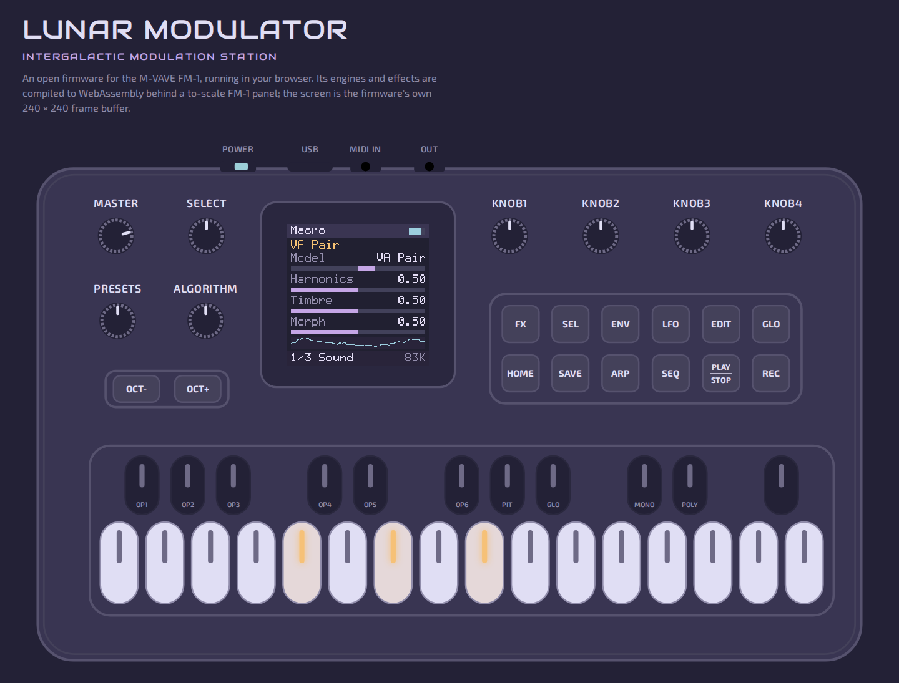
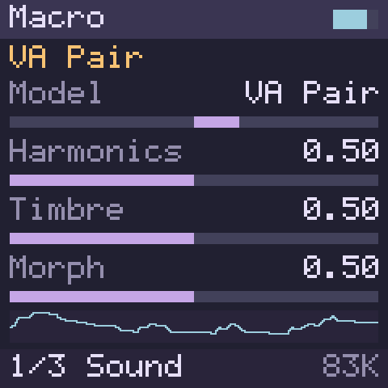
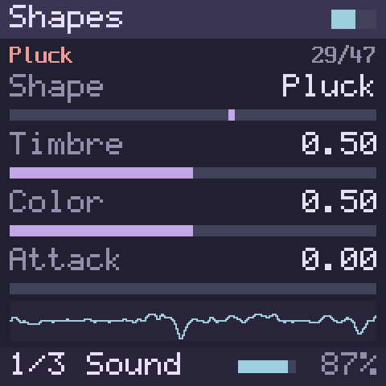
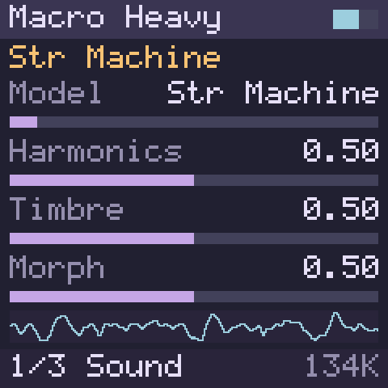
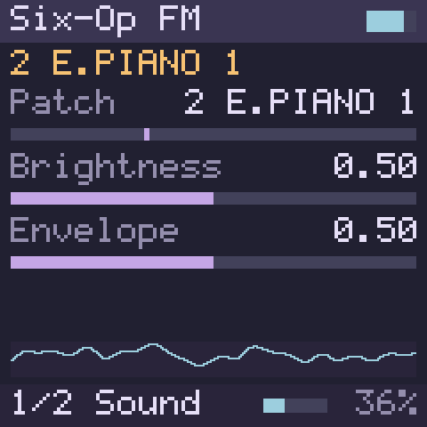
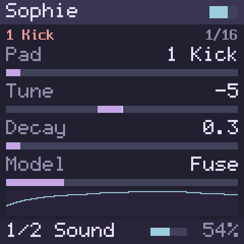
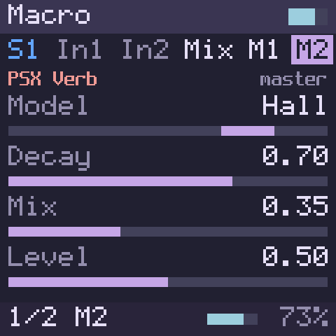
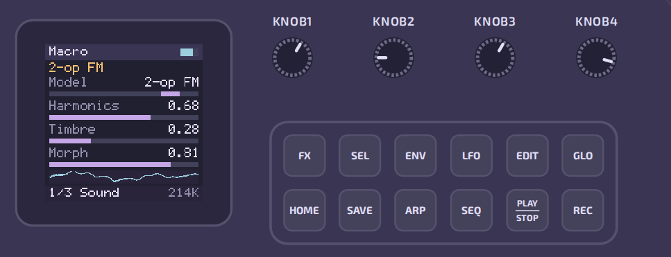
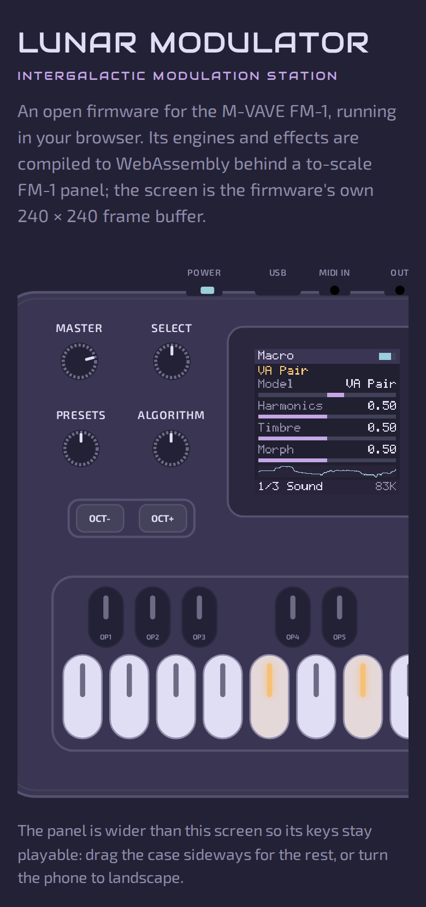

# Lunar Modulator


**INTERGALACTIC MODULATION STATION**

Lunar Modulator is open firmware for the M-VAVE FM-1, the compact,
battery-powered FM synthesizer from M-VAVE (Cuvave) with 27 keys, a 1.54"
colour screen, USB-C (MIDI and audio), BLE MIDI and a 3.5 mm MIDI input. It
is being built to turn the FM-1 into a multi-engine instrument:
- five sound engines with more than 160 models, shapes and patches between
  them;
- four effects;
- next, a step sequencer with parameter locks.



It is an independent project, not affiliated with or endorsed by M-VAVE,
Cuvave or any space agency.

> **Preview: not yet installable on an FM-1.**
> - Lunar Modulator runs today as a virtual FM-1 in your browser, with the
>   firmware's own screen and sound.
> - Before it can be installed, it has to run on a JieLi development kit;
>   nothing has run on a JieLi chip yet.
> - A full backup and a byte-identical restore of an FM-1's memory also
>   have to be proven, so that a unit that fails to start can be put back
>   ([Installing on your FM-1](#installing-on-your-fm-1)).
> - This project has never written anything to an FM-1.

*This page presents Lunar Modulator as a product: what it does, how to try
it, and what is coming. Everything technical lives in
[`DEVELOPERS.md`](DEVELOPERS.md): specifications, the hardware, how the
software works, the research behind it, where development stands, and how to
build, test and contribute.*

## Try it in your browser

Play it online at **<https://ip2k.github.io/lunar-modulator/>** and press
**Power on**. To run it from a copy of this repository instead, you need
Python 3 (the built module is included) and a current browser with
WebAssembly and AudioWorklet support:

```bash
cd sim/web/www && python3 -m http.server 8000
```

Open <http://localhost:8000/> and press **Power on**: browsers only start
audio after a click.
- The page needs `http://localhost` or `https://`. Opening `index.html` as a
  file does not work.
- It has been tested in Chromium only so far. Firefox, Safari, real touch
  screens and MIDI hardware are not tested yet.
- "Connect MIDI input" plays the synth from a MIDI keyboard, in browsers with
  Web MIDI. Without it, the panel and the computer keyboard still play.

**Controls.**

| Control | Mouse or touch | Computer keyboard |
| --- | --- | --- |
| Keys | Click or touch; lower on a key plays louder | `A` `S` `D` `F` `G` `H` `J` `K` `L` `;` `'` play the white keys F3 to B4, `W` `E` `R` `Y` `U` `O` `P` `[` the black ones |
| OCT− / OCT+ | Click | `Z` / `X`. Both together reset octave and transpose; hold one and turn ALGORITHM to transpose ±12 |
| SELECT | Drag up or down, or scroll | `←` `→`: the page, or in FX mode the slot and its pages |
| PRESETS | Drag or scroll | `↑` `↓`: the sound engine |
| ALGORITHM | Drag or scroll | `-` `=`: the engine's model (Model, Shape, Patch or Pad), or in FX mode the effect in the selected slot |
| KNOB1–4 | Drag or scroll | Tab to a knob, then the arrow keys: the four parameters on the screen |
| MASTER | Drag or scroll | Tab to it, then the arrow keys: the volume |
| FX, SEL, GLO, HOME | Click | Tab to a button, then Enter or Space. FX: the effect slots; SEL then SELECT: swap them; GLO: rate, block, RAM, voices, effects, octave and transpose; HOME: back to the sound |
| Everything | | `Esc` releases every note |

ENV, LFO, EDIT, SAVE, ARP, SEQ, PLAY/STOP and REC say "not in the
simulator yet": those features are on the [roadmap](#roadmap).
- The menus under the panel pick the sound and both effects directly.
- "Screen ×2" shows the screen enlarged.
- A MIDI keyboard plays notes, with pitch bend (±2 semitones), CC 7 (volume)
  and CC 123 (all notes off).

## What it does

Everything below runs today in the browser simulator, and the pictures are
its screen; none of it runs on an FM-1 yet.

### Sound engines

Five sound engines; PRESETS switches between them.
- **Macro:** eight models, 12 voices. Virtual analogue, phase distortion,
  terrain, chiptune, VA pair, waveshaper, 2-op FM and wavetable.
- **Shapes:** 47 classic digital oscillator shapes.
- **Macro Heavy:** 13 more models, 4 voices. String machine, chords, speech,
  modal, particle, three drums and more.
- **Six-Op FM:** a DX7-style engine with 96 patches and 8 voices.
- **Sophie:** a 16-pad FM drum kit.

Each engine shows its parameters four at a time, one per knob (KNOB1–4):
SELECT turns the page and ALGORITHM picks the model, shape, patch or pad.
The engines are built on Emilie Gillet's Mutable Instruments code and a
Schwung module ([Credits](#credits)).

<table>
<tr>
<td></td>
<td></td>
<td></td>
<td></td>
<td></td>
</tr>
<tr>
<td align="center">Macro</td>
<td align="center">Shapes</td>
<td align="center">Macro Heavy</td>
<td align="center">Six-Op FM</td>
<td align="center">Sophie</td>
</tr>
</table>

### Effects

Two effect slots follow any engine:
- **Plate**, a reverb;
- **Ensemble**, a chorus;
- **Diffuse**, a diffuser;
- **PSX Verb**, a reverb with several models.

FX shows the slots, SELECT moves between them and their pages, and
ALGORITHM picks the effect. SEL then SELECT swaps the two slots. A limiter
on the output keeps a full twelve-voice chord from clipping.



### The virtual FM-1

A to-scale drawing of the FM-1's front panel: the 27 keys, the 14 buttons
with their LEDs, MASTER and the seven encoders.
- The screen is the firmware's own 240 × 240 display.
- Turn KNOB1–4 and the four parameters on the screen follow.
- Play it with the mouse, a touch screen, the computer keyboard or a MIDI
  keyboard.
- On a phone the panel keeps playable key sizes and scrolls sideways; turned
  to landscape it fits whole.

 

### Sequencer (coming next)

A step sequencer whose design and logic follow Movy by megadake
([Credits](#credits)):
- **Tracks:** 4 to 8, each playing the synth or a USB-MIDI channel.
- **Per note:** velocity and length.
- **Per step:** probability, A:B conditions and chords.
- **Per clip:** playback speed (1/8× to 4×), transpose and quantise.
- **Parameter locks:** hold a step and turn a knob to change that step's
  sound.
- **Capture:** turns what you just played into a clip, without having
  pressed record.

Its core is built and tested. Bringing it to the panel and screen is the next
step.

## Roadmap

Nothing on this list installs on an FM-1 yet: everything on the device waits
on the first installable build ([Installing on your FM-1](#installing-on-your-fm-1)).
"The simulator" means the virtual FM-1 in your browser.

| Feature | Status | Where it stands |
| --- | --- | --- |
| Sound engines and effects | Available in the simulator | Five engines and four effects ([What it does](#what-it-does)). |
| Sequencer | In progress | The core is built and tested, Capture included. It comes to the simulator's panel and screen next. |
| Screen and controls refinement | In progress | Ongoing with each feature. All 287 of the simulator's screens pass a layout check. |
| Arpeggiator | Planned, design chosen | Our own arpeggiator, after Mutable Instruments' Yarns, with the extra note orders of MCL (MegaCommand Live): rhythm patterns and Euclidean rhythms, octave modes, ratchets, swing, latch, and chance settings that can repeat a variation. It takes the first MIDI-effect slot, so it plays alongside the sequencer, which the stock firmware cannot do [reported]. |
| MIDI effects (chords, scales, note echo, …) | Planned | A short chain of effects on each track, between the keys or the sequencer and the sound. The first set: transpose and note range, scale, chord, velocity, note echo and chance. They come to the simulator first. |
| LFOs, envelopes and a modulation matrix | Planned, design chosen | Two LFOs with tempo sync and trigger modes, two ADSR envelopes after Mutable Instruments' Peaks, and a 16-slot modulation matrix that reaches the engines' and effects' parameters. Per-note envelopes come later, for the engines that can take them. |
| More effects, including eurorack-style ones such as sample-and-hold | Planned | Sample-and-hold, smooth random and Turing-machine-style modulation sources come first, then a bitcrusher (sample-and-hold at audio rate), a random-stepped filter, a wavefolder and a chorus. A ping-pong echo and a beat-repeat follow once effects can keep the sequencer's tempo. On the FM-1, memory is the limit: one long echo or repeat at a time. |
| Installing on a real FM-1 | In preparation | Not installable yet. First, Lunar Modulator has to run on a JieLi development kit (on order), and a full backup and a byte-identical restore of an FM-1 have to be proven. It also needs its own installer and its own update service, so that an FM-1 running it can always go back to the stock firmware. The first installable build will be a small preview, offered first to owners who can already restore their own FM-1 ([below](#installing-on-your-fm-1)). |
| DX7 patches and SysEx, presets saved on the synth | Planned | Comes with the firmware for the FM-1 itself. |
| MIDI out over USB | Planned | The FM-1 already shows the computer a MIDI port that can send [verified]. On the device, this needs Lunar Modulator's own USB-MIDI driver. The simulator receives MIDI but sends none yet; that needs Web MIDI output. |
| MIDI out on the 3.5 mm jack | To be investigated | Probably not possible without a hardware change. M-VAVE's manual and Baud Girl's both call the jack an input [reported], and on the board it appears to feed only the input circuit [inferred]. A measurement on an opened FM-1 will settle it. |
| BLE MIDI | To be investigated | A stock feature, built on JieLi's closed Bluetooth libraries. Lunar Modulator could keep it in builds that use those libraries. Its memory cost is not measured yet, and the first preview will not have it. |
| The FM-1's second CPU core | To be tried on the development kit | The stock firmware appears to play its synth voices on the second core already [inferred, from its code]. Whether Lunar Modulator can do the same will be tried on the development kit. It could make room for more voices and effects. |
| Develop in the simulator, checked on real hardware | In preparation | New sounds and effects are written, heard and tested in the browser simulator first, with no synth at risk. The same code is then checked on the JieLi development kit (on order) and, once a safe restore is proven, on an FM-1, so that what the simulator plays is what the synth plays. |
| A module SDK and friendly guides | Planned | Inviting, easy documentation and a software kit for writing new modules (sound engines, modulation sources, MIDI effects, audio effects) or porting existing ones, as Mutable Instruments' and Schwung's code was ported here. Every new module gets automatic tests and quality checks. Which tools make this easiest, PlatformIO or whatever embedded-audio developers use most today, is to be researched. |
| A custom firmware builder with a browser installer | Planned | If there are more modules than fit in one firmware image, a builder lets you choose what goes into yours. The aim is for it to run in the browser and install with a web flasher, as Baud Girl's FM-1+VA installer does [reported]. It would check every file and checksum before writing, and always keep a way back to the factory firmware. |
| A catalogue of community modules | Planned | A hosted catalogue of modules made by the community: sound engines, modulation sources, MIDI effects, audio effects and any other kind. Each lists what it needs and passes the same checks as the built-in modules. It comes after the module SDK and the builder. |

The detail behind each line is in
[`DEVELOPERS.md`](DEVELOPERS.md#the-roadmap-in-detail), with
[the path to an installable build](DEVELOPERS.md#the-path-to-an-installable-build).

## Installing on your FM-1

**Not yet.** Two things have to happen first.
- **Lunar Modulator has to run on the FM-1's chip.** So far it runs on
  desktops and in the browser. The first JieLi build will be on a JieLi
  development kit.
- **A safe way back has to be proven.** The FM-1 has one copy of its firmware
  and no recovery button, so a bad install could leave a synth that does not
  start. Before Lunar Modulator offers an install, it must be shown that the
  FM-1's memory can be backed up in full and restored byte for byte.
  - That goes through the chip's USB download mode. Two other FM-1 owners
    report reaching it with a small Raspberry Pi Pico adapter, and one
    reports backing up and writing firmware that way
    ([issue #2](https://github.com/ip2k/lunar-modulator/issues/2)).
  - This project will check it first on the development kit, then on an
    FM-1.

Once both are done, the plan is for Lunar Modulator to install over USB
through the FM-1's own update path, as other third-party firmware already
does.
- It will come with its own installer, and it will answer the FM-1's update
  requests itself, so that a unit running it can always go back to the stock
  firmware.
- The first installable build will be a small preview, offered first to
  owners who can already back up and restore their own FM-1.

[`DEVELOPERS.md`](DEVELOPERS.md#the-path-to-an-installable-build) explains
the plan and the rules this project follows until then.

## Documentation

- **[The user manual](https://ip2k.github.io/lunar-modulator/manual/):**
  every control, engine and effect, the sequencer, and the road to the
  device, with a PDF. Its source is [`manual/`](manual/).
- [`DEVELOPERS.md`](DEVELOPERS.md): where development stands, how the
  firmware works, the hardware, and building and testing.
- [`docs/`](docs/): the research documents, listed in the
  [repository map](#repository-map).
- [`sim/web/README.md`](sim/web/README.md): the browser simulator in detail.
- [`CHANGELOG.md`](CHANGELOG.md): what changed.

## Credits

This is a synthesis of other people's work. The details are in
[`docs/04-prior-art.md`](docs/04-prior-art.md) and in each
`engines/third_party/*/UPSTREAM.md`.

**FM-1 research and recovery**

- **aroum**: updater analysis and teardown photos.
- **AL-255**: firmware disassembly, protocol captures, the safety analysis
  behind this project's one rule, and experimental firmware (WTFPL).
- **Echomatter**: in AL-255's
  [PR #2](https://github.com/AL-255/FM-1-RE/pull/2), installed a
  version-bumped V15 package on an FM-1 and rolled it back (2026-09-04). It is
  the first non-stock install we know of.
- **Baud Girl** ([FM-1+VA](https://baudgirl.com/work/FM-1+VA)): the first
  third-party FM-1 firmware that owners install, and the hardware
  measurements behind [docs/03](docs/03-update-protocol.md) §5. From them we
  learned [reported]:
  - The stock updater's first step only refuses the version already running,
    and package content is not authenticated. So a rebuilt package with a new
    version number installs.
  - The OTA loader can rewrite the flash head (`uboot.boot`,
    `isd_config.ini`). That makes keeping it byte-identical to V15 a
    bootloader-safety rule (docs/07 §4 rule 2), not just caution.
  - An install interrupted after the first step can be resumed: the synth
    stays in its loader (`ota-FM-1`) across power cycles.
  - Their install page reports testing builds on a private FM-1 emulator.

  Their `FM-1_092` package also showed us that a package with a moved
  partition table installs and runs [verified here]. Their manual filled in
  port names and control details for docs/01 and docs/03. FM-1+VA is closed
  source, and nothing of it is used or redistributed here. The owner's unit
  runs it (`FM-1_092`).
- **czietz** and **masanaohayashi**, in
  [issue #2](https://github.com/ip2k/lunar-modulator/issues/2): czietz's
  Raspberry Pi Pico `USB_KEY` dongle, and masanaohayashi's report of using it
  to back up and write an FM-1's firmware. Theirs are the first reports we
  know of that the FM-1's mask-ROM download mode can be reached through its
  USB-C port. From them we learned [reported]:
  - the key's clock line is D+;
  - moving the cable from the dongle to the PC works as the hand-over;
  - the ROM may listen for the key only briefly after power-up [inferred].

  Checking our dongle against their tool also turned up a wiring bug in ours,
  fixed before anyone built it ([docs/10](docs/10-usb-key-dongle.md) §1.1).
- **kagaimiq**: JieLi documentation and tools (jielie, jl-uboot-tool,
  jl-misctools, ghidra-jieli).
- **probonopd**: SMK-37 Pro notes.

**Code and sound**

- **Emilie Gillet** (Mutable Instruments): the Plaits, Braids, Rings and
  stmlib code (MIT). It powers the Macro, Macro Heavy, Six-Op FM and Shapes
  engines and the Plate, Ensemble and Diffuse effects.
- **Charles Vestal** for Schwung and its PSX Verb module, and **Matt Estela**
  for the Sophie drum module (MIT).
- Sequencer design and logic after Movy by **megadake** (MIT),
  [github.com/DimaDake/schwung-movy](https://github.com/DimaDake/schwung-movy).
- Google's music-synthesizer-for-android and the Dexed / Synth_Dexed /
  MiniDexed lineage, the engine of the stock firmware.

**The look**

- The Rosé Pine palette (MIT).
- The Audiowide typeface by Astigmatic (SIL OFL 1.1).
- The Exo 2 typeface by Natanael Gama (SIL OFL 1.1).

Vendor firmware images and Baud Girl's packages are not redistributed here;
see the sources.

## License

MIT for the contents of this repository. Third-party material keeps its own
license as noted where it is referenced.

## Repository map

| Path | What it is |
| --- | --- |
| [`DEVELOPERS.md`](DEVELOPERS.md) | For contributors: where development stands, how the firmware works, the hardware, building and testing, the project's rules |
| [`manual/`](manual/), [`tools/manual/`](tools/manual/) | The user manual: chapters in Markdown, a Rosé Pine Dawn theme, and the build that generates its reference from the code and publishes it to GitHub Pages |
| [`sim/web/`](sim/web/) | The browser simulator: the firmware's app layer, its WebAssembly build, the page and its tests |
| [`assets/`](assets/) | The branding art (`assets/branding/`) and the README's screenshots (`assets/screenshots/`) |
| [`CHANGELOG.md`](CHANGELOG.md), [`HANDOFF.md`](HANDOFF.md) | What changed, and the context summary for whoever picks the work up next |
| [`docs/01-hardware.md`](docs/01-hardware.md) | SoC, memory, board, connectors, what is still unknown |
| [`docs/02-stock-firmware.md`](docs/02-stock-firmware.md) | Package format, boot chain, what the stock app is made of, the msfa finding |
| [`docs/03-update-protocol.md`](docs/03-update-protocol.md) | The SysEx update protocol and its step-1 version gate |
| [`docs/04-prior-art.md`](docs/04-prior-art.md) | Every project, SDK, tool and thread this work stands on |
| [`docs/05-open-source-feasibility.md`](docs/05-open-source-feasibility.md) | What "open firmware" can mean here, the blockers, the verdict |
| [`docs/06-movy-and-schwung.md`](docs/06-movy-and-schwung.md) | Why Movy cannot be ported and what to take from it anyway |
| [`docs/07-recovery-and-risk.md`](docs/07-recovery-and-risk.md) | Recovery paths, risk register, rules of engagement |
| [`docs/08-roadmap.md`](docs/08-roadmap.md) | Phased plan with exit criteria |
| [`docs/09-first-session-checklist.md`](docs/09-first-session-checklist.md) | Exact commands for the first hands-on session |
| [`docs/10-usb-key-dongle.md`](docs/10-usb-key-dongle.md) | The RP2040 `USB_KEY` dongle: protocol, hardware, firmware, bench procedure |
| [`docs/11-plugin-platform.md`](docs/11-plugin-platform.md) | Feasibility of a Schwung-style engine/plugin platform: Schwung module compatibility, Mutable Instruments engines, loader design |
| [`docs/12-sequencer.md`](docs/12-sequencer.md) | Feasibility of an Elektron-style sequencer with per-step parameter locks: semantics, prior art and licences (Movy, MCL, Eloquencer, LMN-3, …), data model, timing, controls, staged plan |
| [`docs/13-movy-port.md`](docs/13-movy-port.md) | Port plan for replicating Movy's sequencer on the FM-1: exact semantics, mapping to the FM-1's controls, memory and CPU, a C99 no-heap core, tests, staged plan |
| [`docs/14-verification-ladder.md`](docs/14-verification-ladder.md) | The verification ladder: how to show 1:1 behaviour from the desktop renderer and the browser to the AC79 dev kit and then the FM-1 — tolerance classes, a ladder build profile, FPU probes, the first week with the kit |
| [`dongle/`](dongle/) | Dongle firmware (PIO + C), ROM/dongle simulator, tests |
| [`tools/check_msfa_table.py`](tools/check_msfa_table.py) | Finds the msfa algorithm table in an `app.bin` (tested on V13 and V14) |
| [`tools/extract_fwsc_from_updater.py`](tools/extract_fwsc_from_updater.py) | Carves the embedded `.fwsc` out of an M-UPGRADE updater binary (verified on the macOS DMG) |
| [`tools/fm1_identify.py`](tools/fm1_identify.py) | Read-only identity query with decoder, any OS via mido (verified on hardware 2026-09-06) |
| [`tools/fm1_identify.sh`](tools/fm1_identify.sh) | Read-only SysEx identity query via ALSA `amidi` (untested on hardware) |
| [`notes/2026-09-06-bench.md`](notes/2026-09-06-bench.md) | Bench session 1: USB descriptors, identity reply, MIDI probes, V14 vs V15 |
| [`tests/`](tests/), [`.github/workflows/ci.yml`](.github/workflows/ci.yml) | pytest suite (tools, PIO emulation, dongle/ROM co-simulation, the engines and their reference renders, the sequencer and its Movy oracle fixtures, the virtual FM-1) and CI: tests on Linux/macOS, 32-bit and ASan + UBSan builds of the engines, sequencer and virtual FM-1, the RP2040 UF2 build, AL-255's suite on our fork |
| [`notes/2026-09-06-research-log.md`](notes/2026-09-06-research-log.md) | What was checked, what was blocked, where the numbers come from |
| [`notes/2026-09-29-baudgirl-fm1va-and-pcb-photos.md`](notes/2026-09-29-baudgirl-fm1va-and-pcb-photos.md) | Baud Girl's FM-1+VA, its `FM-1_092` package diffed against V15, and the owner's board photos |
| [`photos/`](photos/) | The owner's photos of their unit, by date, with the crops the notes cite |
| [`engines/`](engines/) | The engine platform, stage A: the C engine API, sound engines and effects from Mutable Instruments code, a Schwung module shim, a desktop renderer and tests |
| [`tools/movy-oracle/`](tools/movy-oracle/) | The Movy oracle: a driver for Movy's own `seq-core`, run in containers on the LAN, plus a random script generator; it produced the golden fixtures the sequencer tests use |
| [`notes/upstream-candidates.md`](notes/upstream-candidates.md) | Findings worth sending to other projects, none posted yet |
