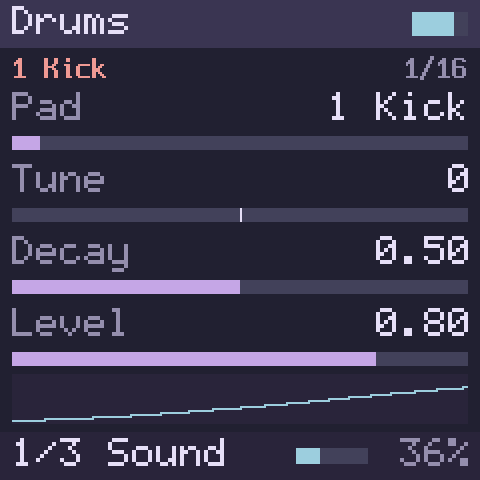
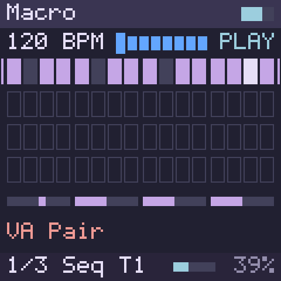
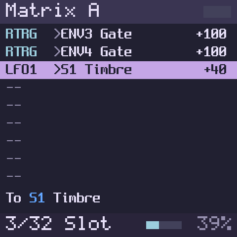

# 🌑🛰️ Lunar Modulator


**INTERGALACTIC MODULATION STATION**

Lunar Modulator is open alternative firmware for the M-VAVE FM-1, the compact, low-cost,
battery-powered FM synthesizer from M-VAVE (AKA Cuvave).
**Current Status**: Active development, runs on the included in-browser simulator only for now.

Play with the latest firmware in your browser: **<https://ip2k.github.io/lunar-modulator/>** 


## Project Goals
- Make the FM-1 the greatest sub-$100 electronic music toy available for curious folks of all ages and skill levels. Learn every part of the stack, from EE to software to synthesis to music.
- Build a legitimately useful and useable instrument that cares about the user experience...and having fun.
- Turn the FM-1 into a modular multi-engine groovebox with a nice sequencer (goal: [schwung-movy compatibility](https://github.com/DimaDake/schwung-movy) )
- Build on the shoulders of giants who have done much of the hard DSP work in this space already -- borrow and port anything awesome that we can fit
- Unlock the full hardware capabilities of the FM-1 (BLE MIDI IO, MIDI over USB, full use of both cores, etc)
- Modular base to allow all types of expansion -- new sound engines, routable modulators and effects, MIDI effects, filters, and more.
- Orbital Dock: Web-based community module marketplace and custom firmware builder + flasher -- pick the engines, modules, sound banks, and presets you want. Remix and share your creations and recipes.
- Make it nice to use and enjoyable to look at

It is an independent project, not affiliated with or endorsed by M-VAVE,
Cuvave or any space agency.
## Why Can't I Flash This Yet?
> **Preview: not yet installable on an FM-1.**
> - Lunar Modulator runs today as a virtual FM-1 in your browser, with the
>   firmware's own screen and sound.
> - Before it can be installed, it has to run on a JieLi development kit;
>   nothing has run on a JieLi chip yet.
> - A full backup and a byte-identical restore of an FM-1's memory also
>   have to be proven, so that a unit that fails to start can be put back
>   ([Installing on your FM-1](#installing-on-your-fm-1)).
> - This project has never written anything to an FM-1.

## Try it in your browser

Open **<https://ip2k.github.io/lunar-modulator/>** and press **Power on**
(browsers only start sound after a click). Then:
- play the keys, with the mouse, a touch screen, the computer keyboard or a
  MIDI keyboard;
- press **Space** to hear the demo pattern;
- turn the knobs and watch the screen follow.

It needs a current browser with WebAssembly and AudioWorklet, and has been
tested only in Chromium, the engine behind Chrome and Edge, so far: Firefox,
Safari, real touch screens and MIDI hardware are not tested yet. The page
loads only its own files and sends nothing anywhere.

To run it from your own copy of this repository you need Python 3 (the
built module is included):

```bash
cd sim/web/www && python3 -m http.server 8000
```

Then open <http://localhost:8000/>. Opening `index.html` as a file does not
work.

### Controls

Drag a knob up or down, or scroll over it. Click or touch a button or a key.

| Control | What it does | Computer keyboard |
| --- | --- | --- |
| Keys | Play notes; lower on a key plays louder. With Sophie or Drums, the 16 white keys play the kit's 16 pads. In SEQ mode, the white keys are the 16 steps. SHIFT (hold SEL) with the black keys MONO or POLY sets the sound's Voice Mode | `A` `S` `D` `F` `G` `H` `J` `K` `L` `;` `'` are the white keys F3 to B4, `W` `E` `R` `Y` `U` `O` `P` `[` the black ones. In SEQ mode, `1` to `8` and `C` `V` `B` `N` `M` `,` `.` `/` are steps 1 to 16 |
| OCT− / OCT+ | An octave down or up. Both together reset octave and transpose; hold one and turn ALGORITHM to transpose ±12 | `Z` / `X` |
| SELECT | The page; in FX mode, the slot and its pages | `←` `→` |
| PRESETS | The current sound's engine. With SEL held, which of the four sounds you play | `↑` `↓` |
| ALGORITHM | The engine's model, shape, patch or pad; in FX mode, the effect in the slot | `-` `=` |
| KNOB1–4 | The four parameters on the screen | `Tab` to a knob, then the arrow keys |
| MASTER | The volume | `Tab` to it, then the arrow keys |
| FX | The effect chain. SEL then SELECT swaps two effects | `Tab` to a button, then `Enter` or `Space`, for every button |
| SEL | SHIFT for the sequencer and for choosing a sound; in FX mode it picks up an effect | `Shift`, in SEQ mode |
| SEQ, PLAY/STOP, REC | The sequencer's steps; start and stop; record, and with SEL, Capture | `Space` is PLAY/STOP |
| LFO, ENV, EDIT | The modulation rack and the matrix. Hold LFO or ENV and turn a knob to run a cable to that knob's parameter | |
| GLO, HOME | The global page (rate, memory, voices, octave) and, on its second page, the project key; back to the sound | |
| ARP | The arpeggiator on the current sound: tap to switch it on (its pages open) or off, hold to latch; with SEL, its pages | |
| SAVE | Not in the simulator yet | |
| Everything | | `Esc` releases every note |

Under the panel:
- **Sound (PRESETS)** picks the current sound's engine, and **Effect 1** and
  **Effect 2** the two master effects.
- **Connect MIDI input** plays it from a MIDI keyboard, in browsers with Web
  MIDI: notes with velocity, pitch bend (±2 semitones), CC 7 (volume) and
  CC 123 (all notes off). It sends no MIDI yet.
- **Screen ×2** shows the screen enlarged.

## What it does

Everything below runs today in the browser simulator, and the pictures are
its screen. None of it runs on an FM-1 yet.

### Sound engines

Seven sound engines, plus Test Sine for testing. PRESETS picks one,
ALGORITHM steps through its models, shapes, patches or pads, and KNOB1–4
play its parameters, four to a page (SELECT turns the page).
- **Macro:** eight synths in one, 12 voices: virtual analogue with a filter,
  phase distortion, wave terrain, chiptune, an analogue pair, a waveshaper,
  2-op FM and wavetable.
- **Macro Heavy:** the bigger models, 4 voices: string machine, chords,
  speech, formants, additive, a swarm, filtered noise, particles, a modelled
  string, a modal resonator and three drums.
- **Six-Op FM:** six-operator FM with 96 patches, 8 voices.
- **FM6:** six-operator FM that plays DX7 voices, 12 voices. It comes with
  32 voices of its own, has 32 slots for yours, and four macros (Brightness,
  Env Time, Feedback, Volume) that shape any voice while it plays.
- **Shapes:** 47 classic digital oscillator shapes, from analogue waves to
  plucked, bowed and blown models, bells and granular textures.
- **Sophie:** a 16-pad metallic FM percussion kit.
- **Drums:** a 16-pad drum kit after the classic analogue drum machines,
  with two kits, Deep and Punch: a kick, two snares, a clap, a rim shot,
  three hi-hats, six toms, a crash and a ride, and any pad can play a
  cowbell instead. The hi-hats cut each other off, any pads can share a
  choke group, and one knob sets the whole kit's decay.

Sophie and Drums play their pads from the 16 white keys, at any octave.

<table>
<tr>
<td></td>
<td></td>
<td></td>
</tr>
<tr>
<td align="center">Macro</td>
<td align="center">Macro Heavy</td>
<td align="center">Six-Op FM</td>
</tr>
<tr>
<td></td>
<td></td>
<td></td>
</tr>
<tr>
<td align="center">Shapes</td>
<td align="center">Sophie</td>
<td align="center">Drums</td>
</tr>
</table>

### Four sounds and twenty-two effects

- Up to **four sounds** play at once, each with its own engine and **two
  insert effects**. Hold SEL and turn PRESETS to pick the one you play.
- The four are mixed, each at its own level, and the mix goes through **two
  master effects**, then a limiter that keeps a full chord from clipping.
- **FX** shows the chain: S1 In1 In2 Mix M1 M2. The **Mix** page sets each
  sound's level.
- A **memory meter** at the bottom of the screen shows how much of the
  FM-1's memory it all takes. Anything that would not fit is refused, so
  the simulator never plays more than the FM-1's memory could hold.

The effects:
- **Reverbs:** Plate and Hall (both with Freeze), Room and PSX Verb.
- **Chorus, space and delay:** Ensemble, Diffuse and Echo, a stereo
  ping-pong delay.
- **Filters and EQ:** Filter (six classic types), Comb, DJ Filter, Tilt,
  Isolator (a three-band kill EQ) and EQ (a low shelf, a bell and a high
  shelf).
- **Grit and colour:** Drive, Crush (bits and sample rate), Fold (a
  wavefolder) and Master Sat.
- **Dynamics:** Comp; Limiter, with a gentle Round mode; Gate, a noise gate
  that can also duck; Squash, three small compressors with characters of
  their own (Snap, Mu and Split; Mu keeps most of its loudness as you turn
  it up); and Transient, a transient shaper.

Knobs for cutoffs, delay times, releases and other frequencies and times
turn in even musical steps, about a semitone per click on a cutoff.


### Sequencer

A step sequencer whose design follows Movy by megadake
([Credits](#credits)):
- **Eight tracks**, each playing one of the four sounds, with mute.
- **Step entry:** press SEQ and the 16 white keys are the bar's 16 steps.
  Tap to add or remove notes, hold a step to edit it.
- **Parameter locks:** hold a step and turn a knob to change that step's
  sound.
- **Conditions and probability** on each step, swing and quantise.
- **Recording** with a count-in and a metronome, **step recording**, and
  **Capture**, which keeps what you just played even if you were not
  recording.

It starts with a one-bar demo pattern: press PLAY/STOP, or Space. Clips,
scenes and songs run in the desktop tools so far.



### Arpeggiator

Our own arpeggiator, after Mutable Instruments' Yarns with the note orders of
MCL (MegaCommand Live) and the repeatable chances of Super Arp
([Credits](#credits)):
- **ARP** switches it on for the current sound; held, it **latches**, so the
  notes play on after you let go.
- **22 note orders**, 1 to 4 octaves, rates from 1/32 triplets to whole
  notes, gate, swing, 22 rhythm patterns or a Euclidean rhythm, ratchets,
  chance, velocity spread and a seed that repeats a variation, on seven
  pages.
- **The stock FM-1's modes** (Up, Down, Up/Down, Down/Up, Random, Played) as
  presets on ALGORITHM.
- It plays the keys, MIDI and the sequencer's notes, in time with the
  sequencer and on its beat while it plays, and the sequencer records what
  you played, so a recorded part arpeggiates again on playback. Stop takes
  back the sequencer's notes and leaves the ones you latched by hand
  playing. The stock firmware runs either its arpeggiator or its sequencer,
  not both [reported].

### Modulation

- A **rack** of up to eight modules (LFOs, envelopes, random sources and
  thirteen more kinds, such as a function generator, a bouncing ball, a
  Turing-style register and a quantizer) and up to **32 cables** to any
  sound's or effect's parameters, the pitch and level, or another module.
- **The gesture:** hold LFO or ENV and turn a knob, and a cable runs to that
  parameter, its depth following your turn.
- **EDIT** opens the **matrix**, the list of cables: amount, offset, a second
  source that scales the depth, curves and polarity.
- Cables can also come from the notes (velocity, pitch, gate) and from the
  sequencer (its clock, beats, bars and each track's notes).
- A modulated parameter shows a gold diamond, its range and a red tick that
  moves as you listen.

The rack starts with two LFOs, two envelopes that every note restarts, and a
random source.



### The virtual FM-1

A to-scale drawing of the FM-1's front panel: the 27 keys, the 14 buttons
with their lights, MASTER and the seven encoders.
- The screen is the firmware's own 240 × 240 display.
- Turn KNOB1–4 and the four parameters on the screen follow.
- On a phone the panel keeps playable key sizes and scrolls sideways; turned
  to landscape it fits whole.

 

## Roadmap

Nothing on this list installs on an FM-1 yet: everything on the device waits
for the first installable build
([Installing on your FM-1](#installing-on-your-fm-1)).

**Done, in the simulator**
- Seven sound engines, four sounds at once, two inserts each, two master
  effects and the memory meter.
- Twenty-two effects, among them the new dynamics: Squash, Transient and
  the Limiter's Round mode.
- The sequencer: eight tracks, steps, locks, conditions, recording,
  Capture and the metronome.
- Modulation: the rack, sixteen kinds of module, the matrix, the gesture
  and per-voice modulation (each note its own envelope, for example).
- The arpeggiator, with the stock modes as presets, alongside the
  sequencer.
- **Glide:** on Macro, Macro Heavy, Six-Op FM, FM6 and Shapes, notes slide
  only when they overlap (legato) or always, as the stock FM-1's
  portamento does, in a set time or at a set speed per octave; Mono and
  Legato play one voice, and SHIFT with MONO or POLY switches.
- **Lighter effects:** EQ, Isolator and Master Sat take almost no
  processing time when left at their neutral settings, and stay ready
  whenever a lock or a modulation cable drives them.
- FM6 loads your own DX7 voices from SysEx files, in the desktop tools.

**In progress**
- **Your DX7 voices in the browser:** a file picker that loads SysEx into
  FM6, and FM6 taking less memory.
- **A fix for Shapes:** a few shapes at the far ends of their settings (Wave
  Line, Comb, Flute, the filter and Sync shapes) will sound the same on
  every build.

**Next**
- **A master chain:** four master slots in order, and shared send reverb and
  delay.
- **Side-chain:** Gate and Comp listening to another sound, the master or a
  trigger from the matrix, for ducking and gating.
- **Tempo delays:** echoes in time with the sequencer, tape, taps, beat
  repeat, smear and pitch.
- **Per-voice filters** in Macro and Shapes, and later a subtractive engine.
- **Sets in the browser and Web MIDI:** save and load your sets (also as
  files), follow a MIDI clock, and send MIDI if you choose to.
- **More MIDI effects:** chords, scales, note echo and chance, in the three
  MIDI-effect slots each track has after the arpeggiator.
- **Later:** more engines and effects, such as resonator engines after Rings
  and Elements, granular textures after Clouds, and shimmer and classic
  reverbs.

**On the FM-1 itself**
- **Installing on a real FM-1:** in preparation
  ([below](#installing-on-your-fm-1)).
- **Develop in the simulator, check on hardware:** new sounds and effects
  are written and heard in the simulator, then checked on a JieLi
  development kit and, once a safe restore is proven, on an FM-1, so that
  what the simulator plays is what the synth plays.
- **Sounds and patterns saved on the synth.**
- **MIDI out over USB.** The FM-1 already shows the computer a MIDI port
  that can send [verified]; it needs Lunar Modulator's own USB-MIDI driver.
- **To be investigated:** MIDI out on the 3.5 mm jack (probably not without
  a hardware change: M-VAVE's and Baud Girl's manuals call it an input, and
  the community firmware reads it as one [reported]), BLE MIDI,
  and the FM-1's second CPU core, which could make room for more voices and
  effects.

**Orbital Dock**
- **A module SDK** with friendly guides, for writing new modules (sound
  engines, modulators, MIDI effects, audio effects) or porting existing
  ones, as Mutable Instruments' and Schwung's code was ported here. Every
  module gets automatic tests.
- **A firmware builder in the browser:** pick the engines, modules, sound
  banks and presets you want, and install them with a web flasher that
  checks every file before writing and always keeps a way back to the
  factory firmware.
- **A community catalogue** to share modules, presets and recipes, each
  passing the same checks as the built-in ones.

The detail behind each line is in
[`DEVELOPERS.md`](DEVELOPERS.md#the-roadmap-in-detail), with
[the path to an installable build](DEVELOPERS.md#the-path-to-an-installable-build).

## Installing on your FM-1

**Not yet.** Two things have to happen first.
- **Lunar Modulator has to run on the FM-1's chip.** Today it runs on
  computers and in the browser. It already compiles for the FM-1's
  processor with JieLi's tools, but it has not run on a JieLi chip. A JieLi
  development kit is on order, and it runs there first.
- **A safe way back has to be proven.** The FM-1 keeps one copy of its
  firmware and has no recovery button, so a bad install could leave a synth
  that does not start. Before Lunar Modulator offers an install, it must be
  shown that an FM-1's memory can be backed up in full and restored byte for
  byte.
  - That goes through the chip's USB recovery mode. Two other FM-1 owners
    report reaching it with a small Raspberry Pi Pico adapter, and one
    reports backing up and writing firmware that way
    ([issue #2](https://github.com/ip2k/lunar-modulator/issues/2)).
  - This project will check it on the development kit first, then on an
    FM-1. A way into that mode without an adapter is being studied too;
    nothing has been sent to an FM-1 for it.

Once both are done, the plan is for Lunar Modulator to install over USB
through the FM-1's own update path, as other third-party firmware already
does.
- It will come with its own installer, and it will answer the FM-1's update
  requests itself, so that a unit running it can always go back to the stock
  firmware.
- The first installable build will be a small preview, offered first to
  owners who can already back up and restore their own FM-1.

Chapter 11 of the manual,
[Updating and recovery](https://ip2k.github.io/lunar-modulator/manual/11-updating-and-recovery.html),
explains it for players, and
[`DEVELOPERS.md`](DEVELOPERS.md#the-path-to-an-installable-build) the plan
and the rules this project follows until then.

## Documentation

**[The user manual](https://ip2k.github.io/lunar-modulator/manual/)**, also
as a [PDF](https://ip2k.github.io/lunar-modulator/manual/lunar-modulator-manual.pdf);
its source is [`manual/`](manual/).
1. [Welcome and safety](https://ip2k.github.io/lunar-modulator/manual/01-welcome-and-safety.html)
2. [Getting started](https://ip2k.github.io/lunar-modulator/manual/02-getting-started.html)
3. [Panel tour](https://ip2k.github.io/lunar-modulator/manual/03-panel-tour.html)
4. [Playing](https://ip2k.github.io/lunar-modulator/manual/04-playing.html)
5. [Sound engines](https://ip2k.github.io/lunar-modulator/manual/05-sound-engines.html)
6. [Effects](https://ip2k.github.io/lunar-modulator/manual/06-effects.html)
7. [Sequencer](https://ip2k.github.io/lunar-modulator/manual/07-sequencer.html)
8. [Modulation](https://ip2k.github.io/lunar-modulator/manual/08-modulation.html)
9. [MIDI](https://ip2k.github.io/lunar-modulator/manual/09-midi.html)
10. [Settings and storage](https://ip2k.github.io/lunar-modulator/manual/10-settings-and-storage.html)
11. [Updating and recovery](https://ip2k.github.io/lunar-modulator/manual/11-updating-and-recovery.html)
12. [Troubleshooting](https://ip2k.github.io/lunar-modulator/manual/12-troubleshooting.html)
13. [Specifications](https://ip2k.github.io/lunar-modulator/manual/13-specifications.html)
14. [Credits and licences](https://ip2k.github.io/lunar-modulator/manual/14-credits-and-licences.html)

Plus a [glossary](https://ip2k.github.io/lunar-modulator/manual/glossary.html)
and an [index of controls](https://ip2k.github.io/lunar-modulator/manual/index-of-controls.html).

For developers:
- [`DEVELOPERS.md`](DEVELOPERS.md): where development stands, how the
  firmware works, the hardware, and building, testing and contributing.
- [`engines/README.md`](engines/README.md): the engines, effects and
  modulation modules, and the engine API.
- [`sim/web/README.md`](sim/web/README.md): the browser simulator in detail.
- [`docs/`](docs/): the research documents, listed in the
  [repository map](#repository-map).
- [`CHANGELOG.md`](CHANGELOG.md): what changed.

## Credits

This is a synthesis of other people's work. The details are in
[chapter 14 of the manual](https://ip2k.github.io/lunar-modulator/manual/14-credits-and-licences.html),
[`docs/04-prior-art.md`](docs/04-prior-art.md) and each
`engines/third_party/*/UPSTREAM.md`.

**FM-1 research and recovery**

- **aroum**: updater analysis and teardown photos.
- **AL-255**: firmware disassembly, protocol captures, the safety analysis
  behind this project's one rule, and experimental firmware (WTFPL).
- **Echomatter**: in AL-255's
  [PR #2](https://github.com/AL-255/FM-1-RE/pull/2), installed a
  version-bumped V15 package on an FM-1 and rolled it back (2026-09-04). It is
  the first non-stock install we know of.
- **Baud Girl** ([FM-1+VA](https://baudgirl.com/work/FM-1+VA)): the first
  third-party FM-1 firmware that owners install, and the hardware
  measurements behind [docs/03](docs/03-update-protocol.md) §5. From them we
  learned [reported]:
  - The stock updater's first step only refuses the version already running,
    and package content is not authenticated. So a rebuilt package with a new
    version number installs.
  - The OTA loader can rewrite the flash head (`uboot.boot`,
    `isd_config.ini`). That makes keeping it byte-identical to V15 a
    bootloader-safety rule (docs/07 §4 rule 2), not just caution.
  - An install interrupted after the first step can be resumed: the synth
    stays in its loader (`ota-FM-1`) across power cycles.
  - Their install page reports testing builds on a private FM-1 emulator.

  Their `FM-1_092` package also showed us that a package with a moved
  partition table installs and runs [verified here]. Their manual filled in
  port names and control details for docs/01 and docs/03. FM-1+VA is closed
  source, and nothing of it is used or redistributed here. The owner's unit
  runs it (`FM-1_092`).
- **czietz** and **masanaohayashi**, in
  [issue #2](https://github.com/ip2k/lunar-modulator/issues/2): czietz's
  Raspberry Pi Pico `USB_KEY` dongle, and masanaohayashi's report of using it
  to back up and write an FM-1's firmware. Theirs are the first reports we
  know of that the FM-1's mask-ROM download mode can be reached through its
  USB-C port. From them we learned [reported]:
  - the key's clock line is D+;
  - moving the cable from the dongle to the PC works as the hand-over;
  - the ROM may listen for the key only briefly after power-up [inferred].

  Checking our dongle against their tool also turned up a wiring bug in ours,
  fixed before anyone built it ([docs/10](docs/10-usb-key-dongle.md) §1.1).
- **hugelton** (Felucca), **isod89** (SLOOP), **Keitark** (fm1-nes) and
  **kurogedelic** (FM-1-transporter): open firmware and tools that run on
  FM-1s. Their reports of how the board reads its keys and knobs, where its
  audio goes and how its recovery mode is reached inform this project's
  plans ([`notes/2026-10-05-community-repos.md`](notes/2026-10-05-community-repos.md)).
  - fm1-nes's `boot_info` bridge (Apache-2.0) is included, and its boot
    audit is the model for ours.
  - Felucca's `fm6_core.c` by Leo Kuroshita (Hügelton Instruments,
    Apache-2.0) checks FM6 in the tests; it is in no build.
  - FM-1-transporter's PIO-USB host idea (MIT) is planned for our recovery
    dongle.
- **benny-sparra**: an editor and librarian for the FM-1, and observations
  of its MIDI.
- **kagaimiq**: JieLi documentation and tools (jielie, jl-uboot-tool,
  jl-misctools, ghidra-jieli).
- **probonopd**: SMK-37 Pro notes.

**Code and sound**

- **Emilie Gillet** (Mutable Instruments): the Plaits, Braids, Rings, Clouds
  and stmlib code (MIT). It powers the Macro, Macro Heavy, Six-Op FM and
  Shapes engines, Drums' kicks, toms, snares and hi-hats (Plaits' drum
  models), and the Plate, Room, Ensemble and Diffuse effects; Peaks' and
  Braids' code is ported in three modulation modules.
- **msfa**, the FM core of Google's Music Synthesizer for Android, by **Raph
  Levien** for **Google** (Apache-2.0): FM6's engine. Google's
  music-synthesizer-for-android and the Dexed / Synth_Dexed / MiniDexed
  lineage are also the engine of the stock firmware.
- **Charles Vestal** for Schwung and its PSX Verb module, and **Matt Estela**
  for the Sophie drum module (MIT).
- Sequencer design and logic after Movy by **megadake** (MIT),
  [github.com/DimaDake/schwung-movy](https://github.com/DimaDake/schwung-movy).
- The arpeggiator, our own code, follows Yarns' arpeggiator by **Emilie
  Gillet** (MIT), MCL's note orders by **Justin Mammarella** (BSD-3-Clause)
  and Super Arp's chances by **Handcrafted Media** (MIT).
- **Airwindows** by **Chris Johnson** (MIT): Master Sat's curves, Squash's
  three types (after Pop3, Pressure4 and ButterComp2) and the Limiter's
  Round mode (after ClipOnly2).
- Drums' cowbell and cymbals follow the circuit studies of **Kurt James
  Werner, Jonathan Abel and Julius O. Smith**.
- Our own effects and modulation modules follow published designs by many
  others, among them **Electro-Smith** (DaisySP), **Music Thing Modular**
  (Tom Whitwell), **Phazerville**, **Vadim Zavalishin**, **Andrew Simper**
  (Cytomic), **Udo Zölzer** and **Geraint Luff** (Signalsmith Audio); the
  manual's chapter 14 credits each one.

**The look**

- The Rosé Pine palette (MIT).
- The Audiowide typeface by Astigmatic (SIL OFL 1.1).
- The Exo 2 typeface by Natanael Gama (SIL OFL 1.1).
- IBM Plex Sans and Mono for the printed manual (SIL OFL 1.1).

Vendor firmware images and Baud Girl's packages are not redistributed here;
see the sources.

## License

MIT for this repository's own code and the manual. Code from other projects
keeps its own licence, recorded beside it with an `UPSTREAM.md`:
- MIT for the Mutable Instruments, Schwung, PSX Verb and Sophie code, and
  for Movy, which the sequencer follows;
- Apache-2.0 for msfa and fm1-nes's bridge (and Felucca's FM core, which
  only the tests use);
- the SIL Open Font License 1.1 for the fonts.

No GPL code is in the tree; if any comes, it will sit behind a build switch
([`DEVELOPERS.md`](DEVELOPERS.md#licences)).

## Repository map

| Path | What it is |
| --- | --- |
| [`DEVELOPERS.md`](DEVELOPERS.md) | For contributors: where development stands, how the firmware works, the hardware, building and testing, the project's rules |
| [`manual/`](manual/), [`tools/manual/`](tools/manual/) | The user manual: chapters in Markdown, a Rosé Pine Dawn theme, and the build that generates its reference from the code and publishes it to GitHub Pages |
| [`sim/web/`](sim/web/) | The browser simulator: the firmware's app layer, its WebAssembly build, the page and its tests |
| [`engines/`](engines/) | The engine platform: the C engine API, the sound engines, effects and modulation modules, the sequencer and arpeggiator cores, a Schwung module shim, a desktop renderer and tests |
| [`firmware/`](firmware/) | Firmware for the FM-1's chip, so far the boot hand-off from fm1-nes and its test |
| [`assets/`](assets/) | The branding art (`assets/branding/`) and the README's screenshots (`assets/screenshots/`) |
| [`CHANGELOG.md`](CHANGELOG.md), [`HANDOFF.md`](HANDOFF.md) | What changed, and the context summary for whoever picks the work up next |
| [`docs/01-hardware.md`](docs/01-hardware.md) | SoC, memory, board, connectors, what is still unknown |
| [`docs/02-stock-firmware.md`](docs/02-stock-firmware.md) | Package format, boot chain, what the stock app is made of, the msfa finding |
| [`docs/03-update-protocol.md`](docs/03-update-protocol.md) | The SysEx update protocol and its step-1 version gate |
| [`docs/04-prior-art.md`](docs/04-prior-art.md) | Every project, SDK, tool and thread this work stands on |
| [`docs/05-open-source-feasibility.md`](docs/05-open-source-feasibility.md) | What "open firmware" can mean here, the blockers, the verdict |
| [`docs/06-movy-and-schwung.md`](docs/06-movy-and-schwung.md) | Why Movy cannot be ported and what to take from it anyway |
| [`docs/07-recovery-and-risk.md`](docs/07-recovery-and-risk.md) | Recovery paths, risk register, rules of engagement |
| [`docs/08-roadmap.md`](docs/08-roadmap.md) | Phased plan with exit criteria |
| [`docs/09-first-session-checklist.md`](docs/09-first-session-checklist.md) | Exact commands for the first hands-on session |
| [`docs/10-usb-key-dongle.md`](docs/10-usb-key-dongle.md) | The RP2040 `USB_KEY` dongle: protocol, hardware, firmware, bench procedure |
| [`docs/11-plugin-platform.md`](docs/11-plugin-platform.md) | Feasibility of a Schwung-style engine/plugin platform: Schwung module compatibility, Mutable Instruments engines, loader design |
| [`docs/12-sequencer.md`](docs/12-sequencer.md) | Feasibility of an Elektron-style sequencer with per-step parameter locks: semantics, prior art and licences (Movy, MCL, Eloquencer, LMN-3, …), data model, timing, controls, staged plan |
| [`docs/13-movy-port.md`](docs/13-movy-port.md) | Port plan for replicating Movy's sequencer on the FM-1: exact semantics, mapping to the FM-1's controls, memory and CPU, a C99 no-heap core, tests, staged plan |
| [`docs/14-verification-ladder.md`](docs/14-verification-ladder.md) | The verification ladder: how to show 1:1 behaviour from the desktop renderer and the browser to the AC79 dev kit and then the FM-1 — tolerance classes, a ladder build profile, FPU probes, the first week with the kit |
| [`docs/15-sequencer-in-simulator.md`](docs/15-sequencer-in-simulator.md) | The plan that put the sequencer into the virtual FM-1, stage by stage, checked against `fm1-render` |
| [`docs/16-modulation.md`](docs/16-modulation.md) | Modulation: the rack of modules inside the matrix, its kinds, cables and chains, and the stages that built it |
| [`dongle/`](dongle/) | Dongle firmware (PIO + C), ROM/dongle simulator, tests |
| [`tools/check_msfa_table.py`](tools/check_msfa_table.py) | Finds the msfa algorithm table in an `app.bin` (tested on V13 and V14) |
| [`tools/extract_fwsc_from_updater.py`](tools/extract_fwsc_from_updater.py) | Carves the embedded `.fwsc` out of an M-UPGRADE updater binary (verified on the macOS DMG) |
| [`tools/fm1_identify.py`](tools/fm1_identify.py) | Read-only identity query with decoder, any OS via mido (verified on hardware 2026-09-06) |
| [`tools/fm1_identify.sh`](tools/fm1_identify.sh) | Read-only SysEx identity query via ALSA `amidi` (untested on hardware) |
| [`tools/dx7_bank.py`](tools/dx7_bank.py) | FM6's 32 built-in voices, written here, and their SysEx bank |
| [`tools/jieli/`](tools/jieli/) | The compile-only check for the FM-1's processor with JieLi's toolchain and SDK, and the link audit and packaging guard that keep its key and eFuse code inert |
| [`tools/seq_bench.py`](tools/seq_bench.py) | Worst-case scripts for the sequencer core's cycle budget |
| [`tools/movy-oracle/`](tools/movy-oracle/) | The Movy oracle: a driver for Movy's own `seq-core`, run in containers on the LAN, plus a random script generator; it produced the golden fixtures the sequencer tests use |
| [`tests/`](tests/), [`.github/workflows/ci.yml`](.github/workflows/ci.yml) | pytest suite (tools, PIO emulation, dongle/ROM co-simulation, the engines and their reference renders, the sequencer and its Movy oracle fixtures, modulation, the virtual FM-1) and CI: tests on Linux/macOS, 32-bit and ASan + UBSan builds of the engines, sequencer and virtual FM-1, the RP2040 UF2 build, AL-255's suite on our fork |
| [`notes/2026-09-06-bench.md`](notes/2026-09-06-bench.md) | Bench session 1: USB descriptors, identity reply, MIDI probes, V14 vs V15 |
| [`notes/2026-09-06-research-log.md`](notes/2026-09-06-research-log.md) | What was checked, what was blocked, where the numbers come from |
| [`notes/2026-09-29-baudgirl-fm1va-and-pcb-photos.md`](notes/2026-09-29-baudgirl-fm1va-and-pcb-photos.md) | Baud Girl's FM-1+VA, its `FM-1_092` package diffed against V15, and the owner's board photos |
| [`notes/2026-10-05-community-repos.md`](notes/2026-10-05-community-repos.md) | The FM-1 community firmware (Felucca, SLOOP, fm1-nes, FM-1-transporter) and JieLi's current AC79 SDK |
| [`notes/2026-10-05-softkey-efuse.md`](notes/2026-10-05-softkey-efuse.md) | The stock "soft key" and the SDK's key and eFuse checks, desk only, with a draft read-only test plan beside it |
| [`notes/`](notes/) | The other studies, by date: the desk review, effects, filters and dynamics options, arpeggiator and modulation options, the JieLi compile check, and more |
| [`notes/upstream-candidates.md`](notes/upstream-candidates.md) | Findings worth sending to other projects, none posted yet |
| [`photos/`](photos/) | The owner's photos of their unit, by date, with the crops the notes cite |
