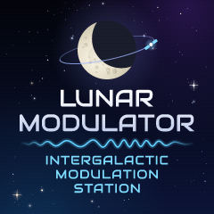

# Branding art

Lunar Modulator's README banner and its boot screen for the FM-1's display.
`render_branding.py` draws all of it from code: the gradients, a seeded
starfield, the moon and its craters, the orbit and its station, and the FM
waveform. It uses no photographs, stock images or third-party artwork.


| File | What it is |
| --- | --- |
| `banner.png` | 1280×320 README banner |
| `banner.svg` | the same banner as vector art; the lettering is converted to outlines, so it needs no font |
| `boot-splash-240.png` | 240×240 boot screen; its pixels are exactly the ones in the `.rgb565` file |
| `boot-splash-240.rgb565` | the boot screen as raw RGB565 (format below), 115,200 bytes, no header |
| `render_branding.py` | regenerates all four files |
| `fonts/Audiowide-Regular.ttf`, `fonts/OFL.txt` | the typeface and its licence, unmodified |



## Typeface

The lettering is set in **Audiowide**, © 2012 Brian J. Bonislawsky DBA
Astigmatic (AOETI), under the SIL Open Font License 1.1 with the Reserved
Font Name "Audiowide" (`fonts/OFL.txt`). The file is an unmodified copy of
`ofl/audiowide/Audiowide-Regular.ttf` from
[google/fonts](https://github.com/google/fonts/tree/main/ofl/audiowide),
where it last changed in commit `1b45567` (2017-08-07). SHA-256
`c7c0f2b0f6fad8c623e31772ce79f94a4edb9321ffce9fce978ea892d20ae730`
[verified].

What the licence allows [verified against `OFL.txt` and the
[OFL FAQ](https://openfontlicense.org/ofl-faq/)]:

- Images made with the font, such as these, are not covered by the OFL
  (FAQ 1.1, 1.13). Attribution is not required (FAQ 1.1.2); it is given
  here anyway.
- The font file may be committed and redistributed, provided `OFL.txt` stays
  next to it.
- A converted, subset or bitmap version, for a web page or for firmware, is a
  Modified Version. It must stay under the OFL, keep the copyright line, and
  must not be called "Audiowide" (OFL condition 3; FAQ 1.21, 2.6). A firmware
  bitmap font made from it needs a name of its own, such as "Lunar Display 16"
  [inferred].

In published text, name the typeface ("set in Audiowide"); do not describe it
as any agency's font. Audiowide was chosen in the 2026-10-01 font research as
the closest open-licence match for rounded, wide, 1970s aerospace lettering.
Nasalization (Typodermic), the commercial font usually associated with that
look, is not used. Its free desktop licence does not allow it in a
repository, on a web page or in firmware [reported: Typodermic Desktop EULA
v260817 §4, read during that research].

## Marks

The art follows the naming rules in `CLAUDE.md` ("What this is" → "The
name"):

- No space agency's insignia, logotype, seal or name, nor anything that could
  pass for one or suggest endorsement.
- No M-VAVE or Cuvave logos.

The design also stays away from the look of well-known agency insignia, such
as a blue disc with a white orbit ring and a red chevron. Here the moon's
dark side is neutral charcoal rather than blue, nothing is red, and the
orbit crosses a moon, not lettering.

## Regenerating

```bash
python3 -m venv /tmp/brand-venv
/tmp/brand-venv/bin/pip install Pillow fonttools numpy
/tmp/brand-venv/bin/python assets/branding/render_branding.py      # writes into assets/branding/
/tmp/brand-venv/bin/python assets/branding/render_branding.py --font path/to/font.ttf --out some/dir -v
```

Pillow, fontTools and numpy are not project dependencies, so CI does not run
this script. With Python 3.9.6, Pillow 11.3.0, fontTools 4.60.2 and numpy
2.0.2, two runs wrote byte-identical files [verified]. Other versions should
produce the same pixels, though the PNG bytes may differ with a different
zlib [inferred].

The script anti-aliases with 4×4 point samples per pixel, using the same
geometry it writes to the SVG. Before writing anything it checks the layout,
and it stops with an error if:

- a line of text, the waveform or the moon group comes within 12 px of
  another of them (5 px on the splash);
- any of them comes within 20 px of an edge (8 px on the splash).

Stars are placed only where they clear the text and the waveform by 10 px
(5 px on the splash). Large sparkles must clear them by 24 px (12 px) and
must stay off the moon and its orbit.

## Boot screen format

`boot-splash-240.rgb565` holds 240 rows of 240 pixels, top-left first. Each
pixel is one 16-bit little-endian word: red in bits 15–11, green in bits
10–5, blue in bits 4–0. The image is ordered-dithered (4×4 Bayer) from the
full-colour render so the gradients do not band. The PNG shows each code
expanded to 8 bits by bit replication.

No firmware uses the boot screen yet, and nothing has been flashed (see "The
one rule" in `CLAUDE.md`). The file's words match a C `uint16_t` array on a
little-endian CPU [inferred for pi32v2]. ST7789-class controllers normally
take each pixel's high byte first over SPI, so a driver that streams this
buffer byte by byte must either swap each pair of bytes or switch the
controller's byte order [inferred]. The stock firmware's byte order and its
RGB/BGR setting on SPI1 have not been checked.

## Checks (2026-10-01)

- Both PNGs inspected by eye, at full size and enlarged (the banner region by
  region, the splash at 3×). No text touches another element or a star, and
  nothing is clipped by an edge [verified].
- Measured gaps, banner:
  - title to waveform 20.7 px, waveform to tagline 21.1 px [verified];
  - moon and orbit to the text block at least 57.8 px [verified];
  - every element at least 20 px from the edges [verified].
- Measured gaps, splash: 5.7 to 11.6 px between neighbouring lines, and at
  least 8 px from the edges [verified].
- Splash legibility:
  - the title's capitals are 18.6 px tall and the tagline's 9.8 px
    [verified];
  - on the FM-1's 1.54-inch 240×240 panel (about 0.115 mm per pixel), that
    is about 2.1 mm and 1.1 mm [inferred];
  - not yet viewed on the device.
- `banner.svg` rendered in Chromium against `banner.png`: the mean absolute
  difference is 0.7/255 per channel, with differences only on anti-aliased
  edges [verified].
- `boot-splash-240.rgb565`, decoded and expanded, equals
  `boot-splash-240.png` pixel for pixel [verified].
