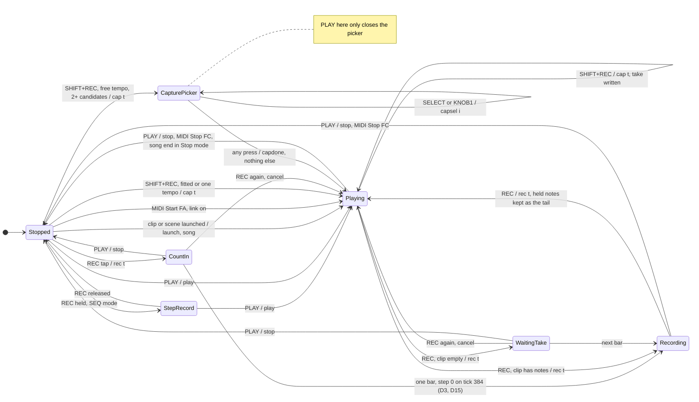
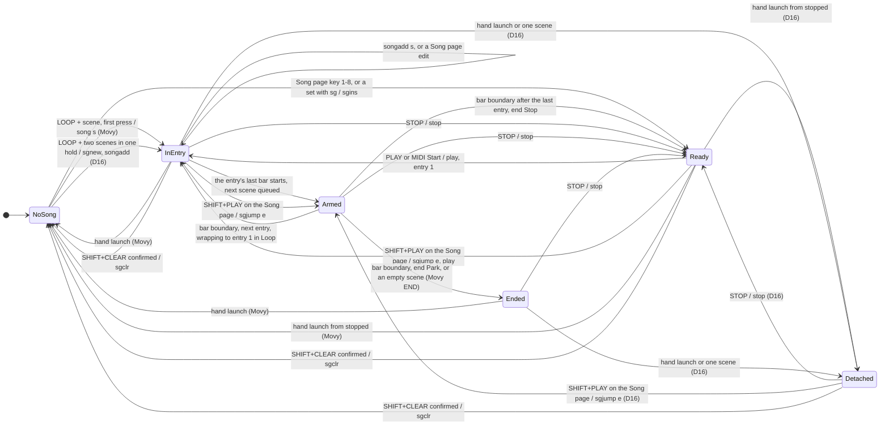
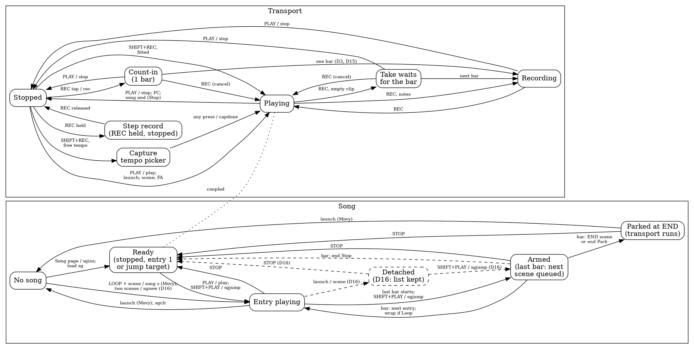

# Scenes and the song list on the panel (2026-10-06)

**Why.** The owner, 2026-10-06: "work on the song-list editing … now". The
guide's last program builds a 4-minute song that plays hands-free from the
song list, plus one mission that performs it live by launching scenes. The
owner's guide brief: "expose Movy's 64-entry song list on the panel so the
track plays hands-free". Earlier answers: S9's CLEAR asks to confirm
(O15), and scenes are white keys 1–8 with LOOP held (O20).

**What this is.** The design of S9's Session view and scenes, a new Song
page, the core verbs they need, and the owner's decisions (§12; 2026-10-06:
every recommendation adopted, each Movy deviation with compat mode keeping
Movy's behaviour). **The core is built** (stage E1, 2026-10-06; joined
with the state stages on `feature/2026-10-06@state-core`): the verbs of
§5.5, the `fm1_seq_info_t` fields, the `se`, `sn` and `dq` lines, D15-D17,
ST11's reseed, and a fourth fix found in testing, D18, which awaits the
owner's word (`engines/seq.md`, "The song"; `tests/test_seq_song.py`). The
Session view and the Song page (S9+) are not built. The companion note
[2026-10-06-state-files.md](2026-10-06-state-files.md) covers files and
launch links; this one says what the song puts in them (§5.6).

**The one rule.** Every verb below runs in the sequencer core: on a desktop,
in a browser, later in our own firmware. Nothing is sent to the owner's
FM-1.

**Marks.**
- `[verified]`: checked for this note on `origin/main` at `250bf53`, by
  reading the code or running `engines/build/fm1-seq` built from it.
- **Movy** was read at the pinned `9190e79`
  (`engines/third_party/movy/UPSTREAM.md`). Its song code is unchanged at
  the clone's head, `4dd5564` [reported: the song design's diff of
  `seq-core`; `launch_clip` and the song functions re-read here at
  `4dd5564`].
- `[reported]` names its source; "the song design" is the proposal this
  note refines, which is not committed.
- `[inferred]` is reasoning.

## Contents

1. Short answer
2. What Movy does
3. The port today, and three apparent Movy bugs
4. Requirements
5. The design
6. Screen layouts (240 × 240)
7. Control map and collision check
8. State diagrams
9. Worked example: the 4-minute song
10. Tests
11. Build
12. Owner decisions

## 1. Short answer

- **Session view and scenes (S9)** work as Movy's do:
  - hold LOOP in Session view, and white keys 1–8 are scenes 1–8;
  - the first scene of a hold starts a song, and later ones add to it.
- **A new Song page.** SHIFT + LOOP opens a list editor. It can view,
  insert, delete and move entries, set each entry's scene and repeat count,
  play from any entry, and choose what happens at the end: loop, park or
  stop.
- **New FM-1 verbs** in the core work on whole entries, not raw presses.
  The `movy1` `sg` line stays exactly Movy's. The end mode and scene names
  go on new lines that Movy ignores.
- **Three apparent Movy bugs, reproduced on our core in both modes**
  (§3.2). Each needs a song to exist while the transport is stopped:
  - a count-in uses up the song's first bar;
  - a stopped Capture plays the song, so the take is never heard;
  - REC records into the song's scene and leaves an empty clip in the slot
    you chose.

  The fixes, D15 and D17, are adopted (SG2, SG12); compat mode keeps
  Movy's behaviour.
- **One change of Movy's design, not a bug, adopted (SG1).** A clip or
  scene launched by hand stops the song following but keeps its list
  (D16). The live mission and the hands-free song can then share one
  project. Compat mode keeps Movy's rule.
- **State diagrams** of the transport and the song, in Mermaid and DOT
  (§8), are ready for the diagram lane.
- **Build.** The core verbs and fixes are `engines/` only, so they can be
  built now. The Session view and Song page follow the UI colour and fonts
  stage (§11).

## 2. What Movy does

[verified: Movy `engine.rs` `launch_clip`, `clear_song`, `song_start`,
`song_add` at `4dd5564`; reported: the song design, from `engine.rs`
600–944, `src/seq/song.ts`, `render.ts` and MANUAL.md at `9190e79`]

- **A scene is a column.** Scene *k* is clip slot *k* on every track, not
  only the tracks on screen. There are 8.
- **Launching a scene.**
  - Each track with a clip in that column queues it for the next bar.
  - Each track with an empty slot stops, so a scene is a snapshot of what
    plays.
  - While stopped, a launch starts the transport at once, with no count-in,
    if the column has any clip.
- **A scene's length** is its longest clip, rounded up to whole bars, and
  at least one bar. Shorter clips loop inside it.
- **The song is a flat list of scene presses**, for example `[0,1,1,2]`.
  - Equal neighbours fold into one entry with a repeat count: `1 1` is
    "scene 2 ×2".
  - **So two neighbouring entries of the same scene cannot exist.** This is
    load-bearing for an editor (§5.3).
- **The gesture.** Hold Loop in Session view:
  - the first scene of a hold sends `song s`, which clears the list,
    makes it `[s]` and launches the scene;
  - each later press sends `songadd s`, which appends and does not launch.
- **The schedule.**
  - At the start of an entry's last bar, the next scene is launched, so
    its clips are queued and blink.
  - At the bar boundary they fall in, and the song moves on.
  - If the next entry is the same scene (a one-entry song wrapping onto
    itself), nothing is relaunched. A track's cycle count keeps running
    across repeats, so an A:B trig condition reaches B: a 4:4 fill lands on
    the fourth pass of a scene ×4.
- **The end.** The song **loops** to its first entry. An entry whose scene
  has no clip on any track is **END**: every track stops there and the song
  parks, while the transport keeps running.
- **What ends a song.**
  - Launching any clip by hand clears it. Movy's comment calls this
    "taking the wheel": the arrangement stops, and what plays keeps
    playing. This is a stated design choice, not an oversight.
  - `song s` replaces it.
  - Stop, then Play, restarts it from entry 1. Movy has no "play from
    here".
- **Saving.** `sg <scene> <scene> …`, the raw presses. Transport state is
  never saved, and unknown lines are ignored.
- **The screen.** An inverted band shows `SONG` and the entries, with the
  playing one boxed and `END` when parked. It shows while Loop is held in
  Session view and while a song exists, never outside Session view. Every
  scene the song uses pulses its LED.

## 3. The port today, and three apparent Movy bugs

### 3.1 The port [verified]

- **The core replays §2 in both modes:**
  - `sq_launch_scene`, `song_bar`, `song_try_arm`, `sq_song_start`,
    `sq_song_add` and `sq_clear_song` in `engines/seq/seq_engine.c`;
  - the oracle fixture `13-scenes-song`.
- **The limit is 64 presses** (`lim->song = 64`). Movy's list is unbounded.
  - An import keeps the first 64 and counts the rest in `stats.refused`.
  - `lim.song` and `song_len` are 8-bit, and `fm1_seq_info_t` already
    carries `song[256]`.
- **The verbs are only `song` and `songadd`.** Nothing can insert, delete,
  reorder or change a repeat without clearing and relaunching.
- **The simulator has no Session view, scenes, Song page or song
  readout.** S9 is not built.

### 3.2 Three apparent Movy bugs

All three need a song to exist while the transport is stopped. Run with
`engines/build/fm1-seq [--compat] --cmd X.verbs --log X.jsonl --export
X.movy1`. Each script starts with `#! rate=44118 block=64 tracks=4
end=400000` (`end=700000` for A), then:

```
@0 tog 0 0 60 100
@0 clipsel 0 1
@0 tog 0 0 67 100
@0 clipsel 0 0
@0 song 0
@0 songadd 1
@1000 stop
```

So scene 1 plays a C (60), scene 2 a G (67), and the song is `[0,1]`.

| Script | Then | What happens [verified at `250bf53`, both modes] |
| --- | --- | --- |
| A | `@2000 rec 0` | **The count-in uses up the song's first bar.** REC from stopped calls `sq_play`, which starts the song, then sets a one-bar count-in, which the song counts as entry 1's bar. Default mode: the first note after it is scene 2's G on tick 384; scene 1 never plays. Compat: scene 1's C on tick 383 (D3's off-by-one), then the G on 384 |
| B | `@2000 clipsel 0 2`, four notes from frame 10,000 to 110,000, `@150000 cap 0` | **A stopped Capture plays the song, not the take.** The take is written to slot 3 (`cl 0 2 32 0 0:80:72…`). Then `commit_stopped`'s `sq_play` starts the song: track 1 plays slots 1 and 2 (60, 67, 60…) and stays on slot 1 (`tk 0 0 0`). The take is never heard, and the tempo picker's "hear which fits" does nothing |
| C | slot 3 chosen, `@3000 rec 0`, one note at 100,000, `@150000 rec 0` | **REC records into the song's scene.** The note lands in slot 2 (`cl 0 1 16 0 …;38:43:72:100:2`), and an empty clip is left in slot 3 (`cl 0 2 16 0`). An empty clip "exists", so that column no longer counts as an empty END scene [inferred: `scene_is_empty`] |

The owner's standing rule is to fix apparent Movy bugs in the port, with
compat mode kept for tests. The fixes are D15 and D17 (§5.5), adopted
(SG2, SG12; owner, 2026-10-06). D14 stays reserved for undo [verified:
`engines/seq.md`].

## 4. Requirements

- **The hands-free song** plays a 4-minute track from the song list with
  nobody touching the panel. The guide's launch links open it on the Song
  page, or start it at a given entry.
- **The live mission** launches scenes by hand. That must not wipe out the
  arranged song for good (SG1).
- **Panel only.** Everything works with the 27 keys, 14 buttons and 7
  encoders, without colliding with S3–S8, the arpeggiator or modulation
  (§7).
- **Fonts.** Every screen fits 240 × 240 in today's 5×9 ×2 face (MAIN),
  and in the Spleen MID (8×16) and SMALL (6×12) faces of the UI colour and
  fonts stage, `feature/2026-10-06@ui-colour-type` (§6).
- **Colours** follow that stage's roles in `fm1_look.h` [verified on the
  branch at `b7aa176`]:
  - C_SELECT (iris): selection;
  - C_HELD (gold): held, locked, count-in;
  - C_LIVE (foam): live and playing;
  - C_REFUSE (love): refusal, recording, over the limit;
  - C_CONTEXT (rose): the context line;
  - C_LABEL (subtle): labels;
  - C_TEXT: text; C_HINT: hints;
  - S1–S4 (`C_SOUND_1`–`C_SOUND_4`): the sound hues.

## 5. The design

### 5.1 Session view and scenes (S9)

Session view opens with a SEQ tap inside SEQ; holding SEQ peeks at it
(docs/15 §3.11). It shows 8 tracks × 8 slots. The keys address the focused
track's slots; the grid shows every track.

| Input | Session view |
| --- | --- |
| White 1–8 | The focused track's slot 1–8: `launch t s`, on the bar. An empty slot stops the track. A song is detached (D16, SG1), or cleared in compat mode (Movy) |
| White 9–16 | Focus track 1–8 (`watch t`) |
| **LOOP held** | The scene row. The band appears at once, even with no song (Movy) |
| LOOP + white 1–8 | Scene 1–8. Default (D16): the first press sends `scene s`; a second press in the same hold sends `sgnew s1` (s1 = the hold's first scene), then `songadd s2`, and later ones `songadd s`. Compat (Movy): the first press of a hold sends `song s`, later ones `songadd s`. Each key consumes its own release |
| LOOP + white 9–16 | Inert, LEDs off (Movy's in-between keys are dark) |
| COPY + slot | `clipcopy` / `clippaste` |
| CLEAR + slot | The confirm (§5.2), then `clipdelat t s` |
| MUTE held | The mute map, as in the Track view |
| SHIFT + LOOP | The Song page (§5.3) |
| SHIFT + white N | Movy's shortcuts, as everywhere |

**LEDs** (on, off, slow or fast; docs/15 §3.13):

| Keys | No LOOP | LOOP held, no song | LOOP held, a song |
| --- | --- | --- | --- |
| White 1–8 | The focused track's slots: on with a clip, fast when queued, inverted while playing | On: the column has a clip; fast: queued | **On**: the scene playing; **fast**: the next scene, armed; **slow**: another scene the song uses; off: not in the song |
| White 9–16 | Focus: on for each track, inverted for the focused one | Off | Off |

### 5.2 The CLEAR confirm (O15: confirm)

**Asks to confirm**, because each of these loses a whole clip or song:
- a CLEAR tap with nothing held in the Track view (`clipdel t`);
- CLEAR + slot in Session (`clipdelat t s`);
- SHIFT + CLEAR on the Song page (`sgclr`).

**Does not ask**, because each is one gesture to redo:
- a step (CLEAR + step);
- a lane (CLEAR held + knob);
- one song entry (CLEAR on the Song page).

**The popup** is the existing three-line popup in MAIN (18 characters a
line), with the first line in C_REFUSE:

```
Delete T2 clip 3?      Clear the song?
CLEAR again: yes       CLEAR again: yes
other keys: no         other keys: no
```

- It stays until a press, as Capture's overlay does (SG9).
- CLEAR confirms.
- Any other press cancels and **does nothing else**: a cancelling key never
  launches or edits.
- Knob turns are swallowed. The transport keeps running underneath.

### 5.3 The Song page (new)

**Opening and leaving.**
- SHIFT + LOOP opens it from the Track view or Session view. Pressed again,
  it goes back.
- SEQ goes to the Track view. HOME, FX and GLO leave SEQ mode.
- It is one more SEQ view, `FM1_SEQ_VIEW_SONG`.

**What it shows.** One row per entry, then a last `+ add` row, with a
cursor. Each row has:
- the entry's number;
- its scene, and its name (SG6);
- its repeat count;
- its length in bars;
- its start time at the current tempo.

**Building from nothing** is as quick as Movy's LOOP hold, and launches
nothing: with the cursor on `+ add`, press white keys 1, 2, 2, 3.

| Input | Song page |
| --- | --- |
| SELECT, or ◀ / ▶ (F#3 / A#3) | Cursor up and down the entries and `+ add`. No wrap, as list popups |
| **SHIFT + ◀ / ▶** | **Move the cursor's entry** one place (`sgmov e ∓1`); the cursor moves with it |
| **White 1–8** | **Insert** scene N once after the cursor, or at the end on `+ add` (`sgins`). The cursor moves to the new entry. If the cursor's entry is already scene N, its repeats grow by one, as a double press does in Movy |
| White 9–16 | The cursor's entry repeats ×1–×8 (`sgset`): a shortcut for KNOB2 (SG8) |
| KNOB1 SCENE | The cursor's entry's scene, 1–8. An empty column shows `5 (end)`, Movy's END |
| KNOB2 REPEAT | From ×1 up to what the 64-press limit leaves; past it, the toast `Song full: 64` |
| KNOB3 NAME | The cursor's scene's name, from a list (SG6). Inert without names |
| KNOB4 END | The end of the song: Loop (Movy), Park (END, transport running) or Stop (`sgend`) |
| CLEAR tap | Delete the cursor's entry (`sgdel e`), with no confirm; the toast `Entry 3 deleted` |
| SHIFT + CLEAR | Clear the song, with the confirm (`sgclr`) |
| PLAY | Play or stop from the **top**, as everywhere (Movy) |
| **SHIFT + PLAY** | **From the cursor's entry.** Stopped: it starts there. Playing: that entry falls in on the next bar, relaunched (`sgjump e`; SG5) |
| REC, SHIFT + REC, MUTE, ◀ ▶ tracks (C#5 / D#5) | As everywhere |
| COPY, UNDO (G#4), spare keys | Inert |
| PRESETS, ALGORITHM, OCT | Unchanged |

**Joining.** An edit that puts two entries of the same scene next to each
other joins them, because the format cannot hold them apart (§2). The
toast says so, for example `Joined: 3 Verse x3`.

**Follow.**
- While the song plays, the cursor follows the playing entry until the
  user moves it.
- Moving it back onto the playing entry, or pressing PLAY, makes it follow
  again.

**Editing while the song plays (SG10).** The list changes at once, and the
sound follows on the next bar. The playing position stays with its entry.

| Edit | Effect |
| --- | --- |
| Insert, delete or move elsewhere | The position's index shifts; nothing else changes |
| The playing entry deleted | The entry that takes its place falls in on the next bar |
| The playing entry's scene changed | The new scene falls in on the next bar |
| Its repeats cut below the passes already played | It ends at the next bar boundary |
| The next entry changed while armed (in the playing entry's last bar) | The arm is redone: each track's queued slot, pending stop and pending select are cleared, then the new next scene is armed. Movy's `song_add` already withdraws a no-op arm; the general case is new [inferred] |

### 5.4 What the screen shows while the song plays

| View | Readout |
| --- | --- |
| Song page | The playing entry has `>` in C_LIVE. Its repeat field shows the pass (`2/4`, or `12` alone above ×9), and its bar field shows bars into the pass (`13/16`). In the armed last bar, the next entry's number blinks fast. The context line shows the total time and end mode on the left, and the place (`5/10`) on the right: C_LIVE for the playing entry, else the cursor's in C_LABEL |
| Session view | Movy's band at the bottom: `SONG`, then one token per entry (`3` or `3x2`). The playing entry is boxed in C_LIVE, and the armed next one blinks. `END` or `STOP` appears when the end mode is not Loop. The window keeps the current and next entries in view |
| Track view, Set, Clip and Track pages | The status line's transport word is `SONG` (C_LIVE) while a song is followed, and `END` (C_LABEL) when parked. In the playing entry's last bar, the hint line reads `Next` / `4 Chorus` (C_LIVE), unless a fresh knob hint is showing (SG11). Movy shows nothing here |
| HOME, FX, GLO, modulation pages | Nothing new |

### 5.5 Core additions (`engines/seq`, FM-1 only)

These verbs are FM-1 additions, as `route` is. Movy ignores unknown verbs,
so every oracle script stays byte-identical [inferred; the stage checks
it].
- Indices are 0-based in verbs and 1-based on screen.
- An edit that would pass `lim.song` presses is refused whole, and counted
  in `stats.refused`, which drives the UI's toast.
- No new name collides with today's verbs [verified: the verb table in
  `seq_cmd.c`].

| Verb | Meaning |
| --- | --- |
| `sgins e s r` | Insert r presses of scene s before entry e (e = the entry count appends). On an empty song, it creates one **without launching** |
| `sgdel e` | Delete entry e |
| `sgset e s r` | Entry e becomes r presses of scene s (r ≥ 1) |
| `sgmov e d` | Move entry e by d places |
| `sgclr` | Clear the list without launching; what plays keeps playing |
| `sgend m` | At the end: 0 Loop (Movy); 1 Park (END, transport running); 2 Stop the transport on the bar after the last entry, with D6's reverts and note-offs |
| `sgjump e` | Playing: entry e's scene falls in on the next bar, **relaunched even if it is already playing** (SG5), and the entry plays its full length from there. Stopped: the next `play` starts at entry e. Cleared by `stop`, by the `play` that used it, and by an edit that removes entry e |
| `scene s` | D16 only: launch scene s, keep the list, stop following |
| `sgnew s` | D16 only: the list becomes `[s]` and is followed from the scene now playing or queued, with no relaunch. A LOOP hold's second press sends it for the hold's first scene |

**`fm1_seq_info_t` grows by** `song_armed`, `song_pass`, `song_pass_bar`,
`song_end`, `song_jump` (0xFF for none) and `song_follow` (D16). The Song
page reads them once a block, as the Track view reads its grid.

**Deviations** (default mode; compat keeps Movy):

| # | Movy at `9190e79` | FM-1 default |
| --- | --- | --- |
| D15 | REC from stopped with a song: the count-in bar is counted as the song's first bar (§3.2 A) | The song's first bar is the one the count-in ends on |
| D16 (SG1) | A clip launched by hand clears the song; a scene press replaces it | Either detaches the song: it stops following and **keeps its list**. STOP then PLAY, or SHIFT + PLAY on the Song page, follows it again. A LOOP hold with **two or more** scene presses builds a new song; one press only launches |
| D17 | A stopped Capture with a song starts the song (§3.2 B). REC from stopped with a song leaves an empty clip in the chosen slot (§3.2 C) | A stopped Capture acts as a clip launched by hand on its track: the take plays, and the song is cleared (Movy's rule) or detached (D16). REC creates no clip in a slot the song moves it away from |

D16 departs from a stated intent of Movy's, not a bug. It is adopted
(SG1) because the guide needs a live mission and a hands-free song in one
project.

**ST11** (the state note) is the fourth deviation: a set import reseeds
the sequencer's RNG to its init constant, so a loaded song plays the same
each time; in compat mode the RNG runs on, as Movy's does.

**Memory** [inferred]: the end mode, jump target and follow flag take 3 B,
and scene names 8 × 7 = 56 B. That is about 60 B on the 8-track instance's
31,880 B.

**The command record stays small:** a verb and at most three small
integers, which suits the M4 command ring (`engines/seq.md`).

### 5.6 How the song is saved and launched

**In the set (`movy1`), the "sequence" file:**
- **`sg`** is unchanged: the raw presses, so `3 Verse ×2` is written
  `2 2`. A set that uses no FM-1 feature is byte-identical to Movy's
  export.
- **`se M`** (FM-1): the end mode, written only when it is not 0 (Loop).
- **`sn SLOT NAME`** (FM-1, SG6): scene names, written only when set.
- Both are written outside compat mode only, as `rt` is. Movy ignores
  unknown lines [verified: `seq_persist.c` header], and so does our
  importer [verified: its key dispatch]. A guide set therefore opens in
  Movy and plays, with the song looping instead of stopping.
- **Not saved**, as in Movy: the playing position, the jump target, the
  follow flag, and whether the transport runs.
- **A Movy set with more than 64 presses** keeps the first 64 and shows the
  toast `Song cut to 64`.

**In a project**, the set is that `movy1` text as the JSON array of its
lines, verbatim (state note §7.3), so the song travels with it.

**Launching** (state note §12.4):
- `"view": {"mode": "song"}` in the file, or `&view=song` in a link,
  opens the Song page.
- `&play=1` starts the song after the user powers on.
- `&entry=3` sends `sgjump 2`, then `play`.

These are the verbs a person sends, so a link can never reach a state the
panel could not. Nothing goes to a device.

**The live mission and the hands-free song share one project** under D16:
- the mission launches scenes with LOOP + keys;
- STOP then PLAY brings the arranged song back.

In compat mode, without D16, the mission would end with "reload the
project".

## 6. Screen layouts (240 × 240)

Faces on the UI colour and fonts stage [reported: the song design,
measured on that branch; the list macros `LIST_TITLE_Y`, `LIST_Y`,
`LIST_PITCH_MID` verified there at `b7aa176`]:

| Face | Glyph | Box | Advance | Characters a line |
| --- | --- | --- | --- | --- |
| MAIN | 5 × 9 at ×2 | 18 px | 12 px | 19 |
| MID | Spleen 8 × 16 | 14 px | 8 px | 28 (27 from x 12) |
| SMALL | Spleen 6 × 12 | 12 px | 6 px | 38 |

**The frame is shared by every screen:**
- the title bar is y 0–24, content starts at y 28, and the bottom bar at
  y 216;
- the margin is 6 px, so the right edge is x 234;
- labels sit 4 px from bars;
- at most 96 logged boxes;
- no text is cut short.

### 6.1 Session view (8 tracks)

| Element | y | x and size | Face, colour |
| --- | --- | --- | --- |
| Status line: tempo, track chips, transport | 28–46 | as the Track view | MAIN; transport C_LIVE (`PLAY`, `SONG`) or C_REFUSE (`REC`) |
| Scene header 1–8 | 50–62 | centred on each column | SMALL; C_LABEL, C_TEXT while LOOP is held; the playing scene boxed in C_LIVE |
| Row labels 1–8 | per row | x 6 | SMALL, in the track's sound colour (S1–S4), or C_LABEL for MIDI; the focused track on a C_SELECT box |
| Grid, one graphic box | 66–183 | x 16–229; columns 27 px apart (cells 24), rows 15 px apart (cells 12) | — |
| Song band | 190–212 | full width, on C_TITLE_BG | MID, text at y 194 |
| Bottom bar | 216– | `Session T1`, RAM | MAIN |

With 1–4 tracks, rows are 30 px apart (cells 26), so 4 tracks end at y 182.

| Cell state | Look |
| --- | --- |
| Empty | 1 px frame in C_BAR_BG |
| Clip | Filled C_BAR_BG, with a 2 px top edge in the track's sound colour |
| Playing | Filled in the sound colour, with a 2 px C_TEXT playhead along the bottom |
| Queued | Alternates between clip and playing every 0.25 s |
| Stopping | Playing, alternating with empty every 0.25 s |
| Active (the track's edit target) | A 1 px C_SELECT frame |
| Muted track | The sound colour replaced by C_LABEL |

```
+------------------------------------------+    0  title bar: S1 Macro
| 116 BPM   (track chips)            SONG  |   28  status line (MAIN)
|      1   2  [3]  4   5   6   7   8       |   50  scene header (SMALL), 3 boxed
| 1   ##  ##  ##  ..  ##  ..  ..  ..       |   66  grid: 8 rows, 15 px apart
| 2   ##  ==  ##  ##  ..  ##  ..  ..       |       ## clip, == playing, .. empty
| ...                                      |
| 8   ..  ..  ##  ##  ..  ##  ##  ..       |  168  last row, ends at 183
| SONG < 2x2 3x2 4x2 5x2 3 2 >             |  190  song band (MID), 3x2 boxed
+------------------------------------------+  216  bottom bar: Session T1, RAM
```

A sketch of the regions, not to scale; the table above gives the
geometry.

**The band** holds 28 MID characters: `SONG ` and 23 more.
- Entries are separated by one space.
- `<` at the left and `>` at the right mean more entries are hidden.
- The end token is `END` or `STOP`; there is none for Loop.
- With LOOP held and no song, the band reads `SONG  keys 1-8: scenes`.

**Boxes:** status 4, header 8, labels 8, grid 1, band up to 13: 34 of 96.

### 6.2 Song page

The geometry is the MID list popup's (`fm1_look.h`: `LIST_TITLE_Y`,
`LIST_Y`, 18 px pitch). Seven entry rows leave room for a knob legend.

| Element | y | Detail |
| --- | --- | --- |
| Context line | 30–44 | Left: `Song 4:00 Stop` in C_CONTEXT. Right: the place, `5/10` |
| More above | 48–54 | `LIST_MARK` triangle, when scrolled |
| Rows 1–7 | 58, 76 … 166 (the last box ends at 180) | MID from x 12; the cursor's row on the C_SELECT bar |
| More below | 184–190 | Triangle |
| Knob legend | 196–208 | SMALL from x 6: `K1 SCENE  K2 REPEAT  K3 NAME  K4 END` (36 characters); names in C_HINT, `K1`… in C_LABEL |
| Bottom bar | 216– | `Song T1`, RAM |

A row is 27 MID characters, from x 12 to x 228:

| Columns | Field | Example | Colour |
| --- | --- | --- | --- |
| 0 | playing mark | `>` | C_LIVE |
| 1–2 | entry number, right-aligned (≤ 64, SG3) | `10` | C_LABEL; blinks fast when armed next |
| 4–11 | scene and name | `3 Verse`, `Scene 3`, `5 (end)` | C_TEXT; `(end)` C_LABEL |
| 13–15 | repeats, or the pass while playing | `x2`, `2/4`, `12` | C_TEXT; the pass in C_LIVE |
| 17–21 | bars, or bars into the pass while playing | `16b`, `13/16` | C_LABEL; C_LIVE while playing |
| 23–26 | start time | `1:06`; from ten minutes `12m` | C_LABEL |

```
x 12 ->                       <- x 228
+---------------------------+     0  title bar: Song
|Song 4:00 Stop         3/10|    30  context line (MID)
|             ^             |    48  more above
|  1 1 Intro   x2    8b 0:00|    58
|  2 2 Build   x2    8b 0:17|    76
|> 3 3 Verse  2/2   5/8 0:33|    94  playing, on the cursor bar
|  4 4 Chorus  x2   16b 1:06|   112
|  5 5 Break   x2    8b 1:39|   130
|  6 3 Verse   x1    8b 1:56|   148
|  7 2 Build   x1    4b 2:12|   166
|             v             |   184  more below
+---------------------------+   196  legend, SMALL from x 6:
                                     K1 SCENE  K2 REPEAT  K3 NAME  K4 END
                                216  bottom bar: Song T1, RAM
```

Each row above is exactly 27 MID characters, laid out by the column table.

- **An empty song** shows three lines in C_HINT, in MAIN, under the
  context line: `No song yet`, `Keys 1-8: add`, `or LOOP in Session`.
- **In MAIN only** (19 characters, until MID lands): rows like `>3 3 Verse
  x2 0:33`, without the bars field, 6 rows at 24 px, and no legend. The
  knob's name and value go on the hint line, as the Track view's do.
- **Boxes:** context 2, marks 2, rows 7 × 5, cursor bar 1, legend 1: 41 of
  96.

### 6.3 Track view while a song plays

- The layout is unchanged. The transport word (4 characters, at the
  right of the status line) is `SONG` or `END`.
- The hint line at y 190 shows `Next` / `4 Chorus` in the last bar,
  through `fm1_look_row`: the label in C_LABEL, the value in C_LIVE.
- A fresh knob hint wins.

## 7. Control map and collision check

Taken today [verified: `fm1_seq_ui.c` and `fm1_seq_ui.h` at `250bf53`,
with the arpeggiator merged]; added here; and whether they collide.

| Control | Taken already | Added here | Collision? |
| --- | --- | --- | --- |
| White keys, Track view | steps; held: Step pages; hold A + B: `slen` | — | — |
| White keys, Session | (S9) slots 1–8, focus 9–16 | as planned | no |
| White keys, Song page | — | 1–8 insert, 9–16 repeats | page-local |
| SHIFT + white N | 2 Track page, 3 Clip page, 5/7/9 Set page, 6 metronome, 10 full velocity, 16 clip quantize (built); 15 (S9) | none | no |
| SEQ held + white 1–8; MUTE held + white 1–8 | focus track; mute map | — | — |
| REC held, stopped | step record | — | — |
| ◀ ▶ (F#3 / A#3) | bar page; nudge with steps held; step record's back and rest | Song page: cursor | page-local |
| SHIFT + ◀ ▶ | 1-tick nudge, **with steps held** only | Song page: move an entry (no steps there) | no |
| LOOP (G#3) | inert until S9; S9: Loop view (Track view), scene row (Session) | **SHIFT + LOOP: Song page** | no: unused here and in Movy [reported: the song design] |
| COPY (C#4) | S9: `cpy`/`pst`, slots | inert on the Song page | — |
| CLEAR (D#4) | locks of held steps; held + knob `aclr`; S9 tap deletes the clip | Song page: tap deletes an entry; SHIFT + CLEAR clears the song | page-local; SHIFT + CLEAR unused elsewhere |
| MUTE, C#5 / D#5 | mute, previous and next track | unchanged | — |
| UNDO (G#4), A#4, F#5 | inert or spare | stay free | — |
| PLAY | play or stop; SHIFT: restart [verified] | Song page: SHIFT + PLAY from the cursor | a specialisation of restart |
| REC / SHIFT + REC | record, step record, Capture | — | — |
| SEQ | Track view; (S9) tap Session, held peek | from the Song page: Track view | no |
| SAVE | stub; S10 export | — (the state note) | — |
| ARP | tap on/off, hold Latch, SHIFT + ARP pages (PR #69) | — | — |
| ENV / LFO / EDIT | modulation: RACK, cables, MATRIX | — | — |
| SELECT | pages; Step pages; the Capture picker | Song page: cursor | page-local |
| KNOB1–4 | sound page; Step and lock pages; Set, Clip and Track pages; SHIFT + detent `aclrs`; CLEAR held + detent `aclr`; ENV/LFO held + knob: cable | Song page: SCENE, REPEAT, NAME, END | page-local |

**The computer keyboard** (O19) needs nothing new. Shift is SEL, and
LOOP's key is KeyE [reported: docs/15 §3.15], so Shift + E opens the Song
page.

## 8. State diagrams

There are two machines that touch each other. **The transport** runs at
the core level, plus the UI-only step record and Capture picker. **The
song** runs only while the transport does. How they couple:
- PLAY starts the song at entry 1, or at the jump target;
- STOP resets it to entry 1;
- end mode Stop stops the transport;
- a launch by hand clears the song (Movy) or detaches it (D16).

Labels give the panel gesture, then the core verb. These are the source
for the guide's and the manual's sequencer diagrams; the diagram lane
(`docs/2026-10-06@manual-diagrams`) owns their look.

### 8.1 Transport (Mermaid)

The diagram is flat, because Mermaid cannot draw an edge into a state
nested in a composite. Every state except Stopped and StepRecord runs the
clock.



### 8.2 Song (Mermaid)

The states:
- **NoSong**: an empty list.
- **Ready**: a list, transport stopped.
- **InEntry** and **Armed**: followed while the transport runs.
- **Ended**: parked, transport running.
- **Detached**: D16 only; the list is kept and not followed.



### 8.3 Both, for Graphviz (DOT)



The DOT names no font. The diagram lane's theme sets the faces and colours
(Audiowide is the brand face; the body face is that lane's choice).

## 9. Worked example: the 4-minute song

Seven scenes at 116 BPM give 116 bars, exactly 4:00 (a bar is 4 × 60 / 116
s) [verified: arithmetic]. That is 10 entries and 20 presses, well inside
64. Scene 8 stays free.

| # | Scene | Name | Clip bars | Repeats | Bars | Starts at bar | Time |
| --- | --- | --- | --- | --- | --- | --- | --- |
| 1 | 1 | Intro | 4 | ×2 | 8 | 1 | 0:00 |
| 2 | 2 | Build | 4 | ×2 | 8 | 9 | 0:16.6 |
| 3 | 3 | Verse | 8 | ×2 | 16 | 17 | 0:33.1 |
| 4 | 4 | Chorus | 8 | ×2 | 16 | 33 | 1:06.2 |
| 5 | 5 | Break | 4 | ×2 | 8 | 49 | 1:39.3 |
| 6 | 3 | Verse | 8 | ×1 | 8 | 57 | 1:55.9 |
| 7 | 2 | Build | 4 | ×1 | 4 | 65 | 2:12.4 |
| 8 | 4 | Chorus | 8 | ×2 | 16 | 69 | 2:20.7 |
| 9 | 6 | Drop | 8 | ×2 | 16 | 85 | 2:53.8 |
| 10 | 7 | Outro | 4 | ×4 | 16 | 101 | 3:26.9 |

In `movy1`:

```
sg 0 0 1 1 2 2 3 3 4 4 2 1 3 3 5 5 6 6 6 6
se 2
sn 0 Intro
sn 1 Build
…
```

A set with this `sg` line, 6 tracks, 40 clips and 1,444 notes imports into
the core and exports again unchanged (the state note §3.1) [verified].

Repeats do not relaunch (§2), so a fill on a 2:2 or 4:4 trig condition
lands on each entry's last pass. That gives the guide a lesson in
arrangement for free.

## 10. Tests

- **Scripts A–C** of §3.2: in compat mode, Movy's results stay. In the
  default mode:
  - A: scene 1's note sounds in the bar after the count-in (D15);
  - B: the take plays (D17);
  - C: no empty clip is left in slot 3 (D17).
- **The song verbs against a Python model of the flat list:**
  - every edit, the joins included;
  - the 64-press refusal, whole;
  - `sgjump` while stopped and while playing;
  - the three end modes;
  - edits while armed, including the stale-arm cancel;
  - the playing entry deleted or cut short;
  - after every edit, an export equal to the model's.
- **ST11:** after a set import, a song with probability trigs plays the
  same notes each time; in compat mode the RNG runs on.
- **D16:**
  - a hand launch keeps the list, and STOP then PLAY follows it;
  - a one-press LOOP hold keeps the list;
  - a two-press hold replaces it without relaunching the first scene.
- **No change without FM-1 verbs.** Every oracle script and Movy test runs
  byte-identical in both modes, events and sets, except where D15–D17
  change it, and then only in the default mode.
- **Files.** `se` and `sn` round-trip. A set with them imports in Movy's
  oracle, which ignores them. A 70-press Movy set loads 64 presses, with
  the refusal counted.
- **Screens:**
  - Session at 1, 4 and 8 tracks, with every cell state, LOOP held, with
    and without a song;
  - the band at its longest: 64 alternating presses;
  - the Song page empty, with 1, 7, 8 and 64 entries, with the longest
    names, and playing on the first and last entries;
  - the confirm popups;
  - all with 0 layout faults.
- **Traces.**
  - Build §9's song from the panel, then play it through the app path; its
    `fm1-render` render is byte-identical.
  - Browsing the Song page empties no Capture.
  - A `&entry=3` launch plays entry 3 first.

## 11. Build

- **E1, now, `engines/` only** (state note §18; owner, 2026-10-06). It can
  run beside the UI colour and fonts stage, because it does not touch
  `sim/web/src`. **Built** (2026-10-06; the state note's §21 has how its
  lines reach the files: typed binary items, and a streaming import):
  - the verbs of §5.5;
  - the `fm1_seq_info_t` fields;
  - the `se`, `sn` and `dq` lines;
  - D15, D16 and D17, each with compat mode keeping Movy's behaviour;
  - ST11: a set import reseeds the RNG (compat: it runs on);
  - the tests of §10 that need no screen.
  - It rebuilds `fm1.wasm` in its own PR, because `engines/seq` is linked
    into the module (docs/15 §6.5).
- **S9+, after the UI colour and fonts stage lands.** The rest is
  `sim/web/src` (`fm1_seq_ui.c`, `fm1_seq_view.c`, `fm1_app.c`): S9's
  Session view, Loop view, COPY and CLEAR (docs/15 S9), plus the Song page
  and the readouts of §5.4, with its screens and traces.
  - It comes right after the state stages A1 and W1, ahead of the master
    chain and side-chain stages (ST20, adopted).

## 12. Owner decisions

Decided by the owner on 2026-10-06: **every recommendation adopted.** The
three changes of Movy's behaviour (SG1, SG2, SG12), and the state note's
ST11, each keep Movy's behaviour in compat mode.

| # | Question | Decision (owner, 2026-10-06) |
| --- | --- | --- |
| SG1 | A clip or a single scene launched by hand while a song exists | **Adopted: D16.** The song detaches and keeps its list; STOP then PLAY, or SHIFT + PLAY on the Song page, follows it again; a LOOP hold builds a new song only from its second press. This departs from Movy's stated intent, so compat keeps Movy |
| SG2 | D15: a count-in should not use up the song's first bar | **Adopted**; compat keeps Movy |
| SG3 | Song length | **Adopted.** 64 presses (the owner's "64-entry song list"). The 4-minute song needs 20, and two-digit entry numbers fit the Song page row. Longer Movy songs are cut, with a toast |
| SG4 | The end of the song | **Adopted.** Loop, Park or Stop, saved on an `se` line; default Loop; the guide's song uses Stop |
| SG5 | Play from an entry | **Adopted.** SHIFT + PLAY on the Song page, relaunching that entry's scene from its start. Plain PLAY stays "from the top" everywhere |
| SG6 | Scene names | **Adopted.** Up to 6 characters: picked on the panel from a list (Intro, Verse, Pre, Chorus, Drop, Break, Build, Bridge, Fill, Outro), free text from files; `sn` lines |
| SG7 | Scene labels | **Adopted.** Numbers 1–8, matching the keys; "S" stays the sounds' prefix |
| SG8 | How the Song page opens, and keys 9–16 on it | **Adopted.** SHIFT + LOOP only; keys 9–16 set repeats ×1–×8 |
| SG9 | The confirm popup | **Adopted.** Stays until a press, like Capture's; no timeout |
| SG10 | Editing while the song plays | **Adopted.** Allowed, under §5.3's rules, tested against a model |
| SG11 | Song readout outside Session and the Song page | **Adopted.** The `SONG`/`END` transport word, and a `Next` hint in the last bar |
| SG12 | D17: a stopped Capture or REC with a song | **Adopted**; compat keeps Movy |
| SG13 | When to build | **Adopted.** The core (E1) now, `engines/` only; the Session view and Song page (S9+) as soon as the UI colour and fonts stage lands, after A1 and W1 |

**Not proposed now, for later:**
- per-entry track mutes: an entry would be a scene less some tracks, which
  `sg` cannot carry, so it needs a parallel FM-1 line;
- MIDI Song Position Pointer (F2) mapped to a song bar (docs/12 lists F2
  and FB as open);
- a tempo per entry.
