# UI audit of the virtual FM-1's screen (2026-10-06)

**Why.** The owner, 2026-10-05: when scrolling a list of values (cycling
through ALGORITHM, say) only three values are shown; use more of the screen
to show what is possible. And: "run a UI audit in general to ensure that
we're making the most of the small screen real estate we have available and
making good use of different colors to differentiate things while staying
within the Rose Pine theme and related colors."

**What this is.** An audit and a set of proposals with before/after
mockups. **No app code changed on this branch**: the owner picks proposals
first, and each picked one becomes its own change.

**The list fix landed first.** While this audit was being written, PR #64
built the change the owner asked for: list popups with six entries, a
title and the place in the list. This note was brought up to date after
it: Q1 now records what was built and what is left, and mockups 01–04 show
the screens before and after PR #64 rather than a proposal.

**How it was done** [verified, 2026-10-05, on `origin/main` at `ffb0796`]:
- `fm1-sim-render --screens` drew 2,695 screens with 0 layout faults and
  wrote 273 representative ones. All 273 were looked at as contact sheets
  (PPM to PNG, 2x), by family.
- The colour of every element was read from the drawing code:
  `sim/web/src/fm1_app.c`, `fm1_seq_view.c`, `fm1_mod_view.c` and the
  palette in `fm1_look.h`.
- Contrast was computed after RGB565 rounding, as `app.js` expands it
  (§3).
- **The mockups** came from a throwaway copy of `sim/web/src` in a scratch
  directory, with each proposal behind an environment switch. The copy is
  not committed; only the PNGs are (`assets/ui-audit/`, left before, right
  after).
- With each proposal on, and with all of them on at once, the sweep still
  drew 2,695 screens with 0 faults. So every mockup keeps the layout rules:
  no overlap, nothing clipped or cut short, 4 px between labels and bars,
  at most 96 boxes.

**Brought up to date after PR #64** [verified, on the branch after merging
`origin/main` at `db163d9`]:
- The sweep draws 3,040 screens with 0 faults and writes 283
  representative ones. The list screens were looked at again, and the
  blank-row counts below were taken again on both trees.
- Mockups 01–04 are now real screens: before PR #64 (`ffb0796`) on the
  left, `db163d9` on the right. Mockup 16 (the list's title) came from a
  throwaway copy of the merged tree; its sweep drew 3,040 screens with 0
  faults.
- The review redrew mockups 09, 10 and 15. The FX chip now leaves 4 px
  on each side of its tag (it left 3 px, and 2 px above the capitals).
  The banner now has a lower iris rule; before, it ran into the bottom bar
  with no edge between them.

Marks follow CLAUDE.md: [verified] checked here, [reported] a named source
says so, [inferred] our reasoning.

## Contents
1. Short answer
2. How the screen is built today
3. Contrast, hue distance and type size
4. Findings by screen family
5. A semantic colour map
6. Proposals, in priority order
7. Owner decisions
8. Limits, and how to reproduce
9. Built

## 1. Short answer

- **Lists showed three entries, or only one. PR #64 fixed that** while
  this audit was being written (Q1, mockups 01–04).
  - Before it, PRESETS, the RACK module picker and the MATRIX destination
    picker showed the previous, current and next entries.
  - ALGORITHM on HOME showed only the parameter's name and the chosen
    value. That covered Shapes' 47 shapes, Six-Op's 96 patches and FM6's
    64. In FX mode it showed only the effect's name, out of 22.
  - None of them said where you were in the list.
  - Now each shows the list's name, the place ("6/47") and six entries.
  - **What is left:** the list's title is gold (one more job for gold,
    below). A knob turned on a list parameter, and the sequencer's toasts,
    still show one value (D1).
- **Gold does eleven jobs.** Locks and held steps share it with:
  - the model line and page headings;
  - list popups' titles (since PR #64);
  - hints;
  - modulation marks;
  - the count-in;
  - the grabbed module;
  - the focused track;
  - FX mode's sound tag;
  - MATRIX's hint line.

  On a lock page the heading, the held step and the locked values are all
  gold. Rosé Pine Moon has three accents the screen never uses (rose, pine
  and muted). Freeing gold for locks and held steps, and giving modulation
  foam, makes each colour mean one thing (§5).
- **Refusals look like confirmations.** "does not fit / 155K over budget",
  "refuses 96000 Hz" and "cannot be locked" are drawn in the same text
  colour, between the same iris rules, as "Metronome on".
- **A modulated parameter loses its name.** To make room for the diamond,
  the label becomes an abbreviation of at most six characters: "Bright",
  "EnvT", "FB", "Damp", "Diffus". A foam label and a foam range bracket mark it without the cut
  (mockup 06).
- **Space wasted, by measure:**
  - Popups and toasts left 84 % of the content area's pixel rows blank on
    average before PR #64, and 73 % since. Most other families leave
    38–46 %, much of it the gaps between lines; CHAIN, mostly empty
    states, leaves 62 %. With the toast banners (L1) as well, popups
    dropped to 57 % in the mock, measured with the audit's own list mock
    before PR #64.
  - 5 of the 17 sound-engine pages, and 18 of the 42 effect pages, have
    fewer than four parameters. That leaves 10 and 29 rows empty.
  - All [verified: §4, blank-row count and the catalogue].
- **Everything is one type size** (the 5×9 font at ×2, 19 characters a
  line). Hierarchy comes only from colour and position. MATRIX's
  abbreviations ("S1Tmbre", "M2PngPg") are the cost.

## 2. How the screen is built today

All [verified] from the source:

**Geometry.**

| Part | Size |
| --- | --- |
| Screen | 240 × 240, RGB565 |
| Title bar | 24 px |
| Bottom bar | 24 px |
| Content area | 192 px (80 %) |

**Text.** One bitmap font, 5×9 glyphs drawn at ×2: 12 px a character, 18 px
a line, 19 characters between the 6 px margins.

**HOME's layout:**

| Element | Height |
| --- | --- |
| Context line (gold) | 22 px |
| Four parameter rows (label, value, a 7 px bar under them) | 36 px each |
| Oscilloscope strip at y 192 | 20 px |

**Popups** cover the whole content area, as stock's do ("overlaying the
current mode", the comment on `draw_popup_lines`).

**Palette** (`fm1_look.h`, Rosé Pine Moon): base, surface, overlay,
highlight-med, subtle, text, love, gold, foam and iris are used. **Rose,
pine, muted, highlight-low and highlight-high are not.**

**What each colour means today:**

| Colour | Means today |
| --- | --- |
| text | values; list entries; the title; the playhead cell; the selected knob's bar on SEQ's strip; a bipolar bar's zero tick; the selected RACK cell's outline |
| subtle | labels; secondary text; STOP; empty slots; muted tracks' notes; a disabled cable; a list's place ("6/47") and its Empty entries |
| iris | value bars; notes in the grid; list highlight and the list's triangles; popup rules; FX mode's selected slot (text); the rack's cell fills; unfocused tracks |
| gold | the model line; page headings ("Step 7", "Lock step 6", "Set: all tracks", "Clip: track 1", "Track 1 of 8"); list popups' titles ("Shape", "M1 effect"; since PR #64); hints ("Keys 1-8 mute", "Tap SHIFT: clear"); held steps; lock dots, values and bars; lanes; the bar bracket; the focused track; REC during the count-in; the grabbed module; modulation's diamond and range bracket; FX mode's "S1"; MATRIX's hint line |
| foam | the oscilloscope; the output and RAM meters; PLAY; trig ticks |
| love | REC and STEP; step record's head; RAM over 100 %; the output at clip; a refused cable; modulation's live-value tick |
| highlight-med | bar and cell backgrounds |
| overlay | the title bar |
| surface | the bottom bar; popups; the scope's well |

## 3. Contrast, hue distance and type size

**Method.** Each colour was passed through RGB565 and back as `app.js`
expands it (`((p >> 11) & 31) * 255 / 31`, rounded by `Uint8ClampedArray`),
then given its WCAG 2 contrast ratio [verified: computed]. Subtle on surface
comes out at 4.78:1, the figure `sim/web/README.md` gives.

**Text** needs 4.5:1. **Bars and marks** need 3:1.

| on | base | surface | overlay | highlight-med |
| --- | ---: | ---: | ---: | ---: |
| text | 12.36 | 11.55 | 8.98 | 7.62 |
| subtle | 5.12 | 4.78 | **3.72** | **3.15** |
| muted | **3.02** | **2.83** | **2.20** | **1.86** |
| love | 5.54 | 5.18 | **4.02** | **3.41** |
| gold | 9.82 | 9.18 | 7.13 | 6.05 |
| rose | 7.39 | 6.90 | 5.37 | 4.55 |
| pine | **4.34** | **4.06** | **3.16** | **2.68** |
| foam | 9.35 | 8.74 | 6.79 | 5.76 |
| iris | 7.58 | 7.08 | 5.51 | 4.67 |

Bold: fails 4.5:1 for text. Base text on an iris highlight is 7.58:1; on
gold 9.82:1; on love 5.54:1.

**What the table rules out:**
- **Never subtle on the title bar** (overlay): 3.72:1.
- **Muted is never text** (3.02:1 at best). It is usable only for marks on
  base.
- **Pine is unusable** on this screen:
  - as text, 4.34:1 on base;
  - as a mark on a bar's background, 2.68:1;
  - with text on top, 2.84:1.

  Keep it off the screen.
- **Love as text on overlay or highlight-med fails**, so love stays on base
  and surface.

**Hue distance** (CIEDE2000 between the sRGB palette values)
[verified: computed]:
- **Love and rose are the closest pair of accents: 13.1.** Next come iris
  and subtle (14.4), and iris and text (16.9).
- Gold is at least 25.8 from every other colour here. Foam is at least
  21.6 from every colour the screen uses, and 20.9 from pine, which stays
  off the screen.
- So **rose must never mean something next to love**: a rose hint under a
  love error reads as one colour. Mockup 15's MATRIX shows the risk: its
  rose hint line is three lines under a refused cable in love, and the two
  read as nearly one colour even there.

**Type size.**
- The FM-1's screen is 1.54" diagonal [reported: docs/01 §3]. So it is
  about 27.7 mm square: 0.115 mm a pixel, about 220 ppi [inferred].
- At ×2 a capital is 14 px, about 1.6 mm, and a line 2.1 mm [inferred].
  Comfortable at arm's length.
- At ×1 a capital would be 0.8 mm, too small to read on the device
  [inferred].
- At ×3 (2.4 mm) a line holds 12 characters: a size for one big value
  (a tempo, a volume), not for lists.
- **No size sits between ×2 and ×3.** A second, hand-drawn font of 6×10 or
  7×12 at ×1 (1.0–1.4 mm capitals, 26–34 characters a line) would serve
  dense screens: MATRIX, CHAIN, the lane list, the SHIFT legend. That is
  decision D7.

## 4. Findings by screen family

**What this section covers.**
- Every finding is [verified] on the rendered screens and the code, unless
  marked otherwise.
- The sweep's representative files are named in brackets.
- **"Blank rows" means** the share of pixel rows in the 192 px content
  area drawn in one flat colour. It counts the gaps between lines too, so
  only the differences between families mean anything.

**Blank rows by family** [verified: counted on the sweep's representative
screens]. "Before" is `ffb0796`, before PR #64; "now" is this branch after
merging it. The last column is the mock with every proposal on, measured
before PR #64, so its lists are the audit's own seven-entry mock:

| Family | Screens (before / now) | Blank before | Blank now | With every proposal |
| --- | ---: | ---: | ---: | ---: |
| popups and toasts | 23 | 84 % | 73 % | 57 % |
| list popups (new in the sweep) | — / 6 | — | 40 % | — |
| CHAIN | 4 | 62 % | 62 % | 62 % |
| MATRIX | 14 / 16 | 49 % | 41 % | 41 % |
| RACK | 63 / 65 | 47 % | 46 % | 46 % |
| HOME | 30 | 46 % | 46 % | 36 % |
| FX | 53 | 45 % | 45 % | 41 % |
| SEQ | 81 | 40 % | 39 % | 38 % |
| GLO | 1 | 40 % | 40 % | 40 % |

The script counts `gesture-made` (a popup, 85 %) and the three
`multi-global`/`multi-meter-*` screens (38 %) apart from these.

### HOME (`home-*`)

**Space.**
- **The gold line repeats a row of page 1.** It shows the model, patch or
  pad, and every sound engine with such a list has it on page 1: Macro,
  Macro Heavy, Shapes, Six-Op, FM6, Sophie, Drums (the catalogue). On later
  pages the same line is useful context.
- **Short pages leave rows empty:**
  - Macro page 2: 3 rows;
  - Shapes page 2: 2;
  - Six-Op page 1: 3, page 2: 1 (Volume alone);
  - FM6 page 2: 1 (Volume alone).

  The scope stays a 20 px strip under the empty rows.

**Hard to read.**
- A modulated row swaps its label for the parameter's abbreviation, cut
  to six characters, to make room for the diamond (`fm1_mod_view_row`):
  "Bright", "EnvT", "FB".
- The scope is a flat line until a note sounds. It is fine as it is.

**Colour.**
- The bars are all iris. That is right: iris is "the value you edit".
- The model line is gold, the colour of locks.
- Modulation's marks are gold too.
- The live-value tick is love, the colour of errors everywhere else.

### FX: inserts, Mix and master (`fx-*`, `multi-fx-*`)

**Space.**
- Two header lines (the chain strip, then "> M1 Plate") come before the
  rows. The second repeats the strip's selected tag.
- Effects with three parameters leave a row empty (Ensemble, EQ page 1).
- An empty slot shows two dim lines, then 100 px of nothing.

**Hard to read.** The strip "S1 In1 In2 Mix M1 M2" shows three states in
three close colours, in one 19-character line:
- selected: iris text;
- filled: text;
- empty: subtle.

Only the tag's name tells an insert from a master slot. The bottom bar
says "S1 In1" or "M1".

**Mix page.** An empty sound gets a full-width subtle bar under "Empty
100%", which reads as a full level.

**Colour.** "S1" is gold, beside the iris selection.

### GLO (`global`, `multi-global`)

- **Space:** eight lines at a 23 px pitch fill the page.
- **Stale rows:** "FX1"/"FX2" are the master slots, which FX mode calls
  M1/M2. They show the effect's id in lower case ("crush"), where every
  other screen shows the name ("Crush").
- "Voices" is the current sound's maximum.
- "1/1 Globe" is the stock firmware's name for the page (manual chapter 3).
  Keep it.

### SEQ: Track view (`seq-demo*`, `seq-*-playing`, `seq-recording`, `seq-mute-map`)

**What works.** The grid uses the space well: 4 bars × 16 cells. The
colours are the most deliberate on the screen:

| Element | Colour |
| --- | --- |
| a note | iris |
| the playhead | text |
| a held step | gold |
| a muted track's notes | subtle |
| out of the loop | an outline |
| a trig tick | foam |
| a lock dot | gold |
| step record's head | love |
| REC during the count-in | gold |
| REC while recording, and STEP | love |
| PLAY | foam |
| STOP | subtle |

**The track strip is the smallest mark on any screen.** Eight cells of
5 × 14 px sit beside the tempo (`TRACK_W`, `TRACK_H`):
- the focused one is gold, a muted one an outline (a 5 px outline against
  a 5 px fill);
- which sound each track plays cannot be seen anywhere on the view.

**Lock dots are 3 × 3 px.**

**The hint line** shows the model name when idle. For a pad kit that is the
pad ("1 Kick"), in gold.

### SEQ: Step and lock pages (`seq-step-*`, `seq-lock-*`)

- Step page 2 has three rows: Invert, then Nudge and Note without bars.
  That leaves one empty row and uneven gaps.
- **On a lock page gold means three things** at once:
  - the heading, "Lock step 6";
  - the held step in the strip;
  - the locked values and their bars.

  Mockup 08 shows it.
- The lane dot (6 × 7 px) after each bar is clear.

### SEQ: Set, Clip and Track pages (`seq-set*`, `seq-clip-*`, `seq-trackpg-*`, `seq-lanes-*`)

- These use HOME's rows and read well.
- **Track page 1:** "Sound 2 Macro Heavy" fills its line, so value and
  label sit at the 4 px minimum.
- **Track page 2:** the lanes, eight lines at 23 px. Empty lanes show
  "2 --" in subtle. Long lane names are cut at 13 characters.

### RACK (`rack-*`)

- **The strip** of eight 26 × 18 px cells, filled to the module's output,
  is good use of 18 px.
- **Selection is drawn differently here:** a text outline with a base inner
  frame. Lists use an iris bar, FX mode iris text.
- **The info line "LFO6 >0 <7"** (cables out, cables in, "~1" a tick late)
  is cryptic until learnt.
- **The picker** showed 3 of 17 modules; since PR #64 it shows six and
  the place ("9/17").
- Register's page 2 has two rows and leaves two empty.

### MATRIX (`matrix-*`)

The hardest screen to read:
- **Each row runs together.** Its 19 characters ("LFO2.2>ENV3Gte +100")
  have no space between source, mark and destination.
- **Names are abbreviated:** "Tmbre", "PngPg", "EnvMr", "Rte".
- **Colour is by row state only:**
  - the selected row is an iris bar;
  - a refused row is love;
  - an off row is subtle;
  - everything else is one colour.
- The gold hint line names the selected destination in full. That is good;
  its colour is the issue.
- The destination picker showed 3 of 54; since PR #64 it shows six and
  the place.

### CHAIN (`chain-*`)

- Pairs of lines alternate text and subtle; the highlight is iris. It reads
  well.
- "Slot 21: no cable" leaves 170 px empty. Acceptable for an empty state.

### Popups and toasts (`popup-*`, `multi-popup-*`, `*-toast-*`, `gesture-made`)

- **Every popup takes the whole content area**: 188 px for one to three
  centred lines. That is stock's behaviour.
- **Lists showed 3 entries, or none, until PR #64:**
  - PRESETS, the RACK module and MATRIX destination pickers, and Capture's
    tempo picker showed three;
  - ALGORITHM showed only the chosen value, on HOME ("Model / Chip") and
    in FX mode (the name alone);
  - none gave a position: you could not tell that "Sqr Sub" is 6 of 47.

  All of them now show the list's title in gold, the place in subtle, and
  six entries with the chosen one on the iris bar, between iris triangles
  where the list goes on. They fill the area: the list screens leave 40 %
  of the rows blank, much of it the gaps between lines.
- **Refusals look like confirmations.** They use the same colours as every
  other popup:
  - "does not fit / 155K over budget";
  - "refuses 96000 Hz";
  - "cannot be locked";
  - "No LFO / in the rack";
  - "takes no cable";
  - "Matrix full".
- **One-line confirmations hide the whole page for about a second:**
  "Volume N", "Transpose −5", "Metronome on", "Locks cleared", the
  gesture's "LFO1 > S1Harm / +12%".

### Drums and Sophie (`home-drums-*`, `home-sw-sophie-*`, `seq-drums-p1`)

- The gold line "1 Kick" repeats the Pad row, as the model line does
  elsewhere. The Track view's hint line shows the pad too.
- The 16 pads are a list that ALGORITHM walks; since PR #64 it shows
  them six at a time, with the place.
- The scope is flat until a pad sounds.

### FM6 and Six-Op FM (`home-dx7-*`, `home-sixop-*`, `seq-dx7-p1`, `seq-lock-dx7-*`)

- **The longest lists:** 64 and 96 patches. They were the strongest case
  for a list with a position, which PR #64 gave them ("34/96").
- **Page 2 holds Volume alone:** 108 px of empty rows.
- **Modulated labels are cut:** "Bright", "EnvT", "FB".

## 5. A semantic colour map

One meaning per colour; Rosé Pine's own usage in brackets. **Rosé Pine's
roles** are from the role tables in rose-pine/palette's README at `92af52b`,
read 2026-10-05 [reported].

| Role | Rosé Pine says | On the screen (proposed) | Change from today |
| --- | --- | --- | --- |
| base | primary background | the page | — |
| surface | panels, inputs | the bottom bar, popups, the scope's well | — |
| overlay | panels, active tabs | the title bar | — |
| highlight-med | selection background | bar and cell backgrounds | — |
| highlight-high | cursor background, borders | (spare: outlines of empty cells, if wanted) | — |
| muted | comments, git ignored | **marks only, never text** (3.02:1) | — |
| subtle | non-selected, inactive, punctuation | labels, secondary text, idle states (STOP), a list's place ("6/47") | — |
| text | high-contrast foreground, selected results | values, list entries, the playhead, modulation's live tick | + the live tick (from love) |
| iris | parameters, links, hints | **selection and the value being edited**: value bars, notes, the selected row, slot or chip | + FX mode's selected slot becomes a chip |
| gold | strings, warnings | **held and locked**: held steps, locks and lanes, the grabbed module or slot, the count-in | − headings, list titles, hints, the model line, modulation marks, the MATRIX hint |
| foam | object keys, info, git add | **live signal and modulation**: scope, meters, PLAY, trig ticks, modulation marks and brackets, MATRIX sources | + modulation |
| love | errors, git delete | **refusal, recording, over the limit**: REC, STEP, step record's head, RAM over 100 %, clipping, refused cables and refusal popups | + refusal popups; − the live tick |
| rose | booleans, git change, git dirty | **context**: the line under the title bar (model, "Step 7", "Lock step 6", page headings) and a list popup's title. Never on a line where love can appear (§3) | new (decision D3) |
| pine | functions, git rename | none: it fails as text and as a mark on bars (§3) | — |

**Two notes on the map.**
- **Rosé Pine's "git dirty" for rose** suggests a second use later: a value
  changed since the patch was loaded, once SAVE exists. If that matters
  more, the context line could be text instead (D3).
- **Sounds 1–4 have no hue left to take.** Every accent that passes
  contrast already has a role. Decision D6 sets out the options; mockup 11
  shows the strongest form.

## 6. Proposals, in priority order

**Each quick win from Q2 on** (Q1 is built):
- is one small change in `sim/web/src`;
- drew 0 faults in the mock sweep;
- leaves the audio and the browser module's parity untouched, since only
  drawing changes [inferred].

The images are in `assets/ui-audit/`.

### Quick wins

**Q1. List popups: built in PR #64** (the owner's request).
- **What was built:**
  - which lists: PRESETS; ALGORITHM on HOME (the sound's first list
    parameter: Model, Shape, Patch, Pad) and in FX mode (the effect);
    SEL + PRESETS (the four sounds); the RACK kind picker; MATRIX's
    destination picker; Capture's tempos;
  - the list's title in gold on the left and the place ("6/47") in subtle
    on the right;
  - six entries from the left at a 24 px pitch, the chosen one on the iris
    bar and on the third row where it can be; Empty entries in subtle;
  - an iris triangle above or below the entries where the list goes on;
  - a window that stops at both ends of every list.
- **How it differs from the audit's own mock** (seven centred entries at a
  22 px pitch under a subtle header, wrapping lists kept centred): PR #64
  keeps 4 px between the title, the triangles, the entries and their bars.
  With the triangles, six rows are what the area holds at that spacing.
  Stopping at the ends keeps every row filled. That settles D2.
- **What is left:**
  - the title's colour: gold, a job the colour map (§5) gives to locks
    alone. It should follow the context line (Q4, mockup 16);
  - a knob turned on a list parameter (FM6's Patch on KNOB1, say) and the
    sequencer's toasts still show one value (D1).
- **Before and after** (left: `ffb0796`; right: after PR #64):

  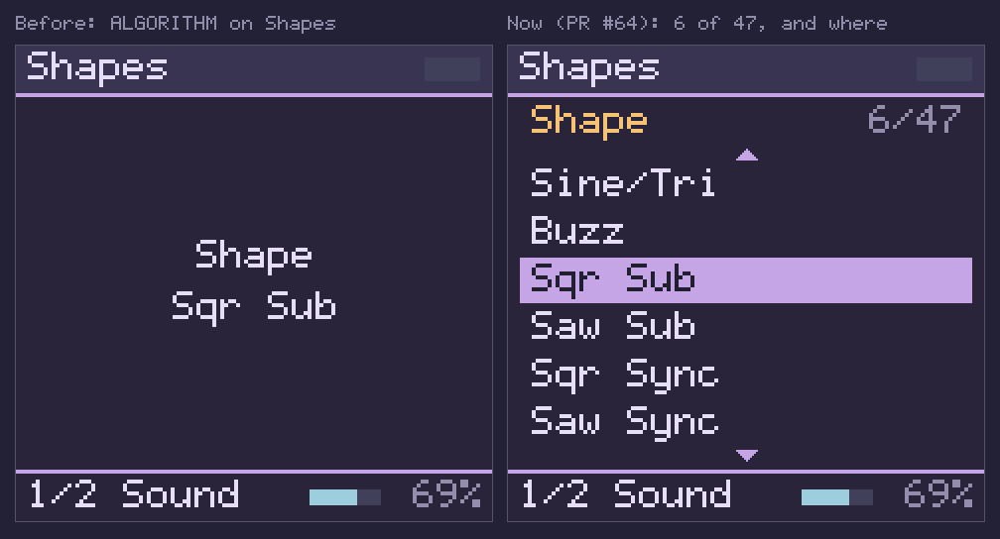
  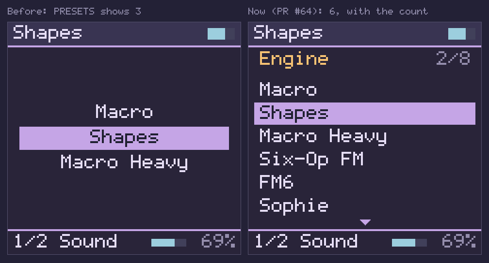
  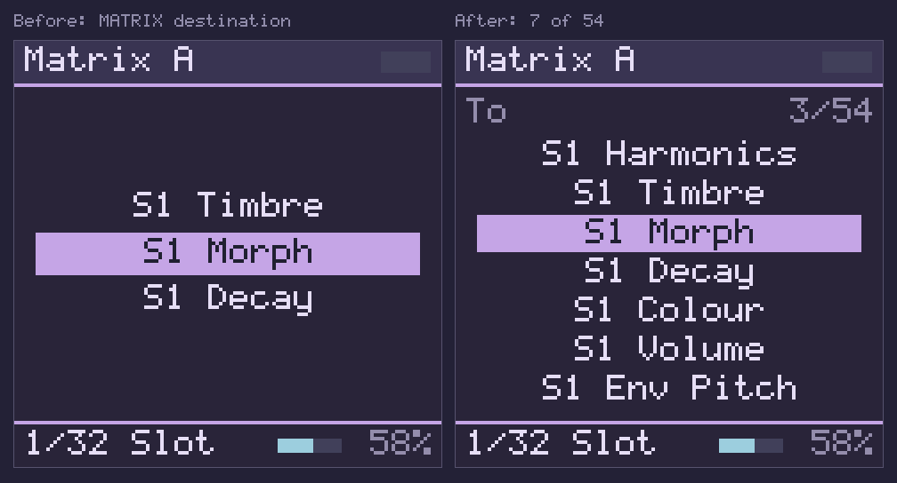
  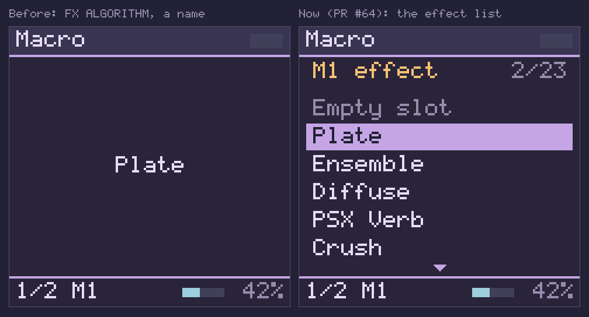

**Q2. Refusals in love.**
- **What changes:** a popup that refuses something draws its rules and its
  reason lines in love; the name stays text.
- **Which popups:**
  - the RAM and rate refusals;
  - "cannot be locked";
  - "No LFO in the rack";
  - "takes no cable";
  - "Matrix full".
- **Cost:** a tone flag on `popup()`, set at about six call sites.

  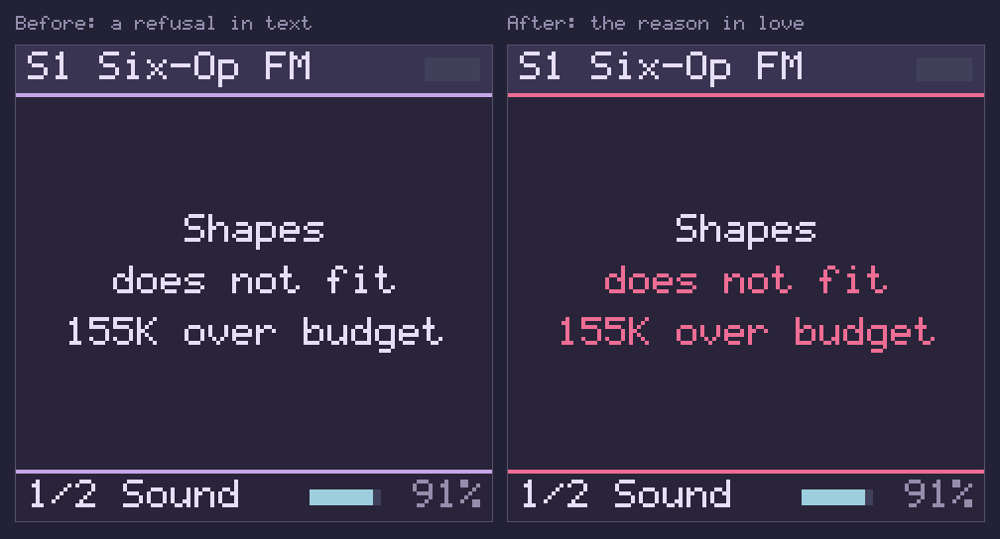

**Q3. Modulation in foam, with full labels.**
- **What changes:**
  - a modulated row's label is drawn in foam, at full length, with no
    diamond;
  - the range bracket is foam;
  - the live-value tick is text, not love.
- **Why:** the bracket keeps a non-colour cue for colour-blind readers.
  Gold is freed for locks, so a locked and modulated parameter is no
  longer gold on gold.
- **Cost:** `fm1_mod_view_row` only.

  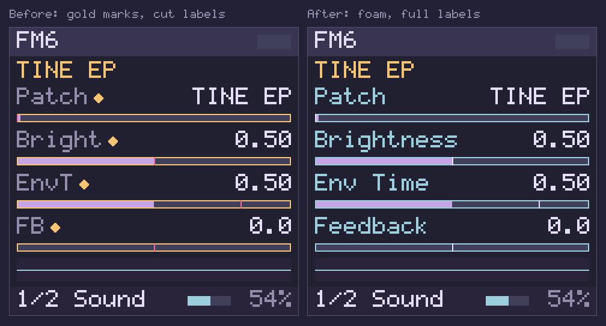

**Q4. A context line that says something.**
- **What changes:**
  - the line under the title bar (model, "Step 7", "Lock step 6", page
    headings) moves from gold to rose (D3);
  - on HOME, a list parameter's position is added in subtle ("VA+Filter
    1/8"), so page 1 tells you how many models there are rather than
    repeating the row below;
  - hints on SEQ's bottom line ("Keys 1-8 mute") become text;
  - a list popup's title (gold since PR #64) takes the same colour as the
    context line.
- **The result:** on lock pages gold then means "locked" alone.

  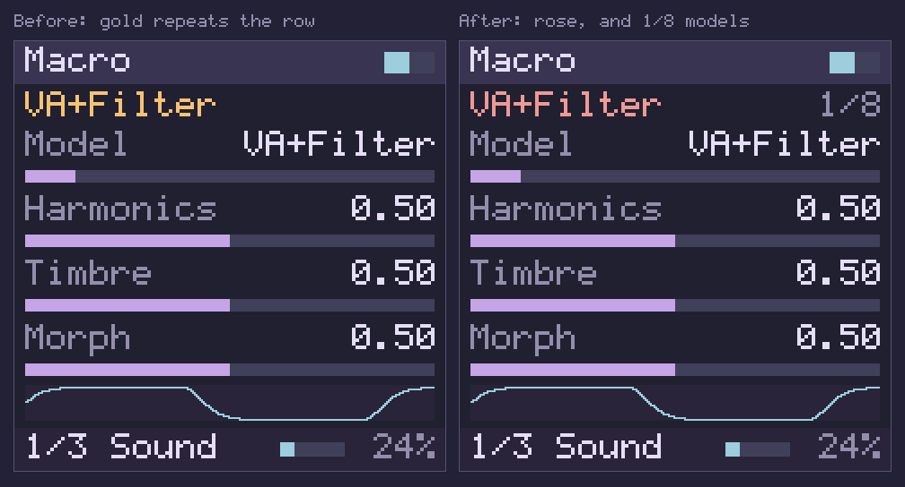
  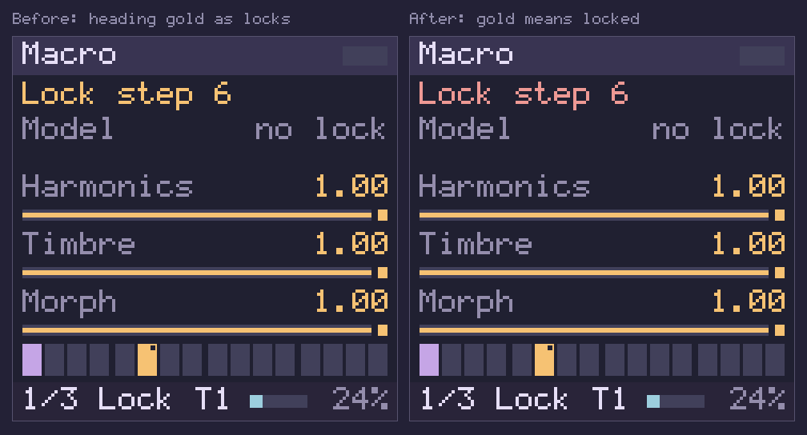
  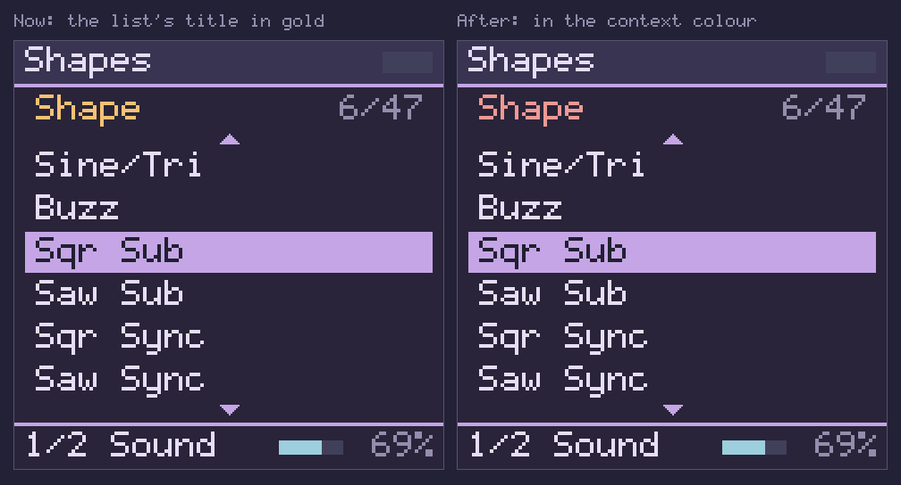

**Q5. FX mode's strip: a chip for the selected slot, and the slot's role.**
- **What changes:**
  - the selected tag becomes an iris chip with base text, gold while SEL
    holds it. The chip leaves 4 px on each side of the tag, 3 px above its
    capitals and 4 px below; its top is 1 px below the title bar;
  - the second line says the effect in the context colour, and its role
    ("insert", "master", "mix") in subtle on the right.

  This replaces "> M1 Plate", which repeated the strip.

  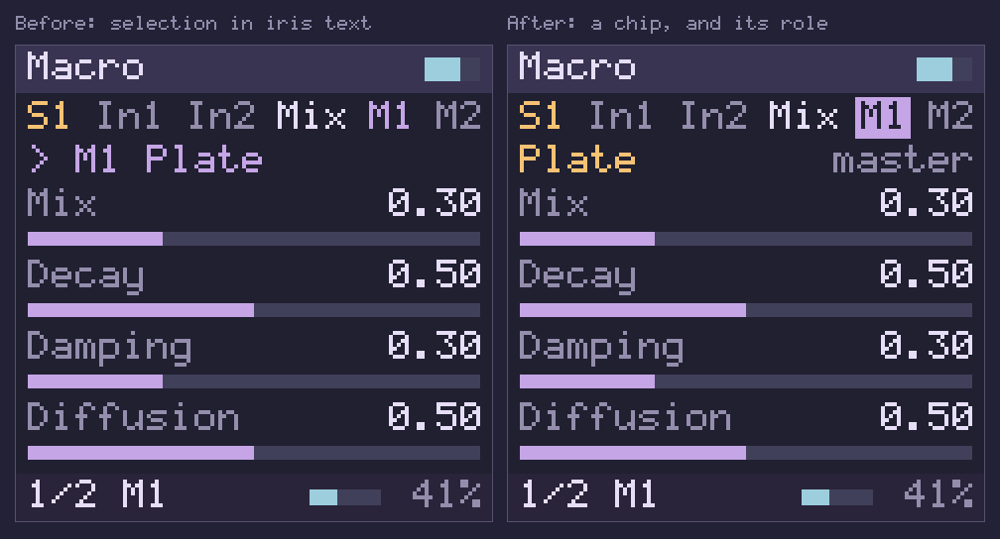

**Q6. GLO's master slots named as FX mode names them.** "M1"/"M2" with the
effect's name, not "FX1"/"FX2" with its id.

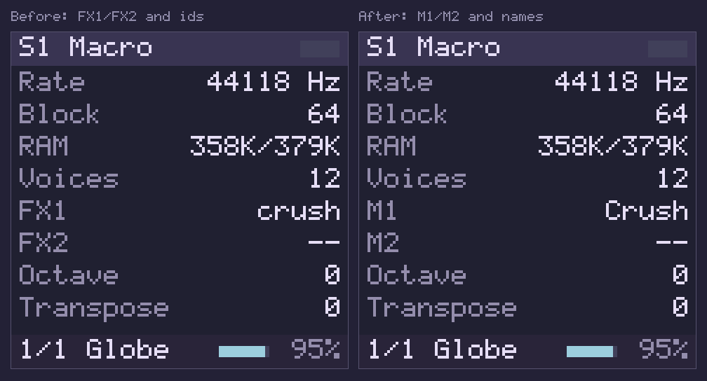

### Larger

**L1. One-line confirmations as a banner.**
- **What changes:** a confirmation of 18 characters or fewer is drawn in a
  28 px band over the bottom of the page ("Volume 80", "Transpose −5",
  "Metronome on", "Locks cleared", the gesture's amount). The page stays
  in view. The band has an iris rule at its top and bottom, as a popup
  does, so it does not run into the bottom bar, which has the same
  surface colour.
- **What stays:** lists and refusals keep the full-screen popup.
- **Cost:** a departure from stock's behaviour (D5).
- **A side benefit on hardware:** the FM-1 flushes the screen in ten
  24-row strips, so a banner sends about two strips instead of eight
  [inferred].

  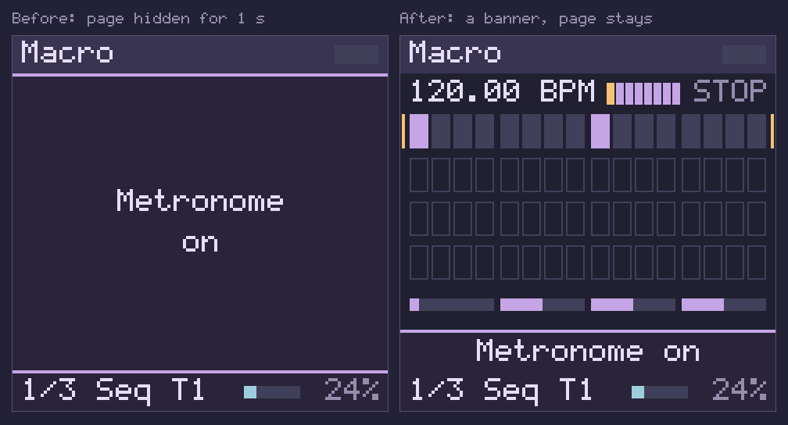

**L2. MATRIX's columns in colour.**
- **What changes:**
  - the source in foam;
  - the mark (">", "~", "!", "-") in subtle;
  - the destination and the amount in text.

  This separates three fields that run together. Selected, refused and off
  rows stay as they are.
- **What it needs:** a multi-colour text run in `fm1_tft` (one logged box,
  several colours). Two runs 2 px apart would fail the 4 px rule. **The
  mockup overdraws the colours without logging them**, which a real change
  must not do.

  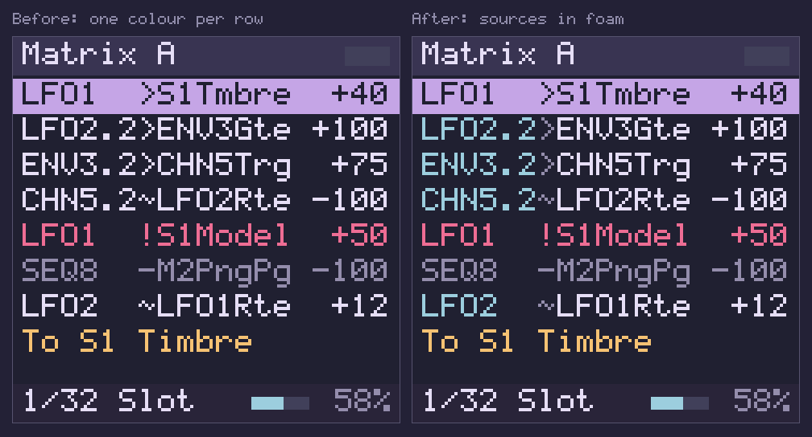

**L3. A colour for each sound** (D6).
- **What changes** in the mockup's strongest form:
  - S1 iris, S2 foam, S3 gold, S4 rose;
  - on the Mix page's labels and bars;
  - on the "S2" in the title bar;
  - on FX mode's sound tag and the sound's filled inserts.
  - Empty sounds lose their full grey bar.
- **The collisions:** S1 is the selection colour, S2 modulation's, S3 the
  locks', and S4 sits next to love.

  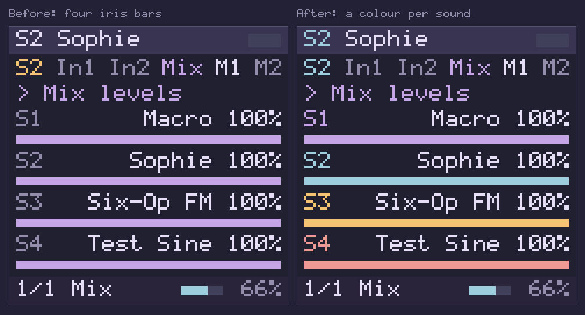

**L4. Short pages: the scope takes the empty rows.** On HOME, a page with
fewer than four parameters lets the oscilloscope grow into the space: FM6's
page 2 gets a 122 px scope.
- **Value:** low. It is feedback, not information.
- **Better later:** an engine-provided panel (FM6's algorithm, the operators'
  levels), which needs an engine API.

  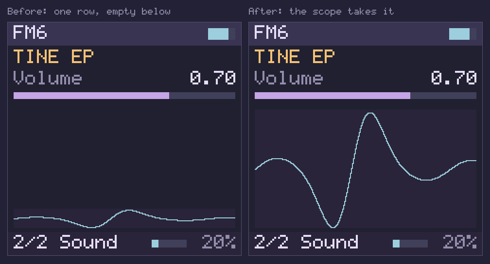

**All proposals together:**

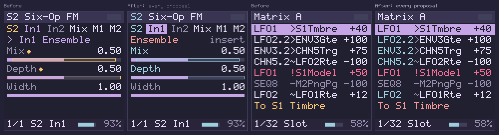

### Seen but not mocked

- **A second, mid-size font** for dense screens (§3, D7). A ×1 mock of the
  5×9 font would misrepresent it.
- **The track strip.** Its eight cells have 48 px between the tempo and
  the transport, with 8 px clear on each side. That is no room for larger
  cells. Two ways to get it [inferred]:
  - write a whole tempo as "120 BPM" rather than "120.00 BPM", which frees
    36 px;
  - give the strip a row of its own.

  A route colour per track needs D6.
- **One look for "selected".** Today it is drawn five ways:
  - an iris bar (lists, MATRIX);
  - iris text (FX strip);
  - a text outline (RACK);
  - a text-coloured bar (SEQ's knob strip);
  - a gold outline (held steps).

  PR #64's lists already use the iris bar, and Q5 moves the FX strip to
  an iris fill. RACK's outline could follow.

## 7. Owner decisions

- **D1. List popups, what is left.** PR #64 settled the layout (six
  entries under a title, with the place). Two questions remain:
  - Should a knob turned on a long list parameter (FM6's Patch on KNOB1)
    open the same list, or keep changing the row in place?
  - Should the sequencer's toasts, which PR #64 left showing one value,
    do the same where they walk a list?
- **D2. Wrapping lists: settled by PR #64.** Every list's window stops at
  its ends.
- **D3. The context line's colour.**
  - **Rose** (mocked) is distinct from gold, but it is 13.1 ΔE from love,
    so it must stay off lines where love appears.
  - **Text** is the safest and leaves rose free for "edited since load"
    once SAVE exists.
  - **Gold** keeps today's ambiguity.
- **D4. Modulation's colour: foam** (with the scope, meters and PLAY, as
  "live signal"), as mocked. Iris is taken by selection, rose by D3.
- **D5. Banners or stock-style popups** for one-line confirmations.
- **D6. Sound colours.** Three options:
  - **none**: identity by number;
  - **on the Mix page only**, where no other role appears;
  - **everywhere** (mocked, with the collisions listed under L3).
- **D7. A second font size** for MATRIX, CHAIN, the lanes and the SHIFT
  legend. A design task: a hand-drawn 6×10 or 7×12 bitmap font.
- **D8. Scope of the next change.** Q1 is built. Q2–Q6 together, or one
  at a time? Should the browser page's own chrome follow the same map?
  Today `style.css` uses gold for focus rings.

## 8. Limits, and how to reproduce

**Limits.**
- The mockups are throwaway. Each answers "does it fit and how does it
  look", not "how to build it":
  - L2's colour runs were drawn outside the layout log;
  - the FX chip (Q5) is painted, not logged, so the layout check does not
    see the gap between the chip and its tag; its padding was measured
    on the pixels.
- Mockups 05–15 were drawn on the tree before PR #64. None of them shows
  a list, and their screens are unchanged by it: of the 273 representative
  screens both trees write, the 13 that differ are all list popups
  [verified: byte comparison].
- Only the native harness ran. The WebAssembly module was neither rebuilt
  nor needed: nothing on this branch changes its inputs.
- Readability on the device itself is untested: no build runs on an FM-1
  (CLAUDE.md, the one rule).

**Reproduce the sweep.** From the repository root:

```bash
make -C engines -f Makefile -f $PWD/sim/web/mk/sim.mk SIM=$PWD/sim/web \
  BUILD=$PWD/sim/web/build/native $PWD/sim/web/build/native/fm1-sim-render
sim/web/build/native/fm1-sim-render --screens /tmp/screens   # {"screens":3040,"faults":0}
```

The mockups' PNGs were drawn from those PPMs and from single-screen renders.
For example, ALGORITHM on Shapes:

```bash
fm1-sim-render --engine shapes --turn 0.1:ALGORITHM:5 --seconds 0.4 --screen x.ppm
```

The PNGs were scaled ×2 and captioned with the screen's own 5×9 font.

## 9. Built

The owner adopted every proposal on 2026-10-06 (all of §6, the items
"seen but not mocked", D1, D6 "everywhere", D7 with Spleen, D8) and added
D9: "Re-audit the list sizes and number of items on popups once the new
fonts land. We can probably fit more and use longer, more legible names."
The palette (`sim/web/PALETTE.md`) and the two faces (`fm1_tft.h`) landed
first; this section records the screens.

### The app's screens (`fm1_app.c`)

All [verified] on the native harness after the change: `fm1-sim-render
--screens` draws 3,204 screens with 0 faults (3,165 before: the new ones
are every list parameter's knob on every sound and effect, banners over
HOME, FX, GLO and MATRIX, and FX mode's chip on every slot), every text
box in one of the three faces at that face's height (31,394 MAIN boxes,
6,313 MID, 0 SMALL over the sweep). The families below were looked at as
contact sheets; the browser module was rebuilt (parity 76 of 76).

- **Q2:** refusals keep the full popup with rules and reason in love, the
  name in text: the RAM, rate and arena refusals, "cannot be locked",
  "8 lanes used", "No LFO / in the rack", "takes no cable", "Matrix full",
  the SAVE and ARP stubs and "No DX7 voices".
- **Q4:** HOME's context line is MID, in rose, the model by its full name
  with its place in subtle ("Phase Distortion 2/8"); list titles are rose.
- **Q5:** FX mode's selected slot is a chip (iris, gold while SEL holds
  it, base text) and the second line is the slot's effect in rose with its
  role ("insert", "master", "mix") in subtle.
- **Q6:** GLO's master slots are "M1"/"M2" with the effect's name.
- **L1:** a confirmation that joins into one line is a banner over the
  page's bottom 28 px between iris rules: MAIN up to 18 characters, and,
  with the new faces, MID up to 27 ("Octave 0, Transpose 0", the gesture's
  "LFO1 > S1Tmbre +25%"). A text run the band would cut is erased whole.
  Lists and refusals keep the full popup.
- **L3:** the title bar's "S2", FX mode's sound tag, the sound's filled
  inserts and the bottom bar's "S1 In1", the Mix page's labels and bars,
  and SHIFT + PRESETS's tags take the sound's colour; an empty sound's Mix
  bar is an unfilled track.
- **L4:** HOME's scope starts under the page's last row: FM6's page 2
  gets 133 px.
- **D1:** a knob on a list parameter of five entries or more opens its
  list as ALGORITHM does; shorter ones (Off/On, Gate/Ping/Off) change in
  place. SHIFT + 16's quantize toast is its list (0 %, the default, 100 %).

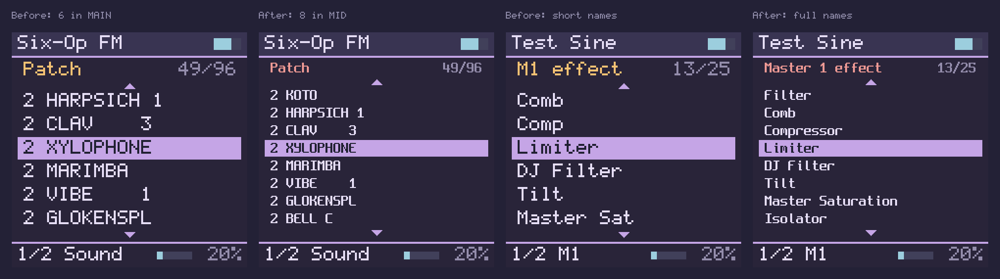
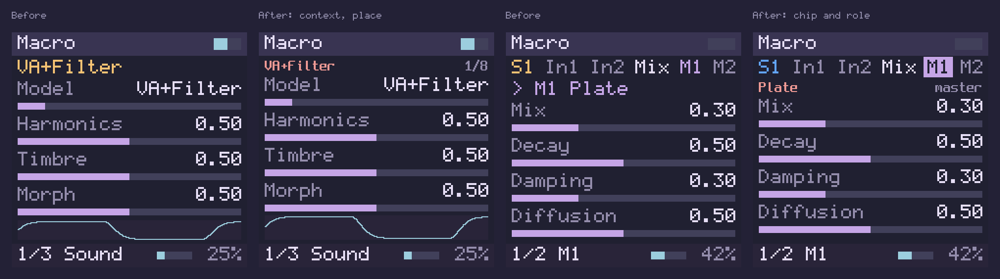
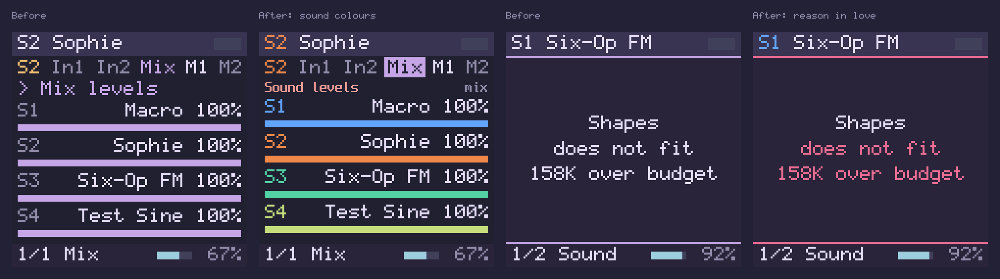
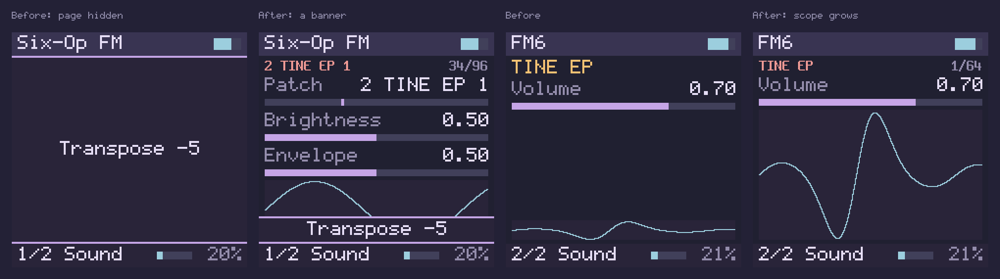

### D9: the lists, measured

**What a face holds** [verified: `fm1_look.h`, checked at compile time in
`fm1_app.c`]. The title line is MID (14 px) at y 30 with the place on its
right; a triangle (6 px) and 4 px on each side of it; the entries from
y 58; the last entry's box ends by y 200, leaving its triangle 4 px above
the bottom rule. Entries run from x 12 to x 228 (6 px inside the
selection bar). Each face keeps 4 px between entries' boxes and 3 px of
bar above a capital:

| Face | Entry box | Pitch | Entries | Characters an entry | Title characters beside "96/96" |
| --- | ---: | ---: | ---: | ---: | ---: |
| MAIN (5×9 at ×2) | 18 px | 24 px | 6 | 18 | 13 (MAIN title, before) |
| MID (Spleen 8×16) | 14 px | 18 px | 8 | 27 | 21 |
| SMALL (Spleen 6×12) | 12 px | 16 px | 9 | 36 | — |

A ninth MID entry's box would reach y 215, the bottom rule; SMALL buys
one entry over MID at a 2 px smaller capital (8 px against 10).

**The longest name in each list** [verified: the catalogue, 2026-10-06],
short form and full name: engines 11 ("Macro Heavy"); effects 10 / 17
("Master Sat" / "Master Saturation"); Macro's models 9 / 16 ("Phase
Distortion"); Shapes' shapes 10 / 19 ("Chaotic Feedback FM"); Macro
Heavy's models 11 / 14 ("String Machine"); Six-Op FM's patches 12; FM6's
10 (its user bank's names at most 10); the pads 11; PSX Verb's models
10 / 13; the Filter's types 10 / 16 ("Sallen-Key Mixed"); the matrix's
destinations 14 as `fm1_mod_ui` names them today, over the default chain
("Host Pitch Cur"); the rack's kinds 9.
So every full name fits MID's 27 characters, and no list needs SMALL.

**Per list, before and after** (entries shown at once / characters an
entry may have):

| List | Entries | Before (MAIN) | After | Names |
| --- | ---: | --- | --- | --- |
| ALGORITHM on HOME (Model, Shape, Patch, Pad) | 8–96 | 6 / 18 | MID 8 / 27 | full names (fm1_look_full_name) |
| A knob on a list parameter (D1) | 5–96 | 1 value on the row | MID 8 / 27 | full names |
| PRESETS (engines, Empty first on Sounds 2–4) | 8–9 | 6 / 18 | MID 8 / 27: all of Sound 1's | engine names; title "S2 engine" with several sounds |
| ALGORITHM in FX mode (Empty slot and 24 effects) | 25 | 6 / 18 | MID 8 / 27 | Compressor, Master Saturation, Equaliser, Transient Shaper; title "Master 1 effect", "S1 insert 1 effect" (was "M1 effect") |
| SHIFT + PRESETS (the four sounds) | 4 | 4 / 18 | MAIN 4 / 18 | all four already fit the most legible face; tags in the sounds' colours; title "Current sound" |
| SHIFT + 16's quantize (D1) | 2–3 | 1 value | MAIN all / 18 | "0%", the default, "100%" |
| Capture's tempos | 1–3 | 3 / 18 | MAIN 3 / 18 | title "Capture tempo" |
| RACK's kind picker | 17 | 6 / 18 | MID, 6 until `fm1_mod_ui` fills 8 / 27 | the SEQ/MOD lane's content |
| MATRIX's destination picker | 46–93 | 6 / 18 | MID, 6 until `fm1_mod_ui` fills 8 / 27 | the SEQ/MOD lane's content ("S1 Timbre") |

**Choices.**
- **MID for every long list.** It shows two more entries than MAIN and
  every full name; SMALL would show one more again at the cost of a
  smaller capital, and no name needs its 36 characters. The owner's
  example for SMALL, MATRIX's destinations, measured 14 characters at most.
- **MAIN where a list is whole in it** (four sounds, two or three quantize
  values, up to three tempos): the largest face, nothing hidden.
- **The title line is MID in every list**, so the entries start 4 px
  higher and MAIN keeps its six; the title has room for 21 characters
  beside the place, so titles say what they are ("Master 1 effect").
- **Full names** come from the engines' own sources (the effects'
  credits, the Plaits and Braids model enums, PSX Verb's presets, the
  Filter's comments), not from guesses; initials that are names in their
  own right (VA, FM, LP, CSaw) stay. The rows on HOME keep the engine's
  short form; the context line, GLO and FX mode's second line use the full
  name where it fits.
- **A modulation picker** is drawn in the face `fm1_panel.h` names for it
  (`FM1_LIST_FACE_KIND`, `FM1_LIST_FACE_DEST`), with whatever window
  `fm1_mod_ui` fills; until it fills `fm1_list_rows(face)` entries it shows
  six in MID.

**Limits.** Legibility of MID and SMALL on the FM-1's own panel is
untested: no build runs on an FM-1 (CLAUDE.md, the one rule). The README's
screenshots predate these screens and are left for after the SEQ/MOD lane.
