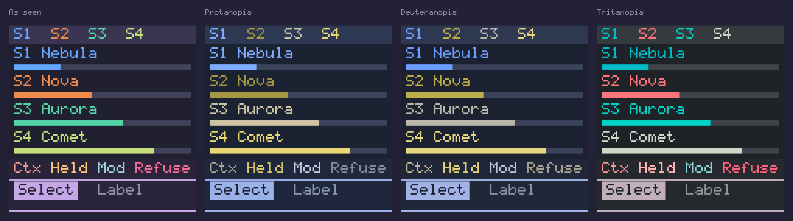

# The virtual FM-1's palette, version 2 (2026-10-06)

The screen (`src/fm1_look.h`) and the page (`www/style.css`) share one
palette and one map of what each colour means. This page records how the
palette was extended for the owner's decisions of 2026-10-06 on the UI audit
(`notes/2026-10-06-ui-audit.md`): every audit proposal adopted, a colour for
each sound everywhere (D6), and the page's own chrome on the same map (D8).
`tools/palette.py` checks both files against everything below, and
`tests/test_sim_palette.py` runs it.

Marks follow CLAUDE.md: [verified] checked here, [reported] a named source
says so, [inferred] our reasoning.

## What changed

- **Four new hues, one for each sound:** nebula (S1, blue), nova (S2,
  orange), aurora (S3, green) and comet (S4, yellow-green). They are
  Lunar Modulator's own, not borrowed from another theme: derived in OKLCH
  at the lightness and chroma of Rosé Pine Moon's accents, in the hues
  Moon leaves free (below).
- **Roles in the header.** Screen code can name what a colour means rather
  than its hue: `C_SELECT`, `C_HELD`, `C_LIVE`, `C_MOD`, `C_REFUSE`,
  `C_CONTEXT`, `C_HINT`, `C_LABEL`, `C_SOUND_1`–`C_SOUND_4` and
  `fm1_sound_colour(n)`. The old names (`C_MODEL`, `C_ACCENT`, `C_WARN`, …)
  still work and still draw what they drew, so **no screen has changed
  yet**: each moves to the roles in its own change.
- **The page follows the map** (D8): the focus ring, links, the tagline and
  the help's terms are the selection colour (iris; the focus ring was gold);
  gold is left to a lit LED, a key or button held or latched; the Power
  on button's hover lightens iris instead of turning rose; code in the help
  is plain text, not foam. In `style.css` only the role variables
  (`--select`, `--held`, `--live`, `--refuse`, `--context`, `--sound-1`…)
  name an accent; every rule names the role.

## The semantic colour map, version 2

One meaning per colour. The audit's map (§5) with the sound colours added;
Rosé Pine's own roles from rose-pine/palette's README [reported, read
2026-10-05].

| Token | Role (header / page) | On the screen | Never |
| --- | --- | --- | --- |
| base | `C_BG` | the page | — |
| surface | `C_BOTTOM_BG`, `C_POPUP_BG` | the bottom bar, popups and banners, the scope's well | — |
| overlay | `C_TITLE_BG` | the title bar | subtle or love text on it |
| highlight-med | `C_BAR_BG` | bar and cell backgrounds | — |
| highlight-high | — | spare: outlines of empty cells, if wanted | — |
| muted | — | marks on base only | text (3.02:1 at best) |
| subtle | `C_LABEL` | labels, secondary text, idle states (STOP), a list's place ("6/47"), FX mode's slot role ("insert") | text on the title bar or a highlight |
| text | `C_HINT` (and `C_TEXT`) | values, list entries, the playhead, hints, modulation's live tick, MATRIX's destination and amount | — |
| iris | `C_SELECT` / `--select` | selection and the value being edited: value bars, notes, the selected row, slot or chip (one look for "selected"), list triangles, popup and banner rules; on the page focus rings, links and accents | — |
| gold | `C_HELD` / `--held` | held and locked: held steps, locks and lanes, the grabbed module or slot (FX mode's chip while SEL holds it), the count-in; on the page a lit LED | headings, titles, hints, modulation |
| foam | `C_LIVE`, `C_MOD` / `--live` | live signal and modulation: the scope, meters, PLAY, trig ticks, a modulated label and its range bracket, MATRIX's sources; on the page the power lever on | — |
| love | `C_REFUSE` / `--refuse` | refusal, recording, over the limit: REC, STEP, step record's head, RAM over 100 %, clipping, refused cables, refusal popups | text on the title bar or a highlight |
| rose | `C_CONTEXT` / `--context` | context: the line under the title bar (model, "Step 7", "Lock step 6", page headings) and a list popup's title | any line where love can appear (ΔE 13.1) |
| pine | — | nothing: it fails as text and as a mark (`fm1_look.h` leaves it out) | anywhere on the screen |
| nebula | `C_SOUND_1` / `--sound-1` | Sound 1 | — |
| nova | `C_SOUND_2` / `--sound-2` | Sound 2 | — |
| aurora | `C_SOUND_3` / `--sound-3` | Sound 3 | — |
| comet | `C_SOUND_4` / `--sound-4` | Sound 4 | — |

**Where a sound's colour goes** (D6, "everywhere"): the Mix page's labels
and bars, the "S2" in the title bar, FX mode's sound tag and the sound's
filled inserts, the Track view's track strip by the sound each track plays,
and anywhere else a sound is named. The S-number always goes with it, as
the cue for anyone who cannot tell the colours apart.

## How the hues were derived

**Moon's accents in OKLCH** [verified: computed by `palette.py`]:

| Accent | sRGB | L | C | h |
| --- | --- | ---: | ---: | ---: |
| love | `#eb6f92` | 0.698 | 0.156 | 4.2 |
| rose | `#ea9a97` | 0.765 | 0.097 | 21.9 |
| gold | `#f6c177` | 0.843 | 0.110 | 74.6 |
| foam | `#9ccfd8` | 0.822 | 0.054 | 209.6 |
| pine | `#3e8fb0` | 0.614 | 0.093 | 228.0 |
| iris | `#c4a7e7` | 0.776 | 0.095 | 305.0 |

**The free hues.** Moon's hue circle has one wide gap, 75°–210°
(yellow-green to teal), and three narrow ones: 228°–305° (blue), 22°–75°
(orange) and 305°–4° (magenta). Four colours that must stay apart from
each other and from five roles do not fit in the wide gap alone.

**The constraints** each candidate met, all after the RGB565 round trip:
- 4.5:1 as text on base, surface and overlay (the title bar's "S2"), with a
  margin: at least 4.6:1;
- 3:1 as a bar on highlight-med;
- CIEDE2000 at least 20 from love and from each other sound colour, and
  at least 15 from subtle, text, iris, gold, foam and rose;
- lightness and chroma within Moon's accents (L 0.70–0.84, widened by
  0.03; C 0.054–0.156).

**The search** [verified: run in a scratch script with `palette.py`'s
functions, not committed]:
- A grid over L 0.70–0.86, C 0.06–0.16 and every 3° of hue, then a
  coordinate search per hue family, each candidate snapped to the RGB565
  grid.
- The set that maximised the smallest distance was four shades of green
  (yellow-green to cyan) told apart by lightness. That scores well on
  ΔE but badly as categories ("the green one" names three of them) and
  worse under deuteranopia. The maximum-distance sets also reached for
  chroma up to 0.155 at 85 % lightness: neon (`#00efde`), not Rosé Pine.
- So the families were fixed as orange, yellow-green, green and blue,
  chroma kept to 0.13–0.14 (gold's 0.11 to love's 0.16), and the search run
  again within them.
- **Orange is the tightest.** Squeezed between rose (22°) and gold (75°),
  no orange at Moon's chroma is 20 from both: the best is nova at 17.4 from
  rose and 16.9 from gold. It stays because it is the only warm sound
  colour, and orange beside blue, green and yellow-green reads as four
  colours with names of their own [inferred].
- **Comet sits slightly above Moon's lightest accent** (L 0.863 against
  gold's 0.843): a darker comet runs into nova under deuteranopia (the two
  differ there mainly in lightness).
- **Each target is snapped to the RGB565 grid**: the sRGB value is passed
  through `FM1_RGB565` and back as `app.js` expands it, and that is the
  token. So each new hue is a fixed point of the round trip: the page's CSS
  and the screen show exactly the same colour. Moon's own colours move by
  up to 6 levels a channel on the screen [verified]; the checker takes the
  lower of the two distances for every pair.

**Names** are space-themed and say the hue: a reflection nebula's blue,
a nova's flare, the aurora's oxygen green, a comet's yellow-green coma.

**The order** S1 nebula, S2 nova, S3 aurora, S4 comet puts the two pairs
that are weakest under a colour-vision deficiency (nova–comet under
deuteranopia, nebula–aurora under tritanopia) on sounds that are not next
to each other, so neighbouring rows on the Mix page always differ.

## The figures

Generated by `python3 sim/web/tools/palette.py --report`;
`tests/test_sim_palette.py` fails if this block and the report differ.
Each derived hue's target, the token both files use and its RGB565 word
[verified: computed]:

<!-- palette.py --report -->
**Derived hues** (OKLCH target, its sRGB, the RGB565 fixed point both files use, and that colour's own OKLCH):

| Name | Sound | Target L, C, h | sRGB | Token | RGB565 | Token's L, C, h |
| --- | --- | --- | --- | --- | --- | --- |
| nebula | S1 | 0.72, 0.140, 256 | `#67a6fb` | `#63a6ff` | `0x653F` | 0.720, 0.147, 256.1 |
| nova | S2 | 0.72, 0.140, 52 | `#e8894a` | `#ef8a4a` | `0xEC49` | 0.730, 0.146, 50.9 |
| aurora | S3 | 0.78, 0.130, 166 | `#54d2a4` | `#52d2a5` | `0x5694` | 0.781, 0.131, 166.5 |
| comet | S4 | 0.86, 0.130, 122 | `#c3df7b` | `#c5df7b` | `0xC6EF` | 0.863, 0.129, 121.1 |

Moon's accents span L 0.698-0.843 and C 0.054-0.156 (love, gold, rose, foam, iris; pine left out); the check allows L 0.668-0.873.

**Contrast** after the RGB565 round trip (WCAG 2; text needs 4.5:1, marks 3:1). Bold: under 4.5:1. A dash: never drawn there as text.

| Colour | base | surface | overlay | highlight-med |
| --- | ---: | ---: | ---: | ---: |
| text | 12.36 | 11.55 | 8.98 | 7.62 |
| subtle | 5.12 | 4.78 | **3.72** – | **3.15** – |
| muted | **3.02** – | **2.83** – | **2.20** – | **1.86** – |
| love | 5.54 | 5.18 | **4.02** – | **3.41** – |
| gold | 9.82 | 9.18 | 7.13 | 6.05 |
| rose | 7.39 | 6.90 | 5.37 | 4.55 – |
| pine | **4.34** – | **4.06** – | **3.16** – | **2.68** – |
| foam | 9.35 | 8.74 | 6.79 | 5.76 |
| iris | 7.58 | 7.08 | 5.51 | 4.67 |
| nebula | 6.41 | 5.99 | 4.65 | **3.95** – |
| nova | 6.39 | 5.97 | 4.64 | **3.94** – |
| aurora | 8.45 | 7.90 | 6.14 | 5.21 – |
| comet | 10.80 | 10.10 | 7.85 | 6.66 – |

**CIEDE2000** between the colours the screen draws with a meaning (the lower of the screen's and the page's value):

| | subtle | text | iris | gold | foam | love | rose | nebula | nova | aurora | comet |
| --- | ---: | ---: | ---: | ---: | ---: | ---: | ---: | ---: | ---: | ---: | ---: |
| subtle |  | 21.7 | **13.4** | 39.3 | 26.9 | 24.0 | 24.8 | 21.9 | 35.1 | 35.7 | 44.1 |
| text | 21.7 |  | **16.6** | 32.5 | 21.6 | 30.3 | 25.3 | 26.6 | 35.7 | 31.8 | 35.9 |
| iris | **13.4** | **16.6** |  | 44.3 | 23.7 | 22.8 | 24.3 | 23.4 | 40.0 | 40.5 | 58.1 |
| gold | 39.3 | 32.5 | 44.3 |  | 34.0 | 40.3 | 25.8 | 48.7 | **16.9** | 36.7 | 22.4 |
| foam | 26.9 | 21.6 | 23.7 | 34.0 |  | 44.0 | 42.6 | **18.2** | 40.2 | 20.6 | 31.1 |
| love | 24.0 | 30.3 | 22.8 | 40.3 | 44.0 |  | **13.1** | 40.6 | 29.3 | 68.7 | 60.8 |
| rose | 24.8 | 25.3 | 24.3 | 25.8 | 42.6 | **13.1** |  | 37.7 | **17.4** | 53.7 | 45.1 |
| nebula | 21.9 | 26.6 | 23.4 | 48.7 | **18.2** | 40.6 | 37.7 |  | 47.3 | 39.8 | 58.7 |
| nova | 35.1 | 35.7 | 40.0 | **16.9** | 40.2 | 29.3 | **17.4** | 47.3 |  | 50.9 | 40.0 |
| aurora | 35.7 | 31.8 | 40.5 | 36.7 | 20.6 | 68.7 | 53.7 | 39.8 | 50.9 |  | 20.7 |
| comet | 44.1 | 35.9 | 58.1 | 22.4 | 31.1 | 60.8 | 45.1 | 58.7 | 40.0 | 20.7 |  |

**The sound colours under colour-vision deficiencies** (Machado 2009, severity 1): each one's simulated colour, then CIEDE2000 between every two.

| | nebula | nova | aurora | comet | nebula-nova | nebula-aurora | nebula-comet | nova-aurora | nova-comet | aurora-comet |
| --- | --- | --- | --- | --- | ---: | ---: | ---: | ---: | ---: | ---: |
| none | `#63a6ff` | `#ef8a4a` | `#52d2a5` | `#c5df7b` | 47.3 | 39.8 | 58.7 | 50.9 | 40.0 | 20.7 |
| protanopia | `#80acff` | `#a79643` | `#cec4a3` | `#ead573` | 50.8 | 39.1 | 53.1 | **17.4** | **17.3** | **13.5** |
| deuteranopia | `#6b9dfd` | `#bfad49` | `#bbb7a8` | `#e6d580` | 55.4 | 34.3 | 55.0 | **19.0** | **10.6** | **18.1** |
| tritanopia | `#00bac7` | `#ff757c` | `#00d3c5` | `#cdd6c7` | 70.6 | **11.2** | 24.7 | 63.8 | 37.6 | 22.0 |
<!-- end of report -->

**Pairs under 20, and why each is acceptable** (`JUSTIFIED` in
`palette.py`; the check fails on any other):

| Pair | ΔE00 | Why |
| --- | ---: | --- |
| love–rose | 13.1 | Moon's own: rose is never on a line where love can appear (the audit, §3) |
| subtle–iris | 13.4 | Moon's own: selection is a filled bar or chip with base text on it, never iris text beside subtle text |
| text–iris | 16.6 | Moon's own: iris marks selection as a fill under base text, not as text beside text |
| gold–nova | 16.9 | 0.11 apart in OKLCH lightness and 24° of hue; S2's number goes with it |
| rose–nova | 17.4 | nova has 1.4 times rose's chroma, 27° of hue away; S2's number goes with it |
| foam–nebula | 18.2 | nebula has 2.6 times foam's chroma, 37° of hue away; S1's number goes with it |

**Colour-vision deficiencies.** Under Machado's full-strength simulations
the sound colours stay at least 10.6 apart (the checker's floor is 9):
nova and comet under deuteranopia (olive against pale yellow) and nebula
and aurora under tritanopia (two cyans, 11.2) differ mainly in lightness.
The S-number on screen is the cue that does not depend on colour
[inferred: severity 1 is dichromacy, the hardest case].



The picture is `palette.py --swatch DIR` (the screen's own 5×9 font at ×2,
then converted to PNG): the four sounds in the title bar and as names and
bars, then the roles.

## Checking

```bash
python3 sim/web/tools/palette.py            # exit 1 and each failure, or "every rule holds"
python3 sim/web/tools/palette.py --report   # the tables above
python3 sim/web/tools/palette.py --swatch /tmp/palette   # PPMs of the swatch and the sheet
python -m pytest tests/test_sim_palette.py
```

The checker reads the tokens from both files and fails if they disagree,
if a derived hue is not its target after the round trip, if any colour
misses its contrast where `USES` says it is drawn, if a pair is too close
or close without a reason, if the sound colours collapse under a
simulated deficiency, if a role macro or role variable points at the wrong
token, if the page's focus ring is not the selection colour, or if
`style.css` names an accent anywhere but in its role's definition. Its
colour science is tested against the audit's own figures and against
Sharma, Wu and Dalal's CIEDE2000 test data.

## Limits

- The figures are for sRGB displays. The FM-1's ST7789V panel has not been
  measured; its gamma and gamut may shift every colour [inferred]. Nothing
  here has run on an FM-1 (CLAUDE.md, the one rule).
- Contrast is WCAG 2's ratio, the one the audit and the page already use;
  no perceptual-contrast model (APCA) was tried.
- Machado's matrices are applied to linear RGB, as DaltonLens recommends
  [reported: DaltonLens, "Understanding CVD simulation"]; at severity 1 they
  model dichromacy, the strongest case.
